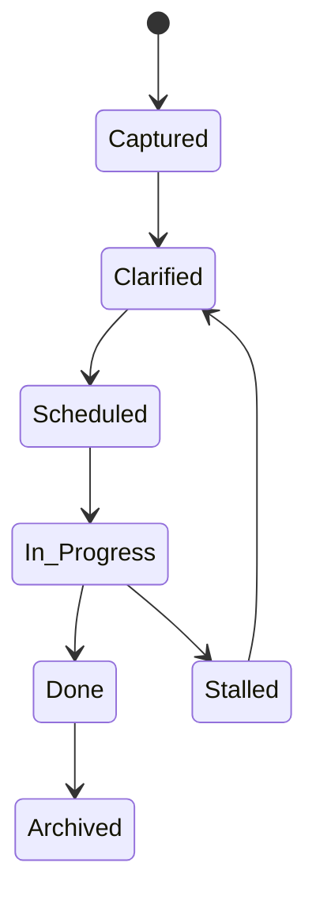
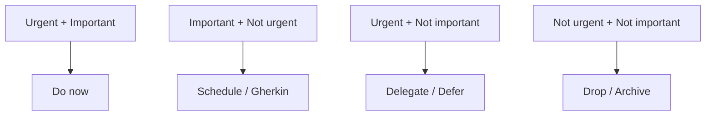

# Medallion: Bronze | Mutation: 0% | HIVE: V

# HFO LifeOS Template Trade Study (Daily‑First)

Date: 2026-01-19

## Objective

Identify 4 evidence‑backed frameworks for managing a massive, low‑signal task pile, and evaluate them for **machine‑parseability**, **cognitive load**, **urgency/cost‑of‑delay clarity**, and **fit with HFO LifeOS cards**.

## Baseline assumptions

- Notes/tasks are stored in Obsidian with strict YAML fields.
- Ingestion is high‑volume, urgency is unclear, and delay cost must be inferred.
- HFO cards can slot frameworks without changing the PARA vault layout.

---

## Option 1 — Implementation Intentions (Gherkin plans)

**Summary:** Convert intention into a concrete trigger/action plan (Given/When/Then). This is supported by research on implementation intentions, including meta‑analyses and multiple field studies (e.g., voting plans, health behaviors) summarized in the literature.

**Why it helps here:** Turns fuzzy tasks into executable behaviors with clear triggers. Easy to parse: “Given/When/Then” is structured and can be stored as YAML or in a dedicated Gherkin block.

**Evidence (overview):** Implementation intentions are described as improving goal attainment and behavior execution in the literature and summarized on the Implementation intention page (includes meta‑analysis references and field experiments).

Source: <https://en.wikipedia.org/wiki/Implementation_intention>

---

## Option 2 — Getting Things Done (GTD)

**Summary:** Capture → Clarify → Organize → Reflect → Engage. Emphasizes externalizing tasks into a trusted system, then defining “next actions.”

**Why it helps here:** Provides a reliable pipeline for clearing inbox overload and converting “stuff” into next actions. Machine‑parseable via consistent fields: `status`, `next_action`, `context`, `project`.

**Evidence (overview):** GTD is a well‑documented workflow with an explicit capture/clarify/organize loop; it’s linked in time‑management literature and has analytical discussion connecting it to cognitive science (see references on the GTD page).

Source: <https://en.wikipedia.org/wiki/Getting_Things_Done>

---

## Option 3 — Eisenhower Matrix (Urgent/Important)

**Summary:** Quadrants: (1) urgent+important, (2) important+not urgent, (3) urgent+not important, (4) neither.

**Why it helps here:** Provides a quick urgency/cost‑of‑delay proxy when you have many tasks without a clear timeline. Machine‑parseable: `urgency`, `importance`, `quadrant`.

**Evidence (overview):** Described as a prioritization method in time‑management literature; commonly used for urgency/importance triage (time‑management references summarize this method).

Source: <https://en.wikipedia.org/wiki/Time_management>

---

## Option 4 — Timeblocking

**Summary:** Pre‑assign blocks of time for tasks to reduce context switching and improve completion.

**Why it helps here:** Converts priorities into scheduled execution. Machine‑parseable: `block_start`, `block_end`, `block_type`.

**Evidence (overview):** Timeblocking is documented as a scheduling method to reduce multitasking and improve focus (see Timeblocking page references, including task‑switching research and structured scheduling claims).

Source: <https://en.wikipedia.org/wiki/Timeblocking>

---

## Trade Study Matrix (HFO‑fit)

| Option | Evidence Strength* | Cognitive Load | Machine Parse Fit | Urgency/Delay Clarity | Best Use | HFO Card Fit |
|---|---|---|---|---|---|---|
| Implementation Intentions (Gherkin) | High | Low | High | Medium | Execution triggers | Daily/Weekly cards |
| GTD | Medium | Medium | High | Medium | Inbox processing | Inbox → Projects/Areas |
| Eisenhower Matrix | Medium‑Low | Low | High | High | Priority triage | Weekly/Monthly |
| Timeblocking | Medium | Medium | High | Medium | Execution scheduling | Daily/Weekly |

\*Evidence strength is qualitative based on sources above; GTD and Eisenhower are more practice‑driven, while implementation intentions and timeblocking have more direct behavioral research cited in the literature pages.

---

## Mermaid 1 — Unified Flow (Capture → Plan → Execute)

## Mermaid 2 — Task State Lifecycle

## Mermaid 3 — Decision Quadrant

---

## Recommendation (suggested HFO integration)

1) **Daily:** Implementation Intentions (Gherkin) + Timeblock anchor.
2) **Weekly:** Eisenhower triage + 2–4 anchors.
3) **Inbox processing:** GTD capture/clarify/organize.

This preserves your strict YAML fields and allows later analytics (counts, durations, success rates).

---

## Notes on machine‑parseability

- Use fixed keys only (no free‑form lists).
- Keep enums in snake_case.
- Use consistent prefixes for cards: `hfo_daily_`, `hfo_weekly_`, etc.

---

## Sources

- Implementation intentions research summary and references: <https://en.wikipedia.org/wiki/Implementation_intention>
- GTD workflow overview and references: <https://en.wikipedia.org/wiki/Getting_Things_Done>
- Eisenhower method overview: <https://en.wikipedia.org/wiki/Time_management>
- Timeblocking overview and cited research links: <https://en.wikipedia.org/wiki/Timeblocking>
