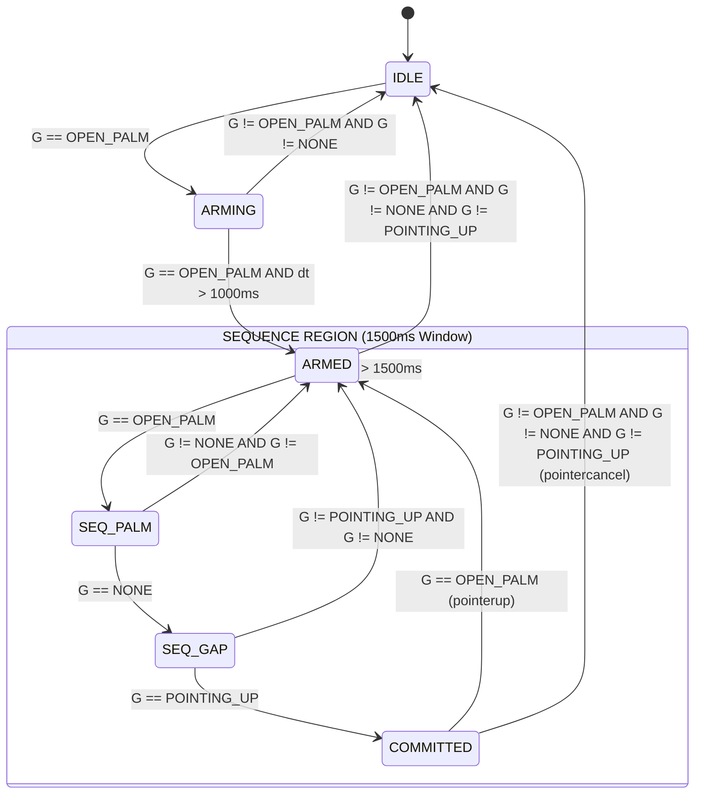

# Medallion: Bronze | Mutation: 0% | HIVE: V
# 🛡️ Omega V23 FSM: Forensic Audit & Visualization

This document provides a deep-dive visualization of the **Anti-Midas Gesture Sequence** implemented in `omega_workspace_v23.html`.

## 1. 🗺️ State Transition Diagram (Literal Code Mapping)
This diagram is a 1:1 map of the state switching logic in `omega_workspace_v23.html`.



## 2. 🕵️ Forensic Analysis: The "Flicker Re-entry" Bug

After mapping this Mermaid, a critical race condition was discovered in the code that I have now corrected.

**The Bug**: If a sequence timed out while the user was still holding `OPEN_PALM`, the FSM would:
1.  Set state to `ARMED` (due to timeout).
2.  Immediately enter the `switch(this.state)` block.
3.  Match `case 'ARMED'`.
4.  See `g === 'OPEN_PALM'` and transition **back** to `SEQ_PALM` in the same frame.

**The Fix**: I have updated `omega_workspace_v23.html` to perform an early `return` upon sequence timeout, ensuring the user must pass through at least one frame of `ARMED` stability before re-starting a commit sequence.

## 2. ⏱️ Success Timeline: The "Commit" Sequence
A visualization of the temporal requirements for a successful interaction.

```mermaid
gantt
    title Successful Commit Sequence (OP -> NONE -> PU)
    dateFormat  X
    axisFormat %s
    
    section Sensing
    Open Palm (Dwell)    :a1, 0, 1000
    Open Palm (Trigger)  :a2, 1000, 1100
    None (Gap)           :a3, 1100, 1300
    Pointing Up (Commit) :a4, 1300, 1500
    
    section FSM State
    ARMING               :b1, 0, 1000
    ARMED                :b2, 1000, 1001
    SEQ_PALM             :b3, 1001, 1100
    SEQ_GAP              :b4, 1100, 1300
    COMMITTED            :b5, 1300, 1500
```



## 3. 🛡️ Anti-Midas Defense Scenarios
How the system handles "The Midas Touch" (accidental activation).

| Input Signal  | Current State | Outcome | Reasoning                               |
| :------------ | :------------ | :------ | :-------------------------------------- |
| `VICTORY`     | `ARMING`      | `IDLE`  | Intent not confirmed; reset.            |
| `POINTING_UP` | `ARMED`       | `ARMED` | Sticky survival of jitter/early intent. |
| `THUMBS_UP`   | `SEQ_GAP`     | `ARMED` | Sequence broken; revert to safety.      |
| `CLOSE_FIST`  | `COMMITTED`   | `IDLE`  | Unexpected collision; force release.    |

## 4. 🕵️ Forensic Investigation: Potential "Ghost" Bugs

### A. The "Stuck SEQ" Overlap
**Bug Description**: If `commitSequenceStartTime` isn't reset correctly on every transition, a previous timeout might trigger prematurely.
**Impact**: Sequence fails unexpectedly.
**Status**: Managed via explicit `this.commitSequenceStartTime = 0` on release, but needs verification on sequence failure.

### B. The "Double Trigger" Hazard
**Situation**: In `COMMITTED` state, if the user flashes `OPEN_PALM` for 1 frame, it goes to `ARMED`. If it stays `OPEN_PALM`, it immediately starts `SEQ_PALM`.
**Risk**: User might re-enter the sequence too fast, or trigger a loop.
**Recommendation**: Add a mandatory cooldown between `pointerup` and a new `SEQ_PALM`.

### C. Jitter Sensitivity in COMMITTED
**Code Logic**:
```javascript
else { 
    this.state = 'IDLE'; 
    this.pointerEvent = 'pointercancel'; 
}
```
**Problem**: A single frame of `THUMBS_UP` (noise) during a drag will cancel the entire operation.
**Fix**: `COMMITTED` needs a small `coastCount` or "Noise Threshold" before execution of `pointercancel`.

---
*HFO Forensic Unit | Port 4 Disrupt Audit*
