# Design Document: HFO Infrastructure Stack

## Overview

This design specifies the complete infrastructure for the HFO (Hive Fleet Obsidian) 8-port hexagonal architecture. The system implements a cognitive symbiote with tri-temporal control (Past/Present/Future) aligned with JADC2 operational patterns.

The architecture follows the canonical Gen 63 Obsidian Matrix tech stack, mapping each of the 8 OBSIDIAN roles to specific vendor-neutral tools accessible via MCP (Model Context Protocol) servers.

```
THE HEARTBEAT MANTRA (Port Reference):

Given One Swarm to Rule the Eight,    ← 0: Observer  (☷) SENSE
And Branches Growing from the Gate,   ← 1: Bridger   (☶) CONNECT
And Spawns Evolve to Recreate,        ← 2: Shaper    (☵) ACT
When Ignitions Flow to Pulsate,       ← 3: Injector  (☴) PULSE
Then Deadly Venoms Concentrate,       ← 4: Disruptor (☳) TEST
But Instincts Rise to Isolate,        ← 5: Immunizer (☲) DEFEND
As Artifacts Accumulate,              ← 6: Assimilator(☱) STORE
To Navigate the Higher State.         ← 7: Navigator (☰) DECIDE
```

## Architecture

```mermaid
flowchart TB
    subgraph SENSE["Port 0: Observer (SENSE)"]
        FS0[filesystem-read]
        BRAVE[brave-search]
        GH[github]
        FETCH[web-fetch]
        OTEL_R[otel-read]
    end

    subgraph CONNECT["Port 1: Bridger (CONNECT)"]
        NATS[nats-jetstream]
        CE[cloudevents]
        SEQ[sequential-thinking]
    end

    subgraph ACT["Port 2: Shaper (ACT)"]
        FS2[filesystem-write]
        PUP[puppeteer]
        DOCK[docker]
    end

    subgraph PULSE["Port 3: Injector (PULSE)"]
        TIME[time-server]
        TEMP[temporal]
        CRON[cron-scheduler]
    end

    subgraph TEST["Port 4: Disruptor (TEST)"]
        HYP[hypothesis]
        CHAOS[chaos-monkey]
        FUZZ[fuzzer]
    end

    subgraph DEFEND["Port 5: Immunizer (DEFEND)"]
        PYD[pydantic]
        OPA[opa-policy]
        OF[openfeature]
    end

    subgraph STORE["Port 6: Assimilator (STORE)"]
        DUCK[duckdb]
        LANCE[lancedb]
        KG[knowledge-graph]
        HIST[history-backup]
    end

    subgraph DECIDE["Port 7: Navigator (DECIDE)"]
        MCTS[mcts-planner]
        QD[pyribs-archive]
        MPC[mpc-controller]
    end

    SENSE --> CONNECT
    CONNECT --> ACT
    ACT --> PULSE
    PULSE --> TEST
    TEST --> DEFEND
    DEFEND --> STORE
    STORE --> DECIDE
    DECIDE --> SENSE
```



## Components and Interfaces

### Design Principle: Official Tools + 1 Custom HFO MCP

The architecture uses:
- **Multiple official/community MCP servers per port** (established, well-maintained)
- **1 unified HFO MCP server** (`hfo-mcp-server`) that composes all HFO-specific functionality

This minimizes custom code while providing full HFO capabilities.

---

### Port 0: Observer (SENSE) - 8 Official MCP Servers

| Sub-Tool | MCP Server | Type | Purpose |
|:---------|:-----------|:-----|:--------|
| `for-observing` | @modelcontextprotocol/server-filesystem | ✅ Official | Read workspace files |
| `for-observing-brave` | @modelcontextprotocol/server-brave-search | ✅ Official | Web search (2000/month free) |
| `for-observing-github` | @modelcontextprotocol/server-github | ✅ Official | GitHub API (repos, issues, code) |
| `for-observing-fetch` | mcp-fetch-server | ✅ Community | Fetch URLs (markdown, JSON, HTML) |
| `for-observing-tavily` | @anthropics/mcp-server-tavily | ✅ Official | AI-optimized search (1000/month free) |
| `for-observing-slack` | @modelcontextprotocol/server-slack | ✅ Official | Slack channel/message read |
| `for-observing-gdrive` | @modelcontextprotocol/server-gdrive | ✅ Official | Google Drive file read |
| `for-observing-postgres` | @modelcontextprotocol/server-postgres | ✅ Official | PostgreSQL read queries |

**8 official servers for comprehensive sensing.**

---

### Port 1: Bridger (CONNECT) - 4 Official + HFO

| Sub-Tool | MCP Server | Type | Purpose |
|:---------|:-----------|:-----|:--------|
| `for-bridging` | @modelcontextprotocol/server-sequential-thinking | ✅ Official | Sequential reasoning |
| `for-bridging-slack` | @modelcontextprotocol/server-slack | ✅ Official | Slack messaging (send) |
| `for-bridging-email` | Community email MCP | ✅ Community | Email send/receive |
| `for-bridging-webhook` | Community webhook MCP | ✅ Community | Webhook triggers |
| `for-bridging-nats` | **hfo-mcp-server** | 🔧 HFO | NATS JetStream + CloudEvents |

**4 official + 1 HFO server.**

---

### Port 2: Shaper (ACT) - 8 Official MCP Servers

| Sub-Tool | MCP Server | Type | Purpose |
|:---------|:-----------|:-----|:--------|
| `for-shaping` | @modelcontextprotocol/server-filesystem | ✅ Official | Write/edit files |
| `for-shaping-puppeteer` | @modelcontextprotocol/server-puppeteer | ✅ Official | Browser automation |
| `for-shaping-docker` | ckreiling/mcp-server-docker | ✅ Community | Docker containers |
| `for-shaping-git` | @modelcontextprotocol/server-git | ✅ Official | Git operations |
| `for-shaping-postgres` | @modelcontextprotocol/server-postgres | ✅ Official | PostgreSQL write |
| `for-shaping-sqlite` | mcp-server-sqlite | ✅ Official | SQLite write |
| `for-shaping-gdrive` | @modelcontextprotocol/server-gdrive | ✅ Official | Google Drive write |
| `for-shaping-aws` | Community AWS MCP | ✅ Community | AWS S3/Lambda |

**8 official servers for comprehensive actuation.**

---

### Port 3: Injector (PULSE) - 4 Official + HFO

| Sub-Tool | MCP Server | Type | Purpose |
|:---------|:-----------|:-----|:--------|
| `for-injecting` | mcp-server-time | ✅ Official | Current time |
| `for-injecting-cron` | Community cron MCP | ✅ Community | Cron scheduling |
| `for-injecting-github-actions` | @modelcontextprotocol/server-github | ✅ Official | Trigger workflows |
| `for-injecting-webhook` | Community webhook MCP | ✅ Community | Webhook triggers |
| `for-injecting-temporal` | **hfo-mcp-server** | 🔧 HFO | Temporal.io workflows |

**4 official + 1 HFO server.**

---

### Port 4: Disruptor (TEST) - 4 Official + HFO

| Sub-Tool | MCP Server | Type | Purpose |
|:---------|:-----------|:-----|:--------|
| `for-disrupting-playwright` | Community playwright MCP | ✅ Community | E2E testing |
| `for-disrupting-jest` | Community jest MCP | ✅ Community | Unit test runner |
| `for-disrupting-pytest` | Community pytest MCP | ✅ Community | Python test runner |
| `for-disrupting-k6` | Community k6 MCP | ✅ Community | Load testing |
| `for-disrupting` | **hfo-mcp-server** | 🔧 HFO | Hypothesis + Chaos |

**4 community + 1 HFO server.**

---

### Port 5: Immunizer (DEFEND) - 4 Official + HFO

| Sub-Tool | MCP Server | Type | Purpose |
|:---------|:-----------|:-----|:--------|
| `for-immunizing-eslint` | Community eslint MCP | ✅ Community | JS/TS linting |
| `for-immunizing-ruff` | Community ruff MCP | ✅ Community | Python linting |
| `for-immunizing-semgrep` | Community semgrep MCP | ✅ Community | Security scanning |
| `for-immunizing-snyk` | Community snyk MCP | ✅ Community | Vulnerability scanning |
| `for-immunizing` | **hfo-mcp-server** | 🔧 HFO | Pydantic + OPA + OpenFeature |

**4 community + 1 HFO server.**

---

### Port 6: Assimilator (STORE) - 8 Official MCP Servers

| Sub-Tool | MCP Server | Type | Purpose |
|:---------|:-----------|:-----|:--------|
| `for-assimilating` | mcp-server-sqlite | ✅ Official | SQLite/DuckDB queries |
| `for-assimilating-kg` | @modelcontextprotocol/server-memory | ✅ Official | Knowledge graph |
| `for-assimilating-postgres` | @modelcontextprotocol/server-postgres | ✅ Official | PostgreSQL |
| `for-assimilating-redis` | Community redis MCP | ✅ Community | Redis cache |
| `for-assimilating-neo4j` | Community neo4j MCP | ✅ Community | Graph database |
| `for-assimilating-pinecone` | Community pinecone MCP | ✅ Community | Vector database |
| `for-assimilating-history` | @modelcontextprotocol/server-filesystem | ✅ Official | Gen 1-72 backup |
| `for-assimilating-memory` | **hfo-mcp-server** | 🔧 HFO | LanceDB vectors |

**7 official + 1 HFO server.**

---

### Port 7: Navigator (DECIDE) - 4 Official + HFO

| Sub-Tool | MCP Server | Type | Purpose |
|:---------|:-----------|:-----|:--------|
| `for-navigating-evals` | Community evals MCP | ✅ Community | LLM evaluation |
| `for-navigating-langchain` | Community langchain MCP | ✅ Community | Chain orchestration |
| `for-navigating-openai` | Community openai MCP | ✅ Community | GPT API access |
| `for-navigating-anthropic` | Community anthropic MCP | ✅ Community | Claude API access |
| `for-navigating` | **hfo-mcp-server** | 🔧 HFO | MCTS + pyribs + MPC |

**4 community + 1 HFO server.**

---

### Summary: Official vs HFO

| Port | Official/Community MCP | HFO MCP Tools |
|:-----|:----------------------:|:-------------:|
| 0 (Observer) | 8 | 0 |
| 1 (Bridger) | 4 | 3 |
| 2 (Shaper) | 8 | 0 |
| 3 (Injector) | 4 | 3 |
| 4 (Disruptor) | 4 | 2 |
| 5 (Immunizer) | 4 | 3 |
| 6 (Assimilator) | 7 | 2 |
| 7 (Navigator) | 4 | 3 |
| **Total** | **43 servers** | **16 tools in 1 server** |

**Architecture**: 43 official/community MCP servers + 1 unified HFO MCP server

---

## The Unified HFO MCP Server

### Location: `src/gen76/hfo_mcp_server.py`

A single Python MCP server that composes all HFO-specific functionality:

```python
# hfo_mcp_server.py - Unified HFO MCP Server
# Composes established libraries with minimal glue

# Port 1: Bridger (CONNECT)
from nats.aio.client import Client as NATS
from cloudevents.http import CloudEvent, to_structured

# Port 3: Injector (PULSE)
from temporalio.client import Client as TemporalClient
from croniter import croniter

# Port 4: Disruptor (TEST)
from hypothesis import strategies as st, given
from chaoslib.experiment import run_experiment

# Port 5: Immunizer (DEFEND)
from pydantic import BaseModel, ValidationError
from opa_client import OpaClient
from openfeature import api as of_api

# Port 6: Assimilator (STORE) - extends existing mcp_memory_server.py
import lancedb

# Port 7: Navigator (DECIDE)
from mcts import mcts
from ribs.archives import GridArchive
from scipy.optimize import minimize
```

### HFO MCP Tools (grouped by port)

| Port | Tool Name | Description |
|:-----|:----------|:------------|
| 1 | `nats_publish` | Publish CloudEvent to NATS JetStream |
| 1 | `nats_subscribe` | Subscribe to NATS stream |
| 1 | `nats_replay` | Replay messages from stream |
| 3 | `temporal_start_workflow` | Start Temporal workflow |
| 3 | `temporal_query` | Query workflow state |
| 3 | `cron_next_run` | Calculate next cron run time |
| 4 | `hypothesis_generate` | Generate test inputs |
| 4 | `chaos_inject` | Inject controlled failure |
| 5 | `pydantic_validate` | Validate data against schema |
| 5 | `opa_evaluate` | Evaluate OPA policy |
| 5 | `openfeature_get_flag` | Get feature flag value |
| 6 | `semantic_search` | Search LanceDB vectors |
| 6 | `graph_query` | Query knowledge graph |
| 7 | `mcts_search` | Run MCTS planning |
| 7 | `pyribs_add` | Add to QD archive |
| 7 | `mpc_replan` | Receding horizon replan |

### Dependencies (pip install)

```
nats-py
cloudevents
temporalio
croniter
hypothesis
chaoslib
pydantic
opa-python-client
openfeature-sdk
lancedb
mcts
ribs
scipy
mcp
```

---

### Summary: Official vs HFO

| Port | Official/Community MCP | HFO MCP Tools |
|:-----|:----------------------:|:-------------:|
| 0 (Observer) | 4 | 0 |
| 1 (Bridger) | 1 | 3 |
| 2 (Shaper) | 4 | 0 |
| 3 (Injector) | 1 | 3 |
| 4 (Disruptor) | 0 | 2 |
| 5 (Immunizer) | 0 | 3 |
| 6 (Assimilator) | 3 | 2 |
| 7 (Navigator) | 0 | 3 |
| **Total** | **13 servers** | **16 tools in 1 server** |

**Architecture**: 13 official/community MCP servers + 1 unified HFO MCP server

## Data Models

### MCP Server Configuration Schema

```json
{
  "mcpServers": {
    "{port-name}": {
      "command": "string (npx|uvx|python)",
      "args": ["array of arguments"],
      "env": { "optional environment variables" },
      "description": "Port description with role and purpose",
      "disabled": "boolean (default false)",
      "autoApprove": ["list of auto-approved tools"]
    }
  }
}
```

### CloudEvents Schema (Port 1)

```json
{
  "specversion": "1.0",
  "type": "hfo.{port}.{action}",
  "source": "/hfo/port/{port_number}",
  "id": "uuid",
  "time": "ISO8601 timestamp",
  "datacontenttype": "application/json",
  "data": { "payload" }
}
```

### Blackboard Entry Schema (Stigmergy)

```json
{
  "id": "string",
  "timestamp": "ISO8601",
  "author": "string (agent/port identifier)",
  "type": "string (event type)",
  "port": "number (0-7)",
  "content": "string or object",
  "refs": ["array of related entries"]
}
```

### QD Archive Entry Schema (Port 7)

```json
{
  "id": "string",
  "behavior_descriptor": [0.0, 0.0],
  "objective": 0.0,
  "artifact_path": "string",
  "provenance": {
    "spell_card": "string",
    "tests_passed": ["array"],
    "timestamp": "ISO8601"
  }
}
```

## Correctness Properties

*A property is a characteristic or behavior that should hold true across all valid executions of a system-essentially, a formal statement about what the system should do. Properties serve as the bridge between human-readable specifications and machine-verifiable correctness guarantees.*

### Property 1: Filesystem Read Round-Trip
*For any* file path in the workspace, reading via the Observer port SHALL return content identical to the actual file content on disk.
**Validates: Requirements 1.1**

### Property 2: CloudEvents Schema Conformance
*For any* event published through the Bridger port, the event SHALL conform to the CloudEvents 1.0 specification schema.
**Validates: Requirements 2.2**

### Property 3: Message Persistence Round-Trip
*For any* message published to NATS JetStream, replaying the stream SHALL return the same message content in the same order.
**Validates: Requirements 2.1, 2.4**

### Property 4: File Modification Round-Trip
*For any* file content written via the Shaper port, immediately reading the file SHALL return identical content.
**Validates: Requirements 3.1**

### Property 5: Time Accuracy
*For any* timestamp returned by the Injector port, the value SHALL be within 1 second of the system clock.
**Validates: Requirements 4.1**

### Property 6: Cron Expression Parsing
*For any* valid cron expression, parsing and calculating the next run time SHALL produce a valid future timestamp.
**Validates: Requirements 4.3**

### Property 7: Hypothesis Input Diversity
*For any* Hypothesis strategy, generating N samples SHALL produce at least N/2 unique values (for N > 10).
**Validates: Requirements 5.1**

### Property 8: Chaos Injection Detection
*For any* chaos injection event, the system SHALL detect the failure and trigger the appropriate error handler.
**Validates: Requirements 5.2**

### Property 9: Pydantic Validation Consistency
*For any* data instance, Pydantic validation SHALL reject invalid data and accept valid data consistently across multiple calls.
**Validates: Requirements 6.1**

### Property 10: OPA Policy Determinism
*For any* policy input, OPA evaluation SHALL return the same allow/deny decision for identical inputs.
**Validates: Requirements 6.2**

### Property 11: OpenFeature Flag Consistency
*For any* feature flag evaluation with the same context, the result SHALL be consistent across calls.
**Validates: Requirements 6.3**

### Property 12: DuckDB Query Execution
*For any* valid SQL query, DuckDB execution SHALL return results matching the query semantics.
**Validates: Requirements 7.1**

### Property 13: Semantic Search Similarity
*For any* query vector, semantic search SHALL return results ordered by decreasing similarity score.
**Validates: Requirements 7.2**

### Property 14: Knowledge Graph Round-Trip
*For any* entity created in the knowledge graph, querying by entity name SHALL return the same entity with all its relations.
**Validates: Requirements 7.3**

### Property 15: HNSW Recall Quality
*For any* query vector, HNSW search SHALL return at least 90% of the true k-nearest neighbors (recall@k >= 0.9).
**Validates: Requirements 7.5**

### Property 16: MCTS Improvement
*For any* planning problem, MCTS with more iterations SHALL produce equal or better solutions (monotonic improvement).
**Validates: Requirements 8.1**

### Property 17: MAP-Elites Diversity
*For any* QD archive, the number of occupied cells SHALL increase or stay constant as more candidates are evaluated.
**Validates: Requirements 8.2**

### Property 18: Budget Conservation
*For any* budget allocation, the sum of allocated resources SHALL equal the total budget (no resource leakage).
**Validates: Requirements 8.4**

### Property 19: Graceful Degradation
*For any* port failure, the system SHALL continue operating with remaining ports and report the failure to the Navigator.
**Validates: Requirements 9.4**

### Property 20: MCP Tool Discovery
*For any* configured MCP server, tool discovery SHALL return the expected tool names under hierarchical naming.
**Validates: Requirements 10.4**

## Error Handling

### Port Failure Recovery

1. **Detection**: Each port implements a health check endpoint
2. **Isolation**: Failed ports are marked as unavailable in the port registry
3. **Reporting**: Failures are logged to the blackboard and reported to Navigator (Port 7)
4. **Recovery**: Automatic retry with exponential backoff (1s, 2s, 4s, max 30s)
5. **Degradation**: System continues with available ports; Navigator adjusts plans

### MCP Server Errors

1. **Connection Failure**: Log error, mark server disabled, continue with other servers
2. **Tool Execution Error**: Return error to caller, log to blackboard
3. **Timeout**: 30-second default timeout, configurable per tool
4. **Rate Limiting**: Respect API rate limits (e.g., Brave 2000/month)

## Testing Strategy

### Dual Testing Approach

This system uses both unit tests and property-based tests:
- **Unit tests**: Verify specific examples, edge cases, and integration points
- **Property-based tests**: Verify universal properties that should hold across all inputs

### Property-Based Testing Framework

- **Library**: Hypothesis (Python)
- **Minimum iterations**: 100 per property
- **Annotation format**: `**Feature: hfo-infrastructure-stack, Property {number}: {property_text}**`

### Test Categories

1. **Port Unit Tests**: Each port has unit tests for basic functionality
2. **Port Property Tests**: Each testable property has a corresponding Hypothesis test
3. **Integration Tests**: Cross-port communication via NATS JetStream
4. **End-to-End Tests**: Full Obsidian Hourglass loop execution

### Test File Structure

```
tests/
├── test_port_0_observer.py      # Observer port tests
├── test_port_1_bridger.py       # Bridger port tests
├── test_port_2_shaper.py        # Shaper port tests
├── test_port_3_injector.py      # Injector port tests
├── test_port_4_disruptor.py     # Disruptor port tests
├── test_port_5_immunizer.py     # Immunizer port tests
├── test_port_6_assimilator.py   # Assimilator port tests
├── test_port_7_navigator.py     # Navigator port tests
├── test_integration.py          # Cross-port integration tests
└── test_properties.py           # All property-based tests
```
