# Requirements Document: HFO Mosaic Ghost Cursor

## Introduction

HFO Mosaic Ghost Cursor is a **Capacity Engineering Platform** that produces a trusted, replayable, engine-agnostic pointer from mobile camera input. The Ghost Cursor is the core deliverable - a spatial computing input layer that any application can consume.

**Mission**: Turn mobile camera into spatial computing input via commodity exemplar composition (Wardley-style capacity engineering).

**Architecture**: Complete HFO 8-Port Hexagonal (Mosaic Warfare DNA)
- All 8 Obsidian roles online with production exemplars
- Physics checks and regression guards BEFORE adding new tech
- Exemplars discovered via web search, wrapped via strangler fig, graded via deterministic test harness
- Score fusion for MAP-Elites / DSE Pareto frontier optimization

**Phoenix Protocol**: This is a cold start. Existing codebase (`src/gesture_ninja/`) is archived as reference only - we assemble verified mosaic tiles with tests first. No tech debt inheritance.

**Zero Magic Numbers Principle**: All thresholds are adaptive to available space, user-tuneable, and guarded. No hardcoded constants - everything flows through configuration with validation.

**Polymorphic Adapter Principle**: If locked into a vendor, language, or format, the architecture is wrong. Every port boundary uses adapters that can be swapped without changing adjacent ports.

**Architecture Progression**:
- Phase 1: Bridger LITE (EventEmitter) + full 8 Mosaic roles
- Phase 2: Upgrade to NATS + OpenTelemetry (required for test harness)
- Phase 3: Full production Bridger with CloudEvents + tracing

**Latency Mitigation**: Device performance offset with async visuals + predictive latency (Kalman prediction renders ahead of actual position).

---

## Dependency Manifest (Verified Exemplars)

### TypeScript/JavaScript (npm)
| Package | Version | Purpose | TRL |
|---------|---------|---------|-----|
| @vladmandic/human | ^3.3.6 | Hand tracking, gesture recognition, finger pose | 8 |
| @webarkit/oneeurofilter-ts | latest | Velocity-adaptive cursor smoothing | 9 |
| xstate | ^5.x | State machine (IDLE→TRACKING→ARMED→DISARMED→COASTING) | 9 |
| cloudevents | ^8.x | Event envelope format | 9 |
| nats.ws | ^1.x | WebSocket messaging (Phase 2) | 8 |
| @opentelemetry/api | ^1.x | Distributed tracing (Phase 2) | 8 |
| fast-check | ^3.x | Property-based testing (JS) | 8 |

### Python (pip)
| Package | Version | Purpose | TRL |
|---------|---------|---------|-----|
| hypothesis | ^6.x | Property-based testing | 9 |
| pyribs | ^0.7.x | MAP-Elites QD optimization | 9 |
| pydantic | ^2.x | Data validation | 9 |

### Human.js Built-in Capabilities (DO NOT REINVENT)
- 21 hand keypoints (palm + 4 per finger)
- Finger curl: none, half, full
- Finger direction: 8 directions
- Gestures: thumbsUp, victory, point, middleFinger, openPalm
- Custom gesture definition via FingerGesture class
- Frame interpolation (time-based weighted average)

### Patterns Adopted from Other Exemplars (MIT License)
| Pattern | Source | Purpose |
|---------|--------|---------|
| Dwell clicking | Tracky Mouse | Hover-to-click with visual feedback |
| Pinch click (thumb-to-index) | NonMouse | Fast click alternative to dwell |
| Scroll gesture (index curl) | NonMouse | Scroll by curling index finger |
| Camera placement modes | NonMouse | Normal/Above/Behind camera positions |
| Smoothing settings UI | Tracky Mouse | User-configurable sensitivity |

---

## Glossary

- **Ghost_Cursor**: The trusted, smoothed pointer output from Shaper - the core deliverable
- **Mosaic_Warfare**: Distributed, composable system where any component can be swapped
- **Capacity_Engineering**: Solving classes of problems, not instances, via commodity adoption
- **Exemplar**: A working open-source solution to a problem class (e.g., 1Euro filter for jitter)
- **Strangler_Fig**: Pattern where new code wraps legacy/exemplar code, gradually replacing it
- **Stigmergy**: Indirect coordination via shared environment (NATS messages)
- **CloudEvents**: Standard event envelope format for inter-port messages
- **CanonicalHandState**: Normalized hand tracking data from any sensor
- **CanonicalIntent**: Trusted cursor output with position, velocity, confidence, armed state
- **1Euro_Filter**: Adaptive low-pass filter (smooth when slow, responsive when fast)
- **Inertial_Coasting**: Physics-based cursor continuation during tracking loss
- **Score_Fusion**: Weighted combination of multiple metrics into single Pareto-comparable score
- **MAP_Elites**: Quality-Diversity algorithm for exploring solution space
- **DSE**: Design Space Exploration - systematic evaluation of alternatives
- **AoA**: Analysis of Alternatives - NASA/DoD trade study methodology

---

## System Architecture

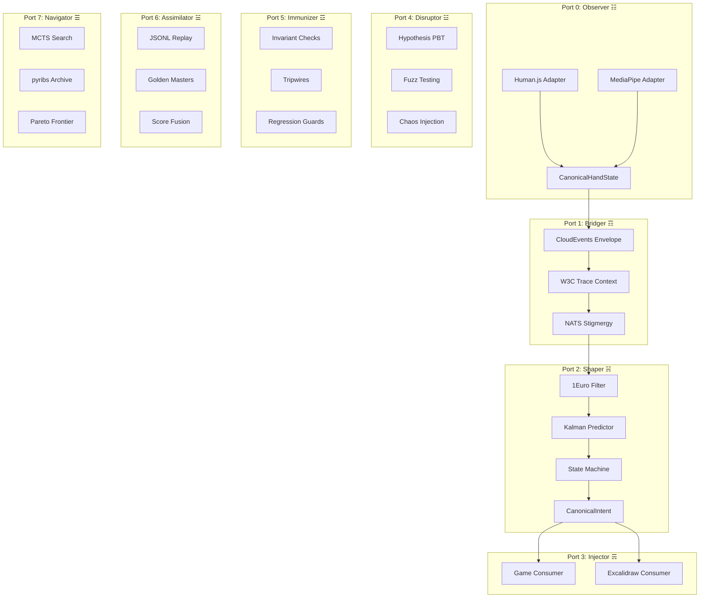

---

## Data Flow Sequence (Bridger as Substrate)

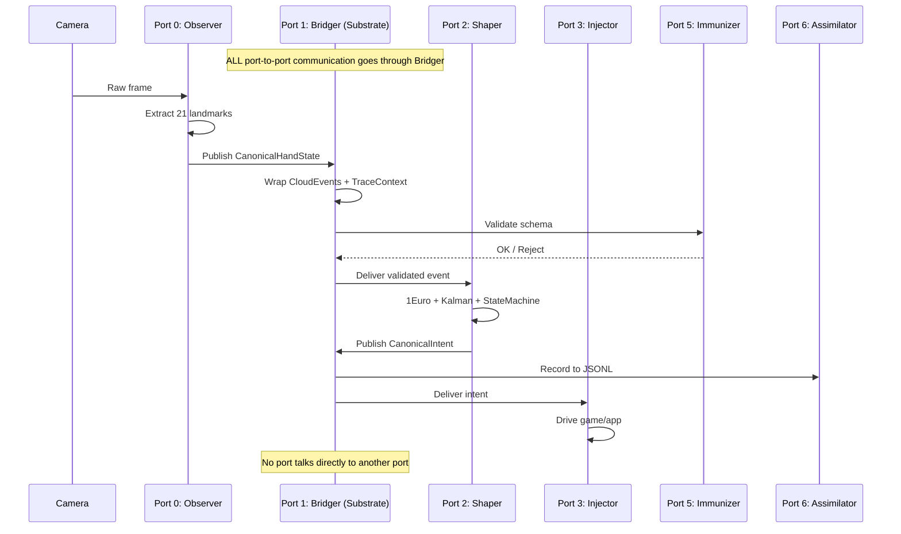

---

## State Machine (Shaper)

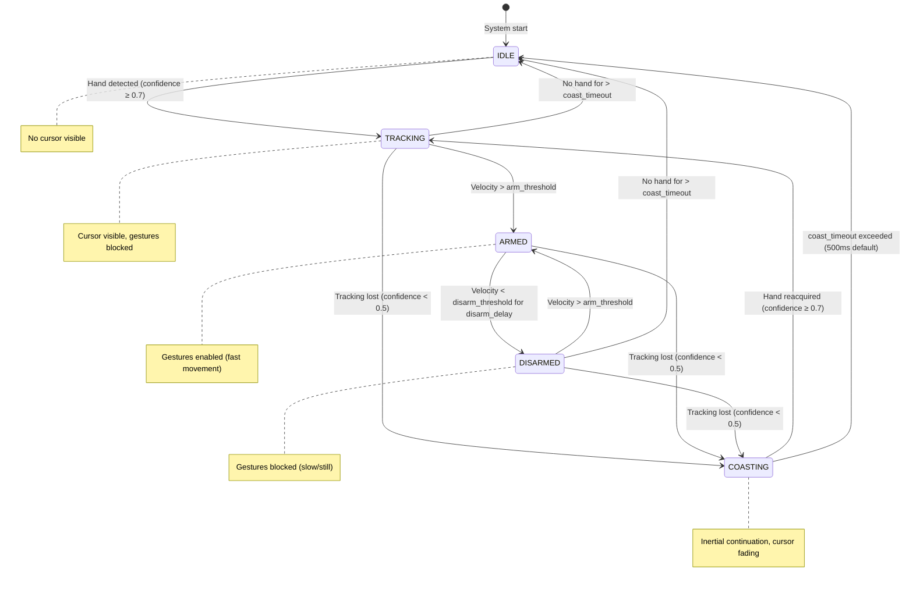

---

## Dwell/Hover Click Pattern

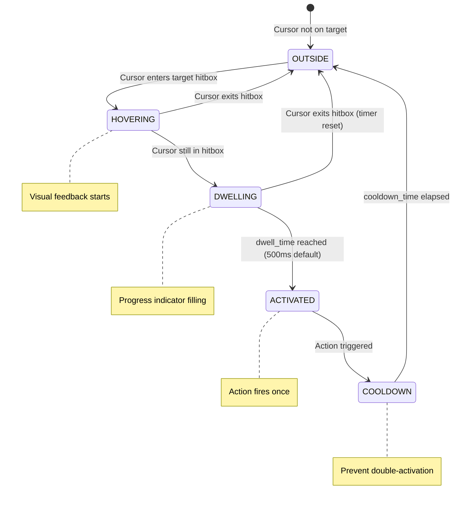

---

## Play Area and Gain Controls

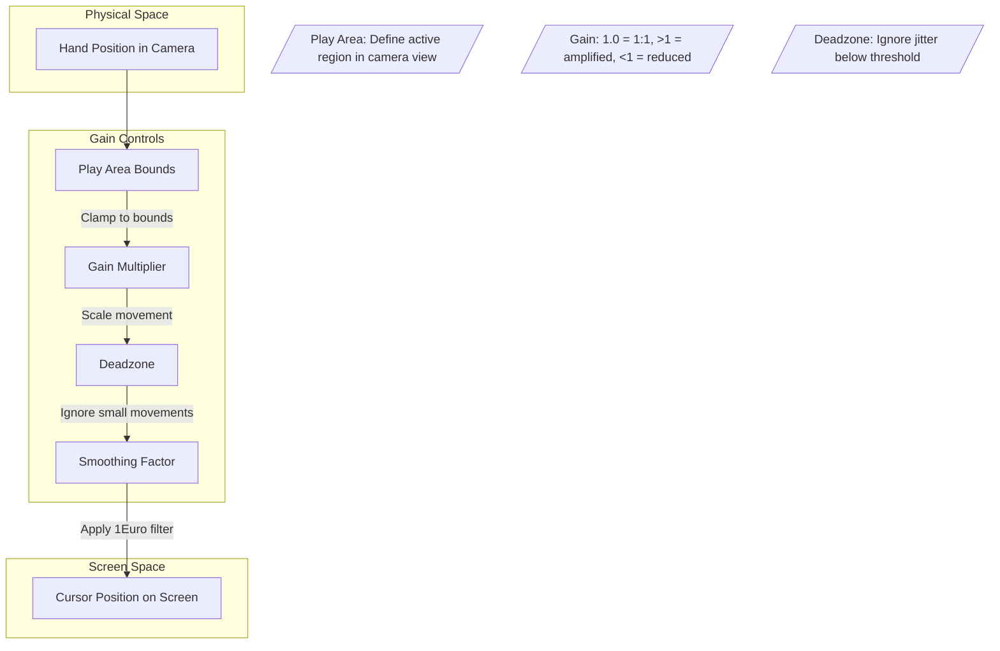

---

## Exemplar Composition Matrix

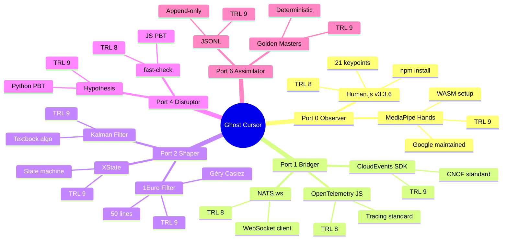

---

## Score Fusion Test Harness

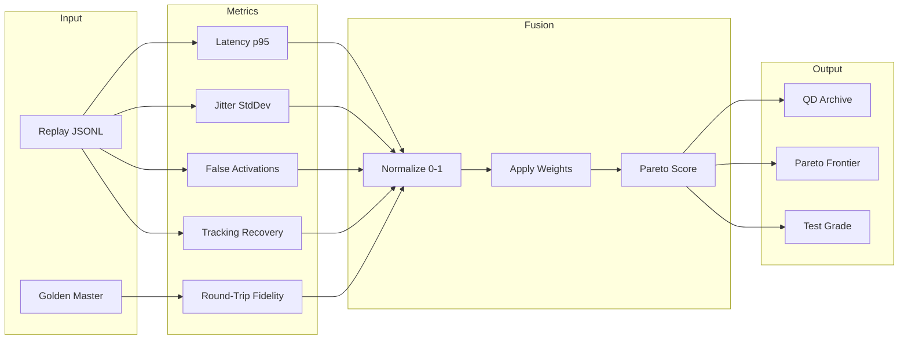

---

## The 8 Obsidian Ports (Complete Mosaic)

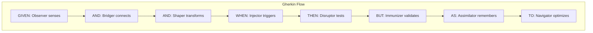

---

## Architecture Progression

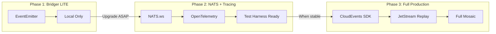

---

## Elemental Preset System

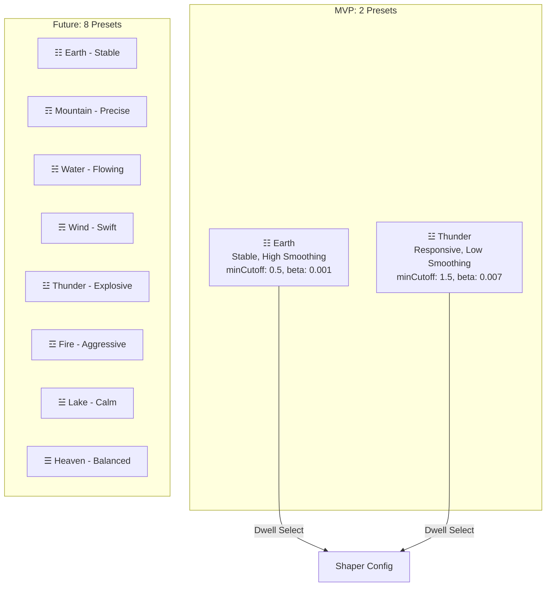

---

## Input Sources

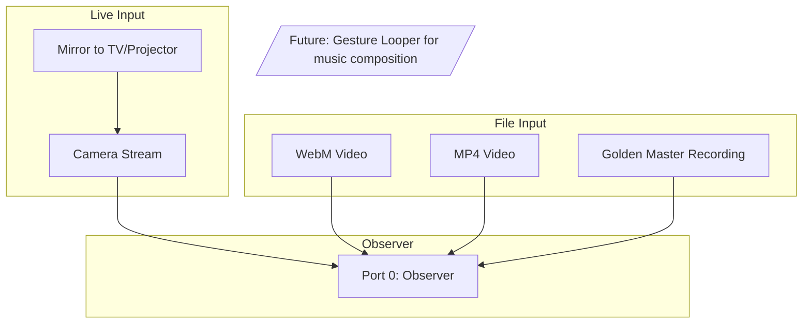

---

## Requirements

### Requirement 0: Cold Start Setup (IDE + Dependencies + Physics Checks)

**User Story:** As a developer, I want a verified development environment with all exemplars tested in isolation, so that I can build with confidence that the foundation is solid.

#### Acceptance Criteria

1. WHEN starting cold start THEN the system SHALL archive existing `src/gesture_ninja/` to `reference/gesture_ninja_archive/`
2. WHEN setting up TypeScript THEN the system SHALL install: @vladmandic/human, @webarkit/oneeurofilter-ts, xstate, cloudevents
3. WHEN setting up Python THEN the system SHALL install: hypothesis, pyribs, pydantic, fast-check (via npm for JS tests)
4. WHEN verifying Human.js THEN the system SHALL confirm hand detection returns 21 keypoints in browser
5. WHEN verifying 1Euro filter THEN the system SHALL confirm smoothing reduces jitter on test data
6. WHEN verifying XState THEN the system SHALL confirm state machine transitions correctly
7. WHEN verifying JSONL THEN the system SHALL confirm round-trip serialization produces equivalent objects
8. WHEN verifying Hypothesis THEN the system SHALL confirm random hand state generation works
9. WHEN verifying pyribs THEN the system SHALL confirm archive accepts fused scores
10. WHEN all physics checks pass THEN the system SHALL emit a READY signal before any glue code is written

### Requirement 1: Ghost Cursor Core (CanonicalIntent Output)

**User Story:** As a developer, I want a trusted pointer output that I can consume in any application, so that I can build spatial computing experiences without dealing with sensor noise.

#### Acceptance Criteria

1. WHEN the Shaper produces output THEN the system SHALL emit a CanonicalIntent with position, velocity, confidence, and armed state
2. WHEN serializing and deserializing CanonicalIntent THEN the round-trip SHALL produce an equivalent object
3. WHEN the Ghost Cursor is consumed by an Injector THEN the Injector SHALL receive position updates at ≥30fps
4. WHEN confidence drops below 0.5 THEN the system SHALL mark the cursor as low-confidence in the output
5. WHEN velocity exceeds 500px/s THEN the system SHALL mark the cursor as "armed" for gesture detection
6. WHEN velocity drops below 100px/s for 100ms THEN the system SHALL mark the cursor as "disarmed"

### Requirement 2: Port 0 Observer (Swappable Sensing)

**User Story:** As a developer, I want to swap between Human.js and MediaPipe without changing downstream code, so that I can choose the best sensor for each device.

#### Human.js Built-in Capabilities (DO NOT REINVENT):
- 21 hand keypoints (palm + 4 per finger)
- Finger curl detection: none, half, full
- Finger direction: verticalUp/Down, horizontalLeft/Right, diagonal variants
- Built-in gestures: thumbsUp, victory, point, middleFinger, openPalm
- Custom gesture definition via FingerGesture class
- Frame interpolation (time-based weighted average)

#### Acceptance Criteria

1. WHEN the Observer adapter is Human.js THEN the system SHALL extract 21 keypoints from HandResult
2. WHEN the Observer adapter is MediaPipe THEN the system SHALL extract 21 keypoints from HandLandmarkerResult
3. WHEN either adapter produces output THEN the format SHALL conform to CanonicalHandState interface
4. WHEN confidence is below 0.7 THEN the Observer SHALL mark the hand as low-confidence
5. WHEN serializing and deserializing CanonicalHandState THEN the round-trip SHALL produce an equivalent object
6. WHEN the Observer produces a hand state THEN the system SHALL publish to the Bridger
7. WHEN Human.js provides finger curl/direction THEN the Observer SHALL pass through without recomputation
8. WHEN Human.js provides gesture recognition THEN the Observer SHALL include gesture in CanonicalHandState

### Requirement 2.5: Multi-Hand Support (2 Hands = 2 Cursors)

**User Story:** As a user, I want to use both hands simultaneously with independent cursors, so that I can interact with the system using natural two-handed gestures.

#### Acceptance Criteria

1. WHEN two hands are detected THEN the system SHALL render two independent cursor elements
2. WHEN each hand is tracked THEN the system SHALL position its cursor above the index finger tip (landmark 8)
3. WHEN left hand is detected THEN the system SHALL render a cursor with distinct visual style (e.g., blue tint)
4. WHEN right hand is detected THEN the system SHALL render a cursor with distinct visual style (e.g., purple tint)
5. WHEN one hand is lost THEN the system SHALL continue tracking the remaining hand independently
6. WHEN both hands are lost THEN the system SHALL apply coasting to both cursors independently
7. WHEN serializing multi-hand state THEN the round-trip SHALL preserve both hand states correctly
8. WHEN the Observer detects hands THEN the system SHALL return an array of CanonicalHandState (up to maxDetected)

### Requirement 3: Port 1 Bridger (Contract Boundary + Telemetry)

**User Story:** As a developer, I want all inter-port communication to go through a contract boundary with trace context, so that I can debug, replay, and evolve the system without breaking changes.

#### Acceptance Criteria

1. WHEN an event crosses a port boundary THEN the Bridger SHALL wrap it in a CloudEvents envelope with specversion, type, source, id, time, and data
2. WHEN an event is published THEN the Bridger SHALL attach W3C Trace Context (traceparent) for distributed tracing
3. WHEN the event schema changes THEN the Bridger SHALL include a schema version field for evolution
4. WHEN NATS is unavailable THEN the Bridger SHALL buffer events locally and retry with exponential backoff
5. WHEN the Bridger receives an event THEN the system SHALL validate required fields before processing
6. WHEN validation fails THEN the Bridger SHALL reject the event and emit an error span

### Requirement 4: Port 2 Shaper (Predictive Latency Engine)

**User Story:** As a developer, I want a filter pipeline that converts noisy sensor data into reliable intent with negative perceived latency, so that the cursor feels instant despite processing delays.

#### Exemplar Stack:
- 1Euro Filter: @webarkit/oneeurofilter-ts (npm) - velocity-adaptive smoothing
- Kalman Filter: Custom ~50 lines - prediction for negative latency
- State Machine: XState (npm) - IDLE→TRACKING→ARMED→DISARMED→COASTING
- Human.js interpolation: Use alongside 1Euro for frame smoothing

#### Acceptance Criteria

1. WHEN the Shaper receives CanonicalHandState THEN the system SHALL apply 1Euro filtering via @webarkit/oneeurofilter-ts
2. WHEN 1Euro filter smooths position THEN the system SHALL adapt cutoff based on velocity (smooth when slow, responsive when fast)
3. WHEN tracking is lost for less than 500ms THEN the system SHALL apply inertial coasting instead of cursor disappearance
4. WHEN tracking is reacquired THEN the system SHALL apply magnetic snap (LERP over 100ms) to prevent teleportation
5. WHEN cursor position jumps more than 100px in one frame THEN the system SHALL blend with previous position (teleport rejection)
6. WHEN the cursor is disarmed THEN the system SHALL NOT emit gesture events (state machine gating via XState)
7. WHEN confidence drops below 0.5 THEN the system SHALL disarm the cursor regardless of velocity
8. WHEN printing and parsing a Shaper configuration THEN the round-trip SHALL produce an equivalent configuration
9. WHEN Human.js provides frame interpolation THEN the Shaper MAY use it in addition to 1Euro for smoother output

### Requirement 5: Port 3 Injector (Consumer Interface)

**User Story:** As a game developer, I want a stable interface to consume Ghost Cursor output, so that I can build gesture-controlled games without coupling to the cursor implementation.

#### Acceptance Criteria

1. WHEN an Injector subscribes to Ghost Cursor THEN the system SHALL provide CanonicalIntent events via callback or stream
2. WHEN CanonicalIntent includes armed=true THEN the Injector MAY interpret fast movement as a gesture
3. WHEN CanonicalIntent includes armed=false THEN the Injector SHALL NOT trigger gesture actions
4. WHEN the Injector needs position THEN the system SHALL provide screen-space coordinates (pixels)
5. WHEN the Injector needs velocity THEN the system SHALL provide velocity vector (px/s)

### Requirement 6: Port 4 Disruptor (Chaos Testing)

**User Story:** As a developer, I want adversarial testing that finds edge cases I wouldn't think of, so that the system is robust before adding new tech.

#### Acceptance Criteria

1. WHEN running property tests THEN the Disruptor SHALL generate random hand states using polymorphic PBT adapters (Hypothesis for Python, fast-check for TypeScript)
2. WHEN running fuzz tests THEN the Disruptor SHALL inject corrupted events (missing fields, invalid values)
3. WHEN running chaos tests THEN the Disruptor SHALL simulate tracking loss, jitter spikes, and latency
4. WHEN a property test fails THEN the Disruptor SHALL report the minimal failing example
5. WHEN the system is under chaos THEN the Shaper SHALL maintain safety invariants (no false activations)
6. WHEN adding a new PBT adapter THEN the system SHALL require only implementing the TestStrategy interface
7. WHEN test results are produced THEN the system SHALL serialize to JSONL for cross-language comparison

### Requirement 7: Port 5 Immunizer (Validation + Regression Guards)

**User Story:** As a developer, I want invariant checks and regression guards that catch violations before they cause harm, so that the system fails safely and new tech doesn't break existing behavior.

#### Acceptance Criteria

1. WHEN a CanonicalHandState is produced THEN the Immunizer SHALL validate all required fields are present
2. WHEN confidence is outside [0, 1] THEN the Immunizer SHALL reject the event and emit an anomaly span
3. WHEN velocity exceeds physically plausible limits (>2000px/s) THEN the Immunizer SHALL flag as anomaly
4. WHEN the cursor is disarmed THEN the Immunizer SHALL verify no gesture events are emitted (invariant)
5. WHEN a new exemplar is added THEN the Immunizer SHALL run regression tests against golden masters
6. WHEN regression tests fail THEN the Immunizer SHALL block the change and report the delta

### Requirement 8: Port 6 Assimilator (Replay + Score Fusion)

**User Story:** As a developer, I want to record sessions, replay them deterministically, and compute fused scores for Pareto optimization, so that I can measure improvements and explore the design space.

#### Acceptance Criteria

1. WHEN a session starts THEN the Assimilator SHALL begin recording all events to JSONL with monotonic timestamps
2. WHEN a session ends THEN the Assimilator SHALL auto-save the replay to local storage
3. WHEN a replay is loaded THEN the Assimilator SHALL feed events to the Shaper in recorded order
4. WHEN replaying THEN the Shaper SHALL produce the same output sequence within tolerance (determinism)
5. WHEN computing metrics THEN the Assimilator SHALL measure latency, jitter, false activations, tracking recovery, and round-trip fidelity
6. WHEN fusing scores THEN the Assimilator SHALL normalize each metric to [0,1] and apply configurable weights
7. WHEN a golden baseline exists THEN the system SHALL compare actual vs expected and report regressions

### Requirement 9: Port 7 Navigator (DSE + Pareto Optimization)

**User Story:** As a developer, I want the system to explore the design space and optimize toward the Pareto frontier, so that it improves as new exemplars become commoditized.

#### Acceptance Criteria

1. WHEN replay data is available THEN the Navigator SHALL compute fused scores for the QD archive
2. WHEN scores are computed THEN the Navigator SHALL store them in the pyribs MAP-Elites archive
3. WHEN optimizing THEN the Navigator SHALL use MCTS to explore parameter space (filter cutoffs, thresholds)
4. WHEN a better parameter set is found THEN the Navigator SHALL propose it as a new preset
5. WHEN evaluating alternatives THEN the Navigator SHALL perform AoA trade analysis with TRL, integration effort, and test coverage
6. WHEN score fusion weights are needed THEN the Navigator SHALL load them from configurable YAML (default: equal weights)
7. WHEN genetic programming is enabled THEN the Navigator SHALL evolve optimal weight configurations via QD archive
8. WHEN printing and parsing score fusion configuration THEN the round-trip SHALL produce an equivalent configuration

### Requirement 10: Dwell/Hover Click Interaction

**User Story:** As a user, I want to activate UI elements by hovering over them for a set time, so that I can interact without needing a physical click gesture.

#### Acceptance Criteria

1. WHEN the cursor enters a target hitbox THEN the system SHALL start a dwell timer
2. WHEN the cursor remains in the hitbox for dwell_time (default 500ms) THEN the system SHALL trigger the activation
3. WHEN the cursor exits the hitbox before dwell_time THEN the system SHALL reset the timer
4. WHEN activation occurs THEN the system SHALL enter cooldown to prevent double-activation
5. WHEN dwelling THEN the system SHALL provide visual feedback (progress indicator)

### Requirement 10.5: Pinch Click Interaction (Thumb-to-Index)

**User Story:** As a user, I want to click by pinching my thumb and index finger together, so that I have an alternative to dwell clicking for faster interactions.

#### Gesture Pattern (Adopted from NonMouse):
- Click: Thumb tip touches index finger second joint
- Release: Thumb and index finger separate
- Double-click: Two pinches within 500ms

#### Acceptance Criteria

1. WHEN thumb tip approaches index finger second joint (distance < threshold) THEN the system SHALL trigger a click event
2. WHEN thumb and index finger separate (distance > threshold) THEN the system SHALL trigger a release event
3. WHEN two click events occur within 500ms THEN the system SHALL emit a double-click event
4. WHEN pinch click is detected THEN the system SHALL provide visual feedback (color change on cursor)
5. WHEN pinch click mode is active THEN the system SHALL disable dwell clicking to prevent conflicts
6. WHEN the user configures interaction mode THEN the system SHALL allow switching between dwell and pinch modes
7. WHEN Human.js provides finger curl/direction THEN the system SHALL use it to detect pinch gesture

### Requirement 10.6: Scroll Gesture (Index Finger Curl)

**User Story:** As a user, I want to scroll by curling my index finger, so that I can navigate content without switching interaction modes.

#### Gesture Pattern (Adopted from NonMouse):
- Scroll mode: Index finger curled (half or full curl)
- Scroll direction: Hand movement up/down while in scroll mode
- Exit scroll: Index finger extended

#### Acceptance Criteria

1. WHEN index finger curl is detected (half or full) THEN the system SHALL enter scroll mode
2. WHEN in scroll mode AND hand moves up THEN the system SHALL emit scroll-up events
3. WHEN in scroll mode AND hand moves down THEN the system SHALL emit scroll-down events
4. WHEN index finger extends (no curl) THEN the system SHALL exit scroll mode
5. WHEN in scroll mode THEN the system SHALL provide visual feedback (scroll indicator)
6. WHEN scroll mode is active THEN the system SHALL pause cursor movement
7. WHEN Human.js provides finger curl detection THEN the system SHALL use it for scroll gesture

### Requirement 11: Play Area and Gain Controls

**User Story:** As a user, I want to configure the active region and sensitivity of the cursor, so that I can use the system comfortably in different physical setups.

#### Acceptance Criteria

1. WHEN configuring play area THEN the system SHALL allow defining bounds within the camera view
2. WHEN the hand is outside play area THEN the system SHALL clamp cursor to screen edges
3. WHEN gain is configured THEN the system SHALL scale cursor movement (1.0 = 1:1, >1 = amplified)
4. WHEN deadzone is configured THEN the system SHALL ignore movements below the threshold
5. WHEN printing and parsing gain configuration THEN the round-trip SHALL produce an equivalent configuration

### Requirement 12: Ghost Cursor Presets (Elemental Styles)

**User Story:** As a user, I want to choose between different cursor behavior presets, so that I can pick the style that feels best for my use case.

#### Acceptance Criteria

1. WHEN the system starts THEN the system SHALL offer 2 presets: Earth (stable, high smoothing) and Thunder (responsive, low smoothing)
2. WHEN a preset is selected THEN the Shaper SHALL apply that preset's filter parameters (1Euro cutoffs, arm/disarm thresholds)
3. WHEN switching presets THEN the system SHALL log the change to the replay stream
4. WHEN a preset is active THEN the cursor visual style SHALL reflect the element (color, trail effect)
5. WHEN the system evolves THEN the system SHALL support up to 8 elemental presets with custom tuning

### Requirement 13: Video Input Mode (Replay from File)

**User Story:** As a developer, I want to load a video file (webm/mp4) instead of live camera, so that I can test and debug without needing a live hand.

#### Acceptance Criteria

1. WHEN a video file is loaded THEN the Observer SHALL process frames from the video instead of camera
2. WHEN processing video THEN the system SHALL maintain the same pipeline (Observer → Bridger → Shaper → Injector)
3. WHEN video playback ends THEN the system SHALL emit an end-of-stream event
4. WHEN video is paused THEN the system SHALL pause event emission
5. WHEN video is seeked THEN the system SHALL reset state machine and resume from new position

### Requirement 14: User Environment Prompting

**User Story:** As a user, I want guidance on setting up my environment, so that I can get the best tracking quality.

#### Acceptance Criteria

1. WHEN the system starts THEN the system SHALL prompt user to ensure clean background and good lighting
2. WHEN tracking quality is poor THEN the system SHALL suggest environment improvements
3. WHEN confidence is consistently low THEN the system SHALL offer to switch to a more robust preset
4. WHEN the user dismisses prompts THEN the system SHALL remember the preference

### Requirement 14.5: Multiple Camera Placement Modes

**User Story:** As a user, I want to choose how my camera is positioned relative to my hand, so that I can use the system in different physical setups.

#### Camera Placement Options (Adopted from NonMouse):
- **Normal**: Camera facing user (laptop webcam, standard setup)
- **Above**: Camera pointing down at hands on desk (overhead mount)
- **Behind**: Camera behind user pointing at display (AR/projection setup)

#### Acceptance Criteria

1. WHEN the system starts THEN the system SHALL offer camera placement selection: Normal, Above, or Behind
2. WHEN Normal placement is selected THEN the system SHALL expect hand in front of camera (standard webcam)
3. WHEN Above placement is selected THEN the system SHALL expect hand below camera (overhead view)
4. WHEN Behind placement is selected THEN the system SHALL expect hand between camera and display
5. WHEN camera placement changes THEN the system SHALL adjust coordinate mapping accordingly
6. WHEN printing and parsing camera placement configuration THEN the round-trip SHALL produce an equivalent configuration
7. WHEN the user selects a placement THEN the system SHALL persist the preference
8. WHEN Above placement is active THEN the system SHALL invert Y-axis for natural cursor movement

### Requirement 15: Adaptive Thresholds (Zero Magic Numbers)

**User Story:** As a developer, I want all thresholds to be adaptive and configurable, so that the system works across different screen sizes, camera setups, and user preferences without hardcoded constants.

#### Acceptance Criteria

1. WHEN a threshold is defined THEN the system SHALL express it as a ratio of available space (not absolute pixels)
2. WHEN arm_threshold is needed THEN the system SHALL compute it as a percentage of screen diagonal per second
3. WHEN disarm_threshold is needed THEN the system SHALL compute it as a percentage of screen diagonal per second
4. WHEN play_area bounds are needed THEN the system SHALL express them as normalized coordinates [0,1]
5. WHEN a magic number is detected in code THEN the Immunizer SHALL reject the change and require configuration
6. WHEN thresholds are loaded THEN the system SHALL validate ranges and emit warnings for extreme values
7. WHEN printing and parsing threshold configuration THEN the round-trip SHALL produce an equivalent configuration
8. WHEN the user tunes thresholds THEN the system SHALL persist preferences and log changes to replay stream

### Requirement 16: Polymorphic Adapter Architecture

**User Story:** As a developer, I want every port boundary to use swappable adapters, so that I am never locked into a vendor, language, or format.

#### Acceptance Criteria

1. WHEN an Observer adapter is added THEN the system SHALL require only implementing the ObserverPort interface
2. WHEN a Bridger transport is added THEN the system SHALL require only implementing the BridgerPort interface
3. WHEN a Shaper filter is added THEN the system SHALL require only implementing the FilterPort interface
4. WHEN an Injector consumer is added THEN the system SHALL require only implementing the InjectorPort interface
5. WHEN a Disruptor test strategy is added THEN the system SHALL require only implementing the TestStrategyPort interface
6. WHEN an Assimilator storage is added THEN the system SHALL require only implementing the StoragePort interface
7. WHEN cross-language communication is needed THEN the system SHALL use JSONL as the interchange format
8. WHEN printing and parsing port configuration THEN the round-trip SHALL produce an equivalent configuration

### Requirement 17: Exemplar Composition Workflow

**User Story:** As a developer, I want a systematic workflow for discovering, wrapping, and grading exemplars, so that I can assemble mosaic tiles with confidence.

#### Acceptance Criteria

1. WHEN a new problem class is identified THEN the system SHALL search for exemplars via web search
2. WHEN an exemplar is found THEN the system SHALL record it with TRL, source, and integration notes
3. WHEN an exemplar is wrapped via strangler fig THEN the system SHALL run physics checks before integration
4. WHEN an exemplar is tested THEN the system SHALL compute a fused score and update the grade
5. WHEN the matrix is queried THEN the system SHALL return all exemplars for a given problem class sorted by score

### Requirement 18: MCP Wrapper Architecture (Exemplar Isolation)

**User Story:** As a developer, I want each exemplar wrapped as an MCP tool, so that I can test, swap, and monitor components independently.

#### Acceptance Criteria

1. WHEN Human.js is used THEN the system SHALL expose it via mcp-human-js wrapper with detect, gesture, and fingerpose tools
2. WHEN 1Euro filter is used THEN the system SHALL expose it via mcp-1euro wrapper with smooth and configure tools
3. WHEN XState is used THEN the system SHALL expose it via mcp-xstate wrapper with transition and getState tools
4. WHEN JSONL replay is used THEN the system SHALL expose it via mcp-jsonl wrapper with record, playback, and compare tools
5. WHEN score fusion is computed THEN the system SHALL expose it via mcp-score-fusion wrapper with compute and configure tools
6. WHEN an MCP wrapper is called THEN the system SHALL log the call to the Assimilator for replay
7. WHEN swapping an exemplar THEN the system SHALL require only changing the MCP wrapper configuration
8. WHEN testing in isolation THEN the system SHALL allow calling any MCP wrapper without the full pipeline

---

## Non-Functional Requirements

### NFR-1: Performance (Target: Mid-Range Smartphone)

1. WHEN running on mid-range smartphone (3rd world market) THEN the system SHALL maintain ≥30fps for gesture processing
2. WHEN running on target device THEN the system SHALL keep p95 input→output latency ≤100ms
3. WHEN mirroring to TV/projector THEN the system SHALL maintain ≥30fps with acceptable latency
4. WHEN running on-device (no mirror) THEN the system SHALL maintain ≥30fps

### NFR-2: Reliability

1. WHEN tracking is lost THEN the system SHALL apply coasting for ≤500ms before marking as lost
2. WHEN NATS connection is lost THEN the system SHALL buffer events and reconnect automatically

### NFR-3: Evolvability

1. WHEN adding a new Observer adapter THEN the system SHALL require only implementing the CanonicalHandState interface
2. WHEN adding a new Injector consumer THEN the system SHALL require only consuming CanonicalIntent
3. WHEN adding a new exemplar THEN the system SHALL require passing regression guards before merge

### NFR-4: Anti-Hallucination

1. WHEN claiming completion THEN the system SHALL show executable test output as proof
2. WHEN adding new tech THEN the system SHALL pass physics checks and regression guards first
3. WHEN searching for exemplars THEN the system SHALL verify source exists via web fetch

---

*Gen 76 | HFO Mosaic Ghost Cursor | Capacity Engineering Platform | Phoenix Protocol Cold Start | 2025-12-17*
