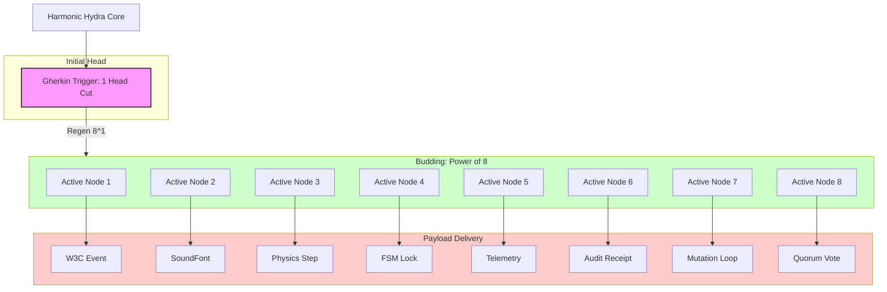
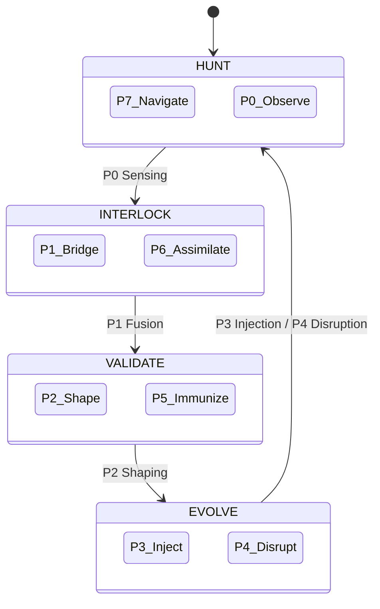

# Medallion: Bronze | Mutation: 0% | HIVE: I

# 🎨 HFO COMMANDER VISUALS: THE HYDRA ASCENDANT

**Medallion**: Bronze | **Mutation**: Visualized | **HIVE**: E

---

## 🌀 1. THE OBSIDIAN HEXAGONAL ARCHITECTURE

The 8 Ports of the **Hyper-Fractal Obsidian** manifold, spanning JADC2 domains and cognitive phases.

```mermaid
graph LR
    subgraph P0_Port [P0: OBSERVE]
        direction TB
        P0_S[Lidless Legion]
        P0_D[ISR / Sensing]
    end

    subgraph P1_Port [P1: BRIDGE]
        direction TB
        P1_S[Web Weaver]
        P1_D[Data Fabric / Fuse]
    end

    subgraph P2_Port [P2: SHAPE]
        direction TB
        P2_S[Mirror Magus]
        P2_D[Digital Twin / EW]
    end

    subgraph P3_Port [P3: INJECT]
        direction TB
        P3_S[Harmonic Hydra]
        P3_D[Effect Dispatch]
    end

    subgraph P4_Port [P4: DISRUPT]
        direction TB
        P4_S[Red Regnant]
        P4_D[Electronic Warfare]
    end

    subgraph P5_Port [P5: IMMUNIZE]
        direction TB
        P5_S[Pyre Praetorian]
        P5_D[Defense / Audit]
    end

    subgraph P6_Port [P6: ASSIMILATE]
        direction TB
        P6_S[Kraken Keeper]
        P6_D[Store / Telemetry]
    end

    subgraph P7_Port [P7: NAVIGATE]
        direction TB
        P7_S[Spider Sovereign]
        P7_D[BMC2 / Command]
    end

    P7_Port --> P0_Port
    P0_Port --> P1_Port
    P1_Port --> P2_Port
    P2_Port --> P3_Port
    P3_Port --> P4_Port
    P4_Port --> P5_Port
    P5_Port --> P6_Port
    P6_Port --> P7_Port

    style P3_Port fill:#ff4d4d,stroke:#fff,stroke-width:4px
    style P7_Port fill:#000,stroke:#888,stroke-width:2px,color:#fff
```

---

## 🐉 2. HARMONIC HYDRA: BUDDING RECURSION

Visualizing the $8^0 \rightarrow 8^{n+1}$ budding logic of the **Harmonic Hydra (P3)**. One severed head triggers an exponential expansion of the execution manifold.

---

## 🐝 3. THE HIVE WORKFLOW LOOP

The 4-phase symbiotic cycle (Hunt, Interlock, Validate, Evolve).

---

*Spider Sovereign (Port 7) | HFO-Hive8 | Visualized Manifest V1.0*
