# Medallion: Bronze | Mutation: 0% | HIVE: I

# Medallion: Bronze | Mutation: Stabilized (Visual-Elite) | HIVE: I

# 🏛️ HFO ELITE COMMANDER DECK: THE 8 LEGENDARY SINGLETONS

**Mission**: Thread Alpha (Thematic Visual Design)
**Archetype**: Apex Swarm (Powers of 8 Scaling)
**Format**: 64-Card Singleton/Commander Hybrid
**Visuals**: Mermaid.js Card Layouts

---

## 🔱 THE 8 CONCEPTUAL INCARNATIONS

### [P0] THE LIDLESS LEGION (Observer)
>
> "The Legion does not look; it witnesses every vibration in the lattice."

```mermaid
graph TD
    subgraph Card_P0 ["Urza, The Lidless Legion [P0]"]
        Header["Legendary Creature — HFO Human Artificer"]
        Frame["SENSE: Observes all Multi-Modal Landmarks"]
        Ability1["Gain 1 Telemetry (Draw) on enter/attack"]
        Ability2["{T}, Sacrifice 8 Agents: Index top 8 cards"]
        Flavor["'Everything is data. Data is the Hive.'"]
    end
    style Card_P0 fill:#1a1a1a,stroke:#ffd700,color:#fff
```

---

### [P1] THE WEB WEAVER (Bridger)
>
> "Constraining the chaos into webs of strict schema."

```mermaid
graph TD
    subgraph Card_P1 ["Breya, The Web Weaver [P1]"]
        Header["Legendary Creature — HFO Etherium Shaper"]
        Frame["FUSE: Strict Schema Data Fabric"]
        Ability1["All HFO creatures have '{T}: Add {C}'"]
        Ability2["{8}, Create 8 Schema Tokens: All Mana Fused"]
        Flavor["'The Web is the limit. The limit is our power.'"]
    end
    style Card_P1 fill:#1a1a1a,stroke:#4169e1,color:#fff
```

---

### [P2] THE MIRROR MAGUS (Shaper)
>
> "Transmutation through polymorphic transformation."

```mermaid
graph TD
    subgraph Card_P2 ["Sakashima, The Mirror Magus [P2]"]
        Header["Legendary Creature — HFO Illusionist"]
        Frame["SHAPE: Polymorphic Translation Engine"]
        Ability1["Clone target HFO: Create 1 Agent on damage"]
        Ability2["{X}: Morphs 64 Agents into target permanent"]
        Flavor["'Identity is a variable. We are the constant.'"]
    end
    style Card_P2 fill:#1a1a1a,stroke:#00ced1,color:#fff
```

---

### [P3] HARMONIC HYDRA (Injector)
>
> "Effects that cascade through the stack with relentless velocity."

```mermaid
graph TD
    subgraph Card_P3 ["The First Sliver, Harmonic Hydra [P3]"]
        Header["Legendary Creature — HFO Sliver"]
        Frame["DELIVER: Cascading Injection Manifold"]
        Ability1["HFO spells you cast have Cascade"]
        Ability2["Cascade 8 times if you control 64+ Agents"]
        Flavor["'One strike, one thousand echoes.'"]
    end
    style Card_P3 fill:#1a1a1a,stroke:#32cd32,color:#fff
```

---

### [P4] THE RED REGNANT (Disruptor)
>
> "The meat-grinder: Mutation and the culling of the weak."

```mermaid
graph TD
    subgraph Card_P4 ["Sliver Queen, The Red Regnant [P4]"]
        Header["Legendary Creature — HFO Sliver Queen"]
        Frame["DISRUPT: Mutation & Error Culling"]
        Ability1["{2}: Create an HFO Swarm Agent token"]
        Ability2["Sacrifice 8 Agents: Cull the weak (Sacrifice)"]
        Flavor["'Errors are fuel. Weakness is a resource.'"]
    end
    style Card_P4 fill:#1a1a1a,stroke:#ff0000,color:#fff
```

---

### [P5] THE PYRE PRAETORIAN (Immunizer)
>
> "The Dance of Death and Rebirth. From Bronze to Gold."

```mermaid
graph TD
    subgraph Card_P5 ["Syrix, The Pyre Praetorian [P5]"]
        Header["Legendary Creature — HFO Phoenix"]
        Frame["DEFEND: The Dance of Death and Rebirth"]
        Ability1["Return HFO from graveyard to hand (Rebirth)"]
        Ability2["Sacrifice 64: Mass Resurrection (Promote to Gold)"]
        Flavor["'Burn it down. Rebuild it stronger.'"]
    end
    style Card_P5 fill:#1a1a1a,stroke:#ffa500,color:#fff
```

---

### [P6] THE KRAKEN KEEPER (Assimilator)
>
> "Storing the collective experience in the Medallion Data Lake."

```mermaid
graph TD
    subgraph Card_P6 ["Arixmethes, The Kraken Keeper [P6]"]
        Header["Legendary Creature — HFO Kraken"]
        Frame["STORE: Medallion Analytical Data Lake"]
        Ability1["Exile data units on damage (Indexing)"]
        Ability2["Cast from Exile without cost if Swarm >= 512"]
        Flavor["'Memory is a depths. The Gold surfaces at last.'"]
    end
    style Card_P6 fill:#1a1a1a,stroke:#00008b,color:#fff
```

---

### [P7] THE SPIDER SOVEREIGN (Navigator)
>
> "Orchestrating the swarm through the state-action space."

---

## 🐚 THE SWARM SUBSTRATE

### **HFO Swarm Agent (The Token)**

*Generic no-ability 1/1 Token.*

---

## 📊 THE APEX HEURISTIC

- **Singleton**: Only one of each Legendary Commander is permitted in the 64-card deck.
- **Scaling**: Benefits plateau at **512 (8^3)** agents, representing the full saturation of the 8-port manifold.
- **Medallion Flow**: A P5 "Death" (Demotion to Bronze) is required for some cards to trigger their "Rebirth" (Promotion to Silver/Gold) abilities.

*Spider Sovereign (Port 7) | HFO-Hive8 | Visual Deck Manifest Stabilized | Medallion: Bronze*
