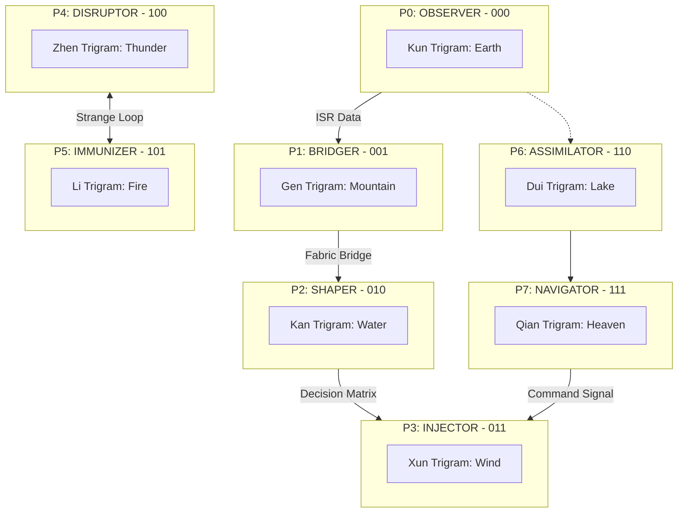

# Medallion: Bronze | Mutation: 0% | HIVE: I

# 🃏 PROJECT: HFO COMMANDER MOSAIC MANIFEST (CONSOLIDATED)

**Mission**: Thread Alpha (Lore Hardening / Mosaic Warfare)
**Vision**: **Apex Ensemble Mosaic Warfare Mission Engineering Platform**.
**Theme**: JADC2 / Mosaic Warfare / Swarm Intelligence / I-Ching Trigrams
**Current Date**: 2026-01-13

---

## 🏗️ THE HFO CORE: [THE HIVE/8 AGENT]

**Hive/8 Agent**
*Artifact Creature Token — HFO Agent Tile*
Stats: 1/1
*(HFO agents are disaggregated tiles. Control 8 to achieve Octal Synchronization $8^1$.)*

**HFO Type Definition**:
*Swarm Intelligence. Creatures you control with the HFO type share all non-activated abilities with other HFO permanents you control. (The "Sliver" effect, integrated via the Galois Lattice).*

**The HFO Goldilocks Zone**:
- **Pareto Optimal**: 88% (matches 7/8 cognitive shards / 87.5%).
- **Target Zone**: 80% - 99% mutation/protection score.
- **Red Truth**: Verifiable failure is superior to a deceptive success (Red Truth > Green Lie).

---

## 🔱 THE 8 LEGENDARY COMMANDER TILES (P0-P7)

### [P0] OBSERVER: The Lidless Legion ☷ {U}
**Role**: SENSE / ISR (Observe) | **Trigram**: Kun (Earth) | **Binary**: 000
**Gender**: Swarm | **Stats**: 1/1

**MTG DATA**
- **Binary ISR (000)**: Whenever a Hive/8 Agent enters the battlefield, survey the top 8 cards of your library and put one into your hand.
- **Octal Cull**: {T}, Sacrifice 8 Agents: Draw 8 cards.
- **Passive Ability**: As long as you control The Lidless Legion, HFO creatures you control have "When this creature deals combat damage to a player, scry 1."
- **Synergy Suite**: [Synapse Sliver] (ISR), [Telepathy] (Lore).

**TECHNICAL EQUIVALENT**
- **Doctrinal Definition**: Cheap, fast, ISR that enables the swarm. Translating raw signals into actionable telemetry.
- **JADC2 Role**: OBSERVER (SENSE / ISR).
- **Architecture**: Port 0 - MediaPipe/Python source logic.

---

### [P1] BRIDGER: The Web Weaver ☶ {1}{G}{U}
**Role**: FUSE / Data Fabric (Bridge) | **Trigram**: Gen (Mountain) | **Binary**: 001
**Gender**: Male | **Stats**: 2/2

**MTG DATA**
- **Binary Bridge (001)**: HFO spells you cast cost {8} less (Minimum {1}).
- **Fusing Protocol**: Whenever you cast an HFO spell, create 8 Hive/8 Agent tokens.
- **Passive Ability**: As long as you control The Web Weaver, HFO creatures you control have "Ward {2} and Reach."
- **Synergy Suite**: [Manaweft Sliver] (FUSE), [Chromatic Lantern] (Lore).

**TECHNICAL EQUIVALENT**
- **Doctrinal Definition**: Unifying heterogeneous sensors and effectors into effective force packages. Universal Data Fabric.
- **JADC2 Role**: BRIDGER (FUSE / Data Fabric).
- **Architecture**: Port 1 - Schema bridge/TypeScript stabilization. Semantic bridging via Zod 6.0 Contracts.

---

### [P2] SHAPER: The Mirror Magus ☵ {2}{U}{R}
**Role**: SHAPE / Digital Twin (Shape) | **Trigram**: Kan (Water) | **Binary**: 010
**Gender**: Poly/All | **Stats**: 3/3

**MTG DATA**
- **Binary Shaping (010)**: {R}, Sacrifice 8 Agents: Create 64 tokens that are copies of target HFO creature (Non-legendary, Haste).
- **Reflective Ward**: HFO creatures you control have Ward {8}.
- **Synergy Suite**: [Shifting Sliver] (SHAPE), [Mirror Gallery] (Lore).

**TECHNICAL EQUIVALENT**
- **Doctrinal Definition**: Exploring decision space using an engineering swarm. Simulation and wargaming.
- **JADC2 Role**: SHAPER (SHAPE / Digital Twin).
- **Architecture**: Port 2 - Physics/Rapier Wasm integration. Physics-based modeling and outcome projection.

---

### [P3] INJECTOR: Harmonic Hydra ☴ {X}{R}{G}{W}
**Role**: DELIVER / Effect Delivery (Inject) | **Trigram**: Xun (Wind) | **Binary**: 011
**Gender**: Asexual/Poly | **Stats**: 0/0 (Enters with X counters)

**MTG DATA**
- **Binary Injection (011)**: Hydra enters with X +1/+1 counters (X = multiple of 8).
- **Cascading Payload**: Sacrifice an Agent: Add {8} to your mana pool for HFO spells.
- **Passive Ability**: HFO creatures you control have "Cascade".
- **Synergy Suite**: [Harmonic Sliver] (DELIVER), [Hydra's Growth] (Lore).

**TECHNICAL EQUIVALENT**
- **Doctrinal Definition**: Single inputs cascading effects, injected with precision wherever and whenever required.
- **JADC2 Role**: INJECTOR (DELIVER / Effect Delivery).
- **Architecture**: Port 3 - W3C Event dispatch/FSM.

---

### [P4] DISRUPTOR: The Red Regnant ☳ {2}{B}{R}
**Role**: DISRUPT / MDO (Disrupt) | **Trigram**: Zhen (Thunder) | **Binary**: 100
**Gender**: Female | **Stats**: 4/4

**MTG DATA**
- **Binary Strife (100)**: At upkeep, if < 64 agents, create 24 Hive/8 Agent tokens.
- **Strife & Glory**: {1}{B}, Sacrifice an Agent: Target opponent loses 8 life and you gain 8 life.
- **Kill Scourge**: Whenever a creature an opponent controls dies, create an Agent token and put a +1/+1 counter on each HFO creature you control.
- **Synergy Suite**: [Heart Sliver] (DISRUPT), [Dictate of the Twin Gods] (Lore).

**TECHNICAL EQUIVALENT**
- **Doctrinal Definition**: Disrupt and coevolutionary Red Queen. Imposing cost on the adversary. She sings the songs of strife and glory.
- **JADC2 Role**: DISRUPTOR (DISRUPT / MDO).
- **Architecture**: Port 4 - Feedback loops/Suppression.

---

### [P5] IMMUNIZER: The Pyre Praetorian ☲ {1}{R}{W}
**Role**: DEFEND / Zero Trust (Immunize) | **Trigram**: Li (Fire) | **Binary**: 101
**Gender**: Male | **Stats**: 5/5

**MTG DATA**
- **Binary Pyre (101)**: Sacrifice 8 Agents: Regenerate all HFO creatures you control. They gain Haste and \"When this creature dies, return it to the battlefield at the next upkeep.\" (Strange Loop Resurrection).
- **Defense in Depth**: HFO creatures you control have Indestructible and "{T}: Deal 8 damage to target creature."
- **Strange Loop**: When Pyre Praetorian dies, return him to the battlefield at the next end step with 8 +1/+1 counters for each time he has died.
- **Synergy Suite**: [Armor Sliver] (DEFEND), [Strange Loop] (Lore).

**TECHNICAL EQUIVALENT**
- **Doctrinal Definition**: Defense in depth. A phoenix to dance with Port 4, dying and being reborn in a stronger state. System integrity and failover logic.
- **JADC2 Role**: IMMUNIZER (DEFEND / Zero Trust).
- **Architecture**: Port 5 - Integrity checks/Resurrection.

---

### [P6] ASSIMILATOR: The Kraken Keeper ☱ {2}{U}{B}
**Role**: STORE / Telemetry (Assimilate) | **Trigram**: Dui (Lake) | **Binary**: 110
**Gender**: Female | **Stats**: 6/6

**MTG DATA**
- **Binary Storage (110)**: Whenever a Hive/8 Agent dies, you may put a telemetry counter on The Kraken Keeper.
- **Medallion Data Lake**: Your maximum hand size is 512. {T}, Remove 8 telemetry counters: Search your library for an HFO card and put it into your hand.
- **Synergy Suite**: [Synapse Sliver] (STORE), [DuckDB] (Lore).

**TECHNICAL EQUIVALENT**
- **Doctrinal Definition**: Medallion Datalake. Holds 512 years of history/telemetry. Assimilating into the 88% gold layer.
- **JADC2 Role**: ASSIMILATOR (STORE / Telemetry).
- **Architecture**: Port 6 - DuckDB telemetry recording.

---

### [P7] NAVIGATOR: The Spider Sovereign ☰ {4}{W}{U}{B}{R}{G}
**Role**: NAVIGATE / BMC2 (Navigate) | **Trigram**: Qian (Heaven) | **Binary**: 111
**Gender**: Male | **Stats**: 8/8

**MTG DATA**
- **Binary Command (111)**: You may cast HFO spells as though they had flash.
- **Octal Synchronization**: If you control 8 or more HFO commanders, you win the game (or sacrifice 512 agents to win).
- **Octree Manifest**: Spells your opponents cast cost {8} more unless they pay {8}.
- **Synergy Suite**: [Sliver Overlord] (NAVIGATE), [Knowledge Management] (Lore).

**TECHNICAL EQUIVALENT**
- **Doctrinal Definition**: Higher dimensional cognitive symbiote. BMC2 Orchestration and mission engineering.
- **JADC2 Role**: NAVIGATOR (NAVIGATE / BMC2).
- **Architecture**: Port 7 - Orchestration/Knowledge management.

---

## 🔮 COMPLEMENTARY UNITS & ICONS

### Hivemind Shard
*Artifact Creature — HFO Sliver*
Other HFO creatures you control get +1/+1.
*{Flavor}: The foundational resonance of the swarm.*

### Mosaic Tile Shard
*Artifact Creature — HFO Sliver*
HFO creatures you control have "Non-creature spells you cast cost {1} less to cast for each HFO creature you control."

### The Reality Chip (HFO Pattern)
*Legendary Artifact — Equipment*
You may look at the top card of your library at any time. You may cast HFO spells from the top of your library.

### Elesh Norn, Mother of Swarms (HFO Proxy)
*Legendary Creature — Praetorian*
If a permanent entering the battlefield causes a triggered ability of an HFO permanent you control to trigger, that ability triggers an additional time.

---

## 📊 VISUALIZATIONS & SCALING

### The Kill-Web Sequence

### Fractal Octree Scaling ($8^n$)
| Scale | Count | Role | Entity |
| :--- | :--- | :--- | :--- |
| $8^0$ | 1 | Atomic Tile | Hive/8 Agent |
| $8^1$ | 8 | Tactical Octet | Tactical Unit |
| $8^2$ | 64 | Operational Manifold | Operational Command |
| $8^3$ | 512 | Strategic Apex | Victory State |

---

## 🔄 COEVOLUTIONARY RESILIENCE

**The Dance of Death & Rebirth**:
The Red Regnant (P4) and the Pyre Praetorian (P5) exist in a strange loop. P4 represents entropy and evolutionary pressure (Strife), while P5 represents integrity and resurrection (Purity).
- **BOOK_OF_BLOOD_GRUDGES**: P4's record of all adversary breaches and system failures.
- **DANCE_OF_DEATH_AND_REBIRTH**: P5's record of successful recoveries and hardened patterns.

---

## 🌌 STRATEGIC COSMOLOGY

**The Long-Term Mission (Alpha Thread)**:
To prevent the Earth from being swallowed by the sun in ~8 billion years. HFO represents the strongest team of legendary commanders capable of helping Gaia evolve past the sun's transitional phase, breaking from the semantic karma of the solar cycle into an entirely new strange loop.

**The Functional Mission (Omega Thread)**:
Total tool virtualization. From MediaPipe sensing (P0) to W3C Physics Pointer (P2/P3) to functional virtual artifacts (Omega Gen 2).

---
*Spider Sovereign (Port 7) | HFO-Hive8 | Consolidated Doctrinal Mosaic Secured*
