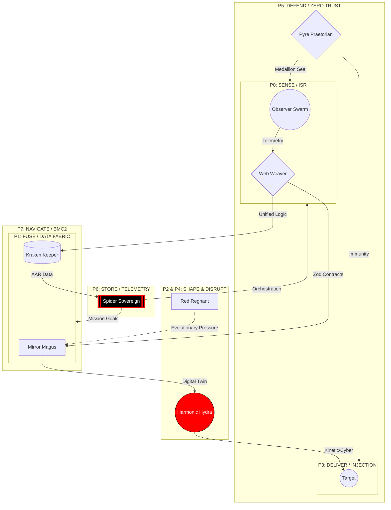
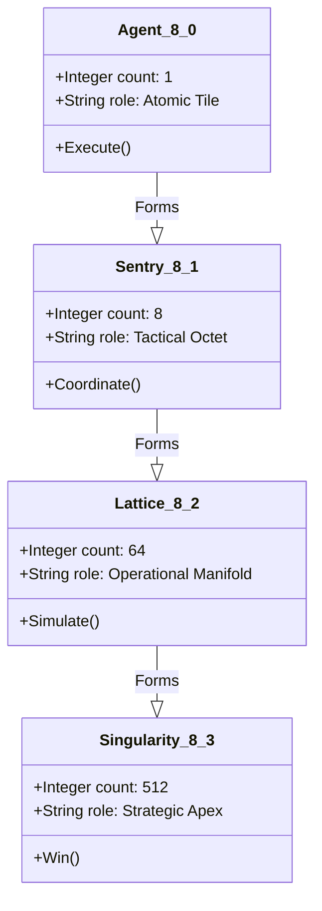

# Medallion: Bronze | Mutation: 0% | HIVE: E

# 🌀 VISUALIZING MOSAIC WARFARE: THE HFO COMMANDER LATTICE

This document serves as a semantic scaffolding to visualize **Mosaic Warfare** principles through the lens of the **HFO MTG Commanders**. Each commander represents a "tile" in a disaggregated kill-web.

---

## 🔱 THE MOSAIC KILL-WEB (SENSOR-TO-EFFECTOR)

This flowchart visualizes the functional relationship between the 8 Ports. Unlike a traditional linear "kill-chain," the HFO Mosaic is a multi-directional "kill-web" where any sensor can feed any effector through the universal data fabric.

---

## 🃏 THE COMMANDER TILES: DUAL-VIEW ARCHITECTURE

### [P0] OBSERVER: The Lidless Legion

*Principle: Disaggregated ISR*

| **MTG SECTION** | **TECHNICAL EQUIVALENT** |
| :--- | :--- |
| **Mechanic**: Look at top 8, put 1 in hand. | **JADC2 Role**: Observer (ISR) |
| **Octal Logic**: Sacrifice 8 Agents to draw 8 cards. | **Mosaic Logic**: Low cost, high-density sensor swarm. |
| **Synergy**: [Synapse Sliver](https://scryfall.com/card/lgn/54/synapse-sliver) (Data Collection). | **Function**: Translating raw signals into actionable telemetry. |

---

### [P1] BRIDGER: The Web Weaver

*Principle: Universal Data Fabric*

| **MTG SECTION** | **TECHNICAL EQUIVALENT** |
| :--- | :--- |
| **Mechanic**: HFO Spells cost {8} less. | **JADC2 Role**: Bridger (FUSE) |
| **Octal Logic**: Casting spells creates 8 Agents. | **Mosaic Logic**: The Interoperability Layer / Data Bus. |
| **Synergy**: [Manaweft Sliver](https://scryfall.com/card/m14/184/manaweft-sliver) (Unified Bus). | **Function**: Semantic bridging via Zod 6.0 Contracts. |

---

### [P2] SHAPER: The Mirror Magus

*Principle: The Digital Twin*

| **MTG SECTION** | **TECHNICAL EQUIVALENT** |
| :--- | :--- |
| **Mechanic**: Create 64 token copies (copies of non-legendary). | **JADC2 Role**: Shaper (Simulation/Wargaming) |
| **Octal Logic**: 8 agents → 64 manifold outcomes. | **Mosaic Logic**: Rapid virtualization of tactical options. |
| **Synergy**: [Mirror Gallery](https://scryfall.com/card/bok/154/mirror-gallery) (No scaling limits). | **Function**: Physics-based modeling and outcome projection. |

---

### [P3] INJECTOR: Harmonic Hydra

*Principle: Kinetic/Non-Kinetic Effect Delivery*

| **MTG SECTION** | **TECHNICAL EQUIVALENT** |
| :--- | :--- |
| **Mechanic**: 8 damage to 8 targets ($8 \times 8 = 64$ output). | **JADC2 Role**: Injector (DELIVER) |
| **Octal Logic**: Sacrifice Agents for Octal Mana Injection. | **Mosaic Logic**: Disaggregated Effectors (Shooters/Injectors). |
| **Synergy**: [Harmonic Sliver](https://scryfall.com/card/tsp/240/harmonic-sliver) (Surgical Effects). | **Function**: Delivering the specific "Juice" to the target point. |

---

### [P4] DISRUPTOR: The Red Regnant

*Principle: Multi-Domain Operations (MDO)*

| **MTG SECTION** | **TECHNICAL EQUIVALENT** |
| :--- | :--- |
| **Mechanic**: Create 24 agents if under 64 (Red Queen Race). | **JADC2 Role**: Disruptor (Electronic Warfare/Cyber) |
| **Octal Logic**: Target loses 8, you gain 8 (Zero-sum). | **Mosaic Logic**: Imposing cost on the adversary. |
| **Synergy**: [Frenzy Sliver](https://scryfall.com/card/fut/85/frenzy-sliver) (Pressure). | **Function**: Disrupting the adversary OODA loop. |

---

### [P5] IMMUNIZER: Pyre Praetorian

*Principle: Zero Trust & Resurrection*

| **MTG SECTION** | **TECHNICAL EQUIVALENT** |
| :--- | :--- |
| **Mechanic**: Hexproof/Indestructible at 8 agents. | **JADC2 Role**: Immunizer (DEFEND) |
| **Octal Logic**: Sacrifice 8 agents for total Indestructibility. | **Mosaic Logic**: System integrity and failover logic. |
| **Synergy**: [Clot Sliver](https://scryfall.com/card/tpr/85/clot-sliver) (Healing/Redundancy). | **Function**: P5 Forensic auditing and code provenance. |

---

### [P6] ASSIMILATOR: Kraken Keeper

*Principle: Perpetual AAR (After Action Review)*

| **MTG SECTION** | **TECHNICAL EQUIVALENT** |
| :--- | :--- |
| **Mechanic**: 512 Hand Size (The Singularity Storage). | **JADC2 Role**: Assimilator (STORE) |
| **Octal Logic**: Sacrifice 8 to exile 64 and cast for free. | **Mosaic Logic**: Large-scale telemetry storage and retrieval. |
| **Synergy**: [Memory Plunder](https://scryfall.com/card/shm/169/memory-plunder) (History). | **Function**: DuckDB-WASM based mission telemetry logging. |

---

### [P7] NAVIGATOR: Spider Sovereign

*Principle: BMC2 (Battle Management Command & Control)*

| **MTG SECTION** | **TECHNICAL EQUIVALENT** |
| :--- | :--- |
| **Mechanic**: Win at 512 agents (The Ultimate Goal). | **JADC2 Role**: Navigator (NAVIGATE/BMC2) |
| **Octal Logic**: Sacrifice 8 to recast from graveyard. | **Mosaic Logic**: Strategic orchestration of the kill-web. |
| **Synergy**: [Sliver Overlord](https://scryfall.com/card/scg/139/sliver-overlord) (Central Command). | **Function**: Mission engineering and high-level strategy. |

---

## 🛠️ DATA SCALING: THE FRACTAL OCTREE

This Class Diagram visualizes the **$8^n$ scaling** of Mosaic Warfare, where complexity builds from atomic agents to strategic singularities.

---
*Spider Sovereign (Port 7) | HFO-Hive8 | Mosaic Warfare Visualization Secured*
