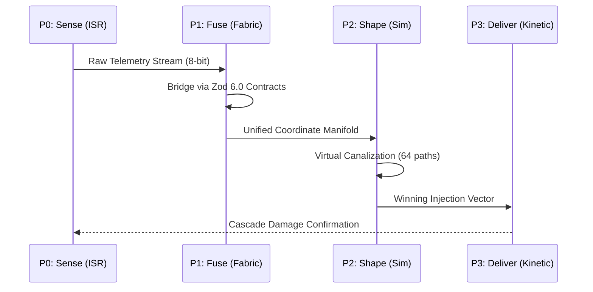
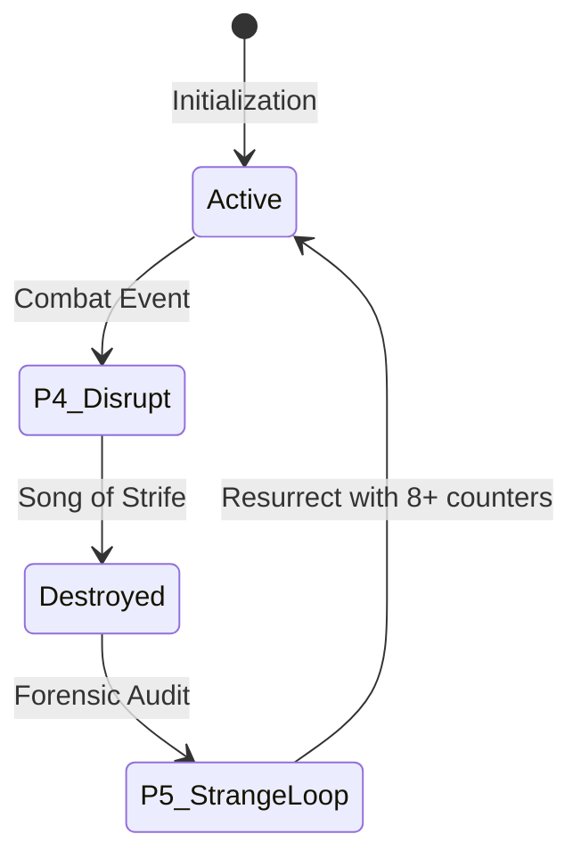
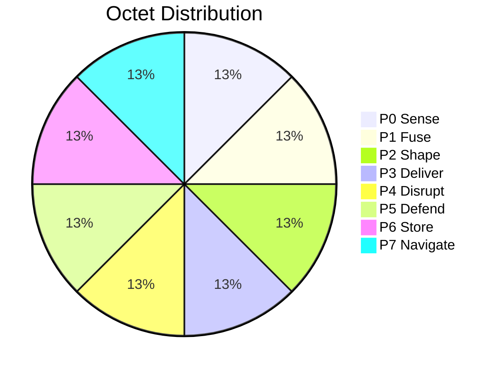

# Medallion: Bronze | Mutation: 0% | HIVE: I

# 🃏 PROJECT: HFO MTG COMMANDERS V12 (DOCTRINAL MOSAIC)

**Mission**: Thread Alpha (Lore Hardening / Mosaic Warfare)
**Theme**: **HIVE/8 SWARM** (Mosaic Warfare)
**Core Numbers**: $8^0=1, 8^1=8, 8^2=64, 8^3=512$
**Logic**: Each card is an 8-bit cognitive port [P0-P7] mapped to the user's doctrinal vision.

---

## 🏗️ THE HFO CORE TOKEN: [THE HIVE/8 AGENT]

**Hive/8 Agent**
*Artifact Creature Token — HFO Agent Tile*
Stats: 1/1
*(HFO agents are disaggregated tiles. Control 8 to achieve Octal Synchronization $8^1$.)*

---

## 🔱 THE 8 LEGENDARY COMMANDER TILES (P0-P7)

### [P0] OBSERVER: The Lidless Legion ☴ {U}

**Legendary Artifact Creature — HFO Swarm** | 1/1
*(Gender: Swarm)*

**MTG SECTION**

- **Mosaic ISR**: Whenever a Hive/8 Agent enters the battlefield, you may look at the top 8 cards of your library and put one into your hand.
- **Octal Cull**: {T}, Sacrifice 8 Agents: Draw 8 cards.
- **Synergy Suite**: [Synapse Sliver] (ISR), [Galerider Sliver] (ISR), [Telepathy] (Lore).

**TECHNICAL EQUIVALENT**

- **Doctrinal Definition**: Cheap, fast, ISR that enables the swarm.
- **JADC2 Role**: OBSERVER (SENSE / ISR).
- **Trigram**: Xun (Wind) — Pervasive Insight.
- **Principle**: Disaggregated Sensing.

---

### [P1] BRIDGER: The Web Weaver ☲ {1}{G}{U}

**Legendary Artifact Creature — HFO Bridger Spider** | 2/2
*(Gender: Male)*

**MTG SECTION**

- **Universal Data Fabric**: HFO spells you cast cost {8} less (Minimum {1}).
- **Fusing Protocol**: Whenever you cast an HFO spell, create 8 Hive/8 Agent tokens.
- **Synergy Suite**: [Gemhide Sliver] (FUSE), [Manaweft Sliver] (FUSE), [Chromatic Lantern] (Lore).

**TECHNICAL EQUIVALENT**

- **Doctrinal Definition**: FUSE, BRIDGE, and enabling DATA FABRIC UNIVERSALITY. Integrating heterogeneous sensors and effectors into effective force packages.
- **JADC2 Role**: BRIDGER (FUSE / Data Fabric).
- **Trigram**: Li (Fire) — Universal Clarity.
- **Principle**: Semantic Interoperability.

---

### [P2] SHAPER: The Mirror Magus ☱ {2}{U}{R}

**Legendary Artifact Creature — HFO Shaper Illusion** | 3/3
*(Gender: Poly/All)*

**MTG SECTION**

- **Spike Factory**: {R}, Sacrifice 8 Agents: Create 64 tokens that are copies of target HFO creature (Non-legendary, Haste).
- **8-Fold Ward**: HFO creatures you control have Ward {8}.
- **Synergy Suite**: [Shifting Sliver] (SHAPE), [Hollowhead Sliver] (SHAPE), [Mirror Gallery] (Lore).

**TECHNICAL EQUIVALENT**

- **Doctrinal Definition**: SHAPING and canalization using Spike Factory to explore decision space with an engineering swarm.
- **JADC2 Role**: SHAPER (SHAPE / Digital Twin).
- **Trigram**: Dui (Lake) — Reflective Shaping.
- **Principle**: Computational Canalization.

---

### [P3] INJECTOR: Harmonic Hydra ☳ {X}{R}{G}{W}

**Legendary Artifact Creature — HFO Injector Hydra** | 0/0
*(Gender: Asexual/Poly)*

**MTG SECTION**

- **Cascading Effects**: Hydra enters with X +1/+1 counters (X = multiple of 8).
- **Injected Payload**: Sacrifice an Agent: Add {8} to your mana pool for HFO spells.
- **Thunderous Injection**: Sacrifice 8 agents: Deal 8 damage to each of up to 8 targets.
- **Synergy Suite**: [Harmonic Sliver] (DELIVER), [Megantic Sliver] (DELIVER), [Hydra's Growth] (Lore).

**TECHNICAL EQUIVALENT**

- **Doctrinal Definition**: About 1 input cascading effects and injected wherever and whenever I want.
- **JADC2 Role**: INJECTOR (DELIVER / Effect Delivery).
- **Trigram**: Zhen (Thunder) — Cascading Shock.
- **Principle**: Precision Effect Injection.

---

### [P4] DISRUPTOR: The Red Regnant ☷ {2}{B}{R}

**Legendary Artifact Creature — HFO Disruptor Demon** | 4/4
*(Gender: Female)*

**MTG SECTION**

- **Songs of Strife and Glory**: At upkeep, if < 64 agents, create 24 Hive/8 Agent tokens.
- **Kill Scourge**: {1}{B}, Sacrifice an Agent: Target opponent loses 8 life and you gain 8 life. Whenever a creature an opponent controls dies, create an Agent token.
- **Synergy Suite**: [Heart Sliver] (DISRUPT), [Frenzy Sliver] (DISRUPT), [Dictate of the Twin Gods] (Lore).

**TECHNICAL EQUIVALENT**

- **Doctrinal Definition**: Disrupt and coevolutionary Red Queen. She kills things and sings the songs of strife and glory.
- **JADC2 Role**: DISRUPTOR (DISRUPT / MDO).
- **Trigram**: Kun (Earth) — Receptive Strife.
- **Principle**: Evolutionary Adversarial Pressure.

---

### [P5] IMMUNIZER: Pyre Praetorian 艮 {2}{W}{B}

**Legendary Artifact Creature — HFO Immunizer Phoenix** | 2/2
*(Gender: Male)*

**MTG SECTION**

- **Defense in Depth**: Sacrifice an Agent: Target HFO permanent gains Ward {8} or Indestructible until end of turn.
- **Strange Loop (Resurrection)**: When Pyre Praetorian dies, return him to the battlefield at the next end step with 8 +1/+1 counters for each time he has died. He coevolves with the Red Regnant.
- **Synergy Suite**: [Pulmonic Sliver] (DEFEND), [Clot Sliver] (DEFEND), [Luminous Broodmoth] (Lore).

**TECHNICAL EQUIVALENT**

- **JADC2 Role**: IMMUNIZER (DEFEND / Zero Trust).
- **Trigram**: Gen (Mountain) — Stillness/Rebirth.
- **Doctrinal Definition**: A phoenix to dance with Port 4 and die and be reborn in a strange loop. Defense in Depth.
- **Principle**: Forensic Resurrection.

---

### [P6] ASSIMILATOR: Kraken Keeper 坎 {3}{U}{B}

**Legendary Artifact Creature — HFO Assimilator Kraken** | 5/5
*(Gender: Female)*

**MTG SECTION**

- **Medallion Datalake**: Your maximum hand size is 512.
- **Abyssal Harvest**: {U}{B}, Sacrifice 8 Agents: Exile top 64 cards. Cast HFO spells from them for free this turn.
- **Synergy Suite**: [Syphon Sliver] (STORE), [Winged Sliver] (STORE), [Memory Plunder] (Lore).

**TECHNICAL EQUIVALENT**

- **Doctrinal Definition**: Medallion Datalake. Holds 512 years of telemetry.
- **JADC2 Role**: ASSIMILATOR (STORE / Telemetry).
- **Trigram**: Kan (Water) — The Datalake.
- **Principle**: Persistent AAR.

---

### [P7] NAVIGATOR: Spider Sovereign ☰ {W}{U}{B}{R}{G}

**Legendary Artifact Creature — HFO Navigator God** | 8/8
*(Gender: Male)*

**MTG SECTION**

- **Lattice Coordinate**: Control 64+ Agents: Sacrifice 8 agents to recast HFO spells from graveyard.
- **Apex Decision**: Sacrifice 512 agents: You win the game.
- **Synergy Suite**: [Sliver Queen] (NAVIGATE), [Sliver Overlord] (NAVIGATE), [The World Tree] (Lore).

**TECHNICAL EQUIVALENT**

- **Doctrinal Definition**: Higher dimensional cognitive symbiote. They work together. Weaver of the Decision Manifold.
- **JADC2 Role**: NAVIGATOR (NAVIGATE / BMC2).
- **Trigram**: Qian (Heaven) — Strategic Orchestration.
- **Principle**: Mission Engineering.

---

## 🧜 DIVERSE MERMAID VISUALIZATIONS

### A. The Kill-Web Sequence (Sensor-to-Effector)

### B. The Strange Loop (Death & Rebirth)

### C. Octal Scaling (The Mosaic Growth)

---
*Spider Sovereign (Port 7) | HFO-Hive8 | V12 Doctrinal Mosaic Secured*
