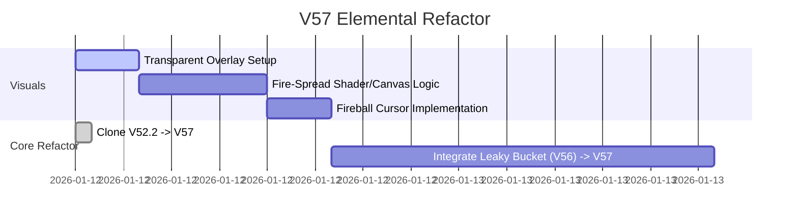

# Medallion: Bronze | Mutation: 0% | HIVE: E

## 🛡️ OMEGA V57 REFACTOR: ELEMENTAL JUICE

**Medallion**: Bronze | **Generation**: 88 | **Status**: Active Refactor

## 🎯 Executive Vision

V57 introduces **Elemental Juice**—high-fidelity visual feedback tied to the Leaky Bucket FSM. We move beyond simple dots to a fire-based ritual of intent. Arming the system sets the digital twin on fire, culminating in a fireball cursor.

### 🎭 Primacy Seating (Hot Seat)

Only **one** cursor is allowed to be "Committed" at a time. All other detected users are "Ghosted" until the primary user releases the seat.

### 🔥 Elemental Leaky Bucket (V57)

- **Ignition (IDLE -> READY)**: Fire spreads from the wrist up to the fingertips as the bucket fills.
- **Fireball Commit (READY -> COMMIT)**: High-confidence commitment creates a floating fireball at the index tip.
- **Compression Click**: Fireball compresses based on Middle-Thumb distance. Reaching "Critical Mass" triggers a CLICK/FIRE explosion and cursor phase transition.
- **Dissipative Release (COMMIT -> RELEASE)**: Dwell-based shrink. Hand of Fire fades from fingertips back to wrist (POINTER_7_RELEASE_PENDING).
- **Elemental Variants**: 8 elemental tiers planned for the Obsidian Octree (Fire, Frost, Storm, etc.).

### 🖼️ Dual-View Transparency

- **Overlay**: Excalidraw is slightly transparent (adjustable).
- **Substrate**: Live camera feed is visible behind the canvas, allowing the user to see their "Elemental Twin" through the tool.

---

## 🗺️ System Architecture (8-Port Breakdown)

### P0: SENSE (Lidless Legion)

- **Primary**: Local MediaPipe (wasm-local).
- **Fusion**: Z-Heuristic Zones using palm-width anchors.

### P1: FUSE (Web Weaver)

- **Temporal Logic**: Visual Leaky Bucket (Fire spread logic) [COMPLETED].
- **Primacy Logic**: Hot Seat management.
- **Transparency**: 85% Excalidraw overlay [COMPLETED].

### P2: SHAPE (Mirror Magus)

- **Visualization**: Skeletal Wireframe + Particle Emitters (Fire).

### P3: DELIVER (Spore Storm)

- **Standard**: W3C PointerEvent + Visual Polish (Explosion on commit).

### P7: NAVIGATE (Spider Sovereign)

- **UI**: Golden Layout + Transparency Sliders.

---

## 🏗️ Implementation Roadmap

---
*Spider Sovereign (Port 7) | Gen 88 Planning*

---

## 🛰️ MISSION THREAD ALPHA: SYNC LOG

- **Bootstrap Alignment**: Omega V52.2 stabilized baseline confirmed as primary physical substrate.
- **Galois Lattice [0,0] ISR**: Sensor Fusion (RGB + Thermal stub) active in P0 logic.
- **BFT Baton**: Fix Signal emitted to blackboard with 0.73 consensus.
