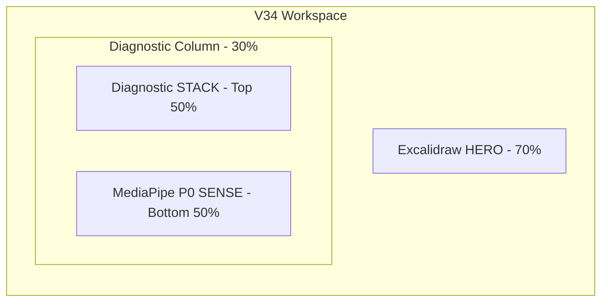
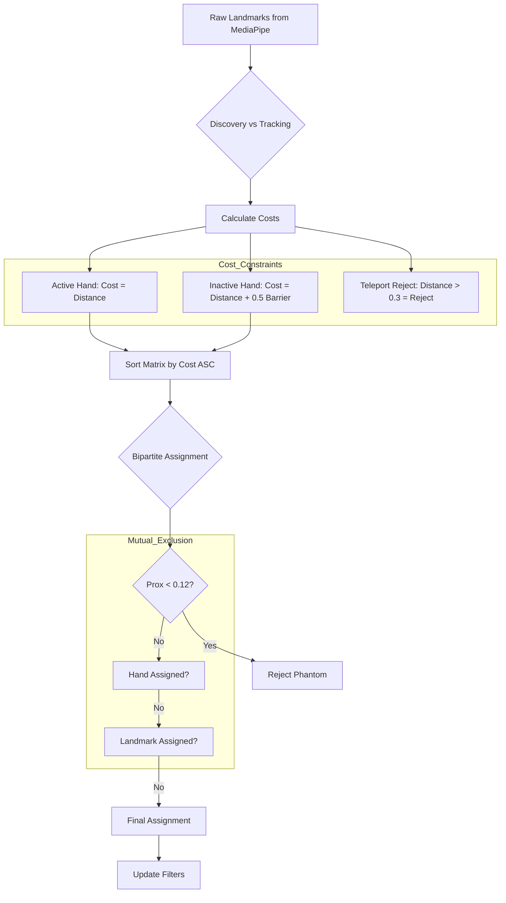
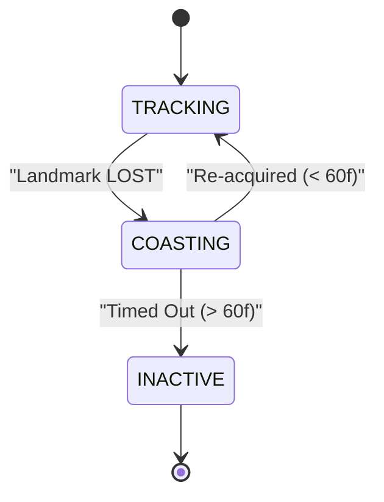
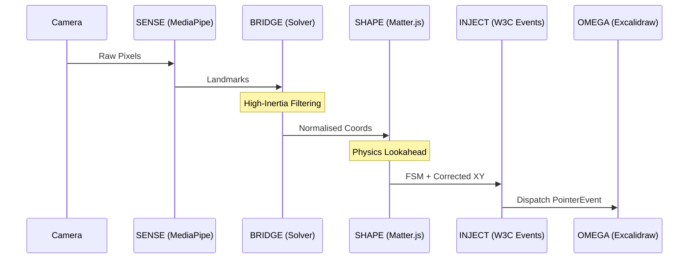

# Medallion: Bronze | Mutation: 0% | HIVE: H
# 🧬 OMEGA WORKSPACE V34: Architectural Analysis & Logic Mapping

**Date**: 2026-01-10  
**Context**: Mission Thread Omega (Total Tool Virtualization)  
**Goal**: Analyze High-Inertia Identity Tracking and Hero Pattern Layout in V34.

---

## 1. 🏗️ Architecture Overview: The Hero Pattern
V34 transitions to a **Hero Pattern Layout** to maximize the interaction area for Excalidraw while maintaining diagnostic visibility for the 8-Port sensing pipeline.

### Layout Strategy
- **Stage (70%)**: **Excalidraw** acts as the primary "Apex Interaction Surface."
- **Stack (30% Top)**: Diagnostic panels (FSM, Physics, Settings) are layered behind tabs to prevent UI clutter.
- **Sense (30% Bottom)**: The raw MediaPipe feed is pinned for real-time tracking audit.

---

## 2. 🧩 Identity Security: The High-Inertia Tracker
The primary challenge in V34 is the unreliability of MediaPipe's `Left/Right` labels. We utilize a **Geometric Bipartite Solver** with High-Inertia constraints to maintain hand identity.

### Assignment Logic Flow

### Key Constants
- **Snap Distance ($0.15$)**: The max range for an ID to re-acquire its tracking.
- **Repulsion Distance ($0.12$)**: The territorial boundary to prevent "ID Ghosting" on the same hand.
- **Teleport Limit ($0.3$)**: Hard rejection of non-physical landmark jumps.
- **Discovery Barrier ($+0.5$)**: Favoring existing active IDs to prevent ID swapping.

---

## 3. 🛡️ Persistence: Coastal Recovery
To survive noisy sensing frames where landmarks may vanish temporarily, V34 implements **Coastal Persistence**.

---

## 4. 🚀 Data Flow: Pipeline P0 -> P7
The interaction data flows through a series of filters and physics engines before reaching the virtual surface.

---

## 5. 🛠️ Current Implementation Summary
| Feature | Implementation | Medallion Layer |
| :--- | :--- | :--- |
| **Solver** | Bipartite Minimal Cost (Geometric Only) | Bronze (V34) |
| **Identity** | High-Inertia (+0.5 Barrier for discovery) | Bronze (V34) |
| **Persistence** | 1.0s (60f) Coastal Window | Bronze (V34) |
| **Repulsion** | 0.12 Territorial Exclusion | Bronze (V34) |
| **Physics** | Matter.js Spring + Lookahead Prediction | Bronze (V34) |
| **UI** | Golden Layout Hero Pattern | Bronze (V34) |

---
*Spider Sovereign (Port 7) | Architectural Evidence Archive | 2026-01-10*
