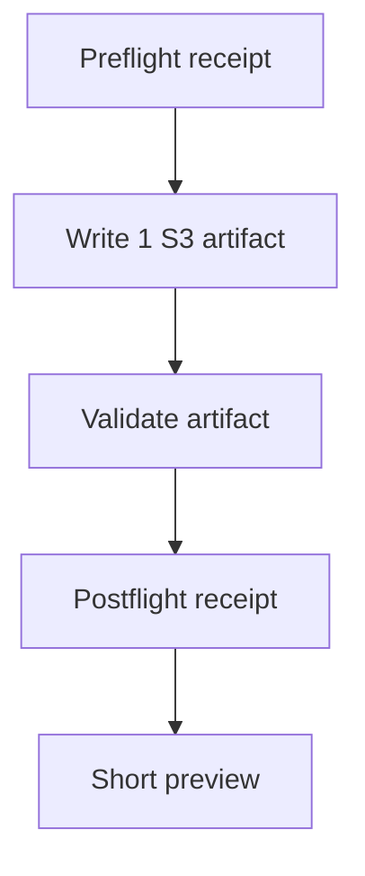
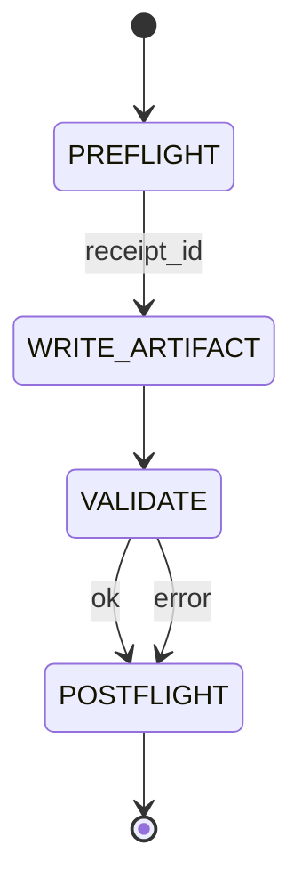

# P0 — OBSERVE — Observations (current question + current state)
- Prompt summary: P7 S3 driver smoke (single blessed entryway)
- Observable vs inferred: This artifact is a first-pass scaffold; content is partially inferred.
- Constraints: fail-closed S3 ritual; one artifact; validate structure.
- Top 3 immediate risks: (1) drift from v2.1 template, (2) missing Mermaid blocks, (3) missing proof bundle when high-risk.
- What changed since last iteration (if known): Introduced a dedicated P7 S3 driver + validator behind a single entryway.

# P1 — BRIDGE — Current understanding + shared data fabrics
Plain language:
- We are standardizing Port-7 sensemaking so every turn is auditable: preflight→artifact→postflight.
- The artifact is the primary review surface; receipts prove tool use.
Where truth lives right now (shared data fabric):
- Canonical S3 spec: hfo_hot_obsidian/silver/3_resources/reports/S3_PROTOCOL_V2_1_TTAO_IDE_CARD_2026_01_25.md
- Artifact: hfo_hot_obsidian/bronze/3_resources/para/areas/sensemaking/s3_protocol_turns/2026-01-25__s3__hub_blessed_entryway_smoke_c7eaa76c405c__v2.1.md

# P2 — SHAPE — Possible next actions (MAP-Elites trade study + exemplars)
## P2.1 Exemplar Registry (named exemplars used in THIS run)
- Exemplar name: PARA
  5W1H: Who=TTao; What=organize notes; Where=Obsidian vault; When=every turn; Why=reviewable provenance; How=Projects/Areas/Resources/Archives.
  Formal definition: A knowledge organization method dividing work into Projects, Areas, Resources, Archives.
  Source link: https://fortelabs.com/blog/para/
  How applied here: Artifact is filed under Areas/Sensemaking by default.
- Exemplar name: Mermaid
  5W1H: Who=developer; What=diagrams-as-text; Where=Markdown; When=each artifact; Why=portable visuals; How=flowchart/stateDiagram.
  Formal definition: Text-based diagramming syntax rendered into visuals.
  Source link: https://mermaid.js.org/
  How applied here: Included flowchart + state diagram blocks.
- Exemplar name: MAP-Elites (Quality-Diversity)
  5W1H: Who=designer; What=archive of diverse options; Where=P2 matrix; When=planning; Why=avoid single-path lock-in; How=binning options.
  Formal definition: Quality-Diversity algorithm that maintains an archive of high-performing diverse solutions across behavioral dimensions.
  Source link: https://en.wikipedia.org/wiki/MAP-Elites
  How applied here: Provide a small option matrix instead of one plan.
- Exemplar name: SKOS aliasing
  5W1H: Who=knowledge builder; What=preferred + alternate labels; Where=YAML front matter; When=each artifact; Why=searchability; How=prefLabel/altLabel/hiddenLabel.
  Formal definition: Simple Knowledge Organization System for concept labeling and relations.
  Source link: https://www.w3.org/TR/skos-reference/
  How applied here: aliases block in front matter.

## P2.2 Trade Study Matrix (4–8 options; exemplar-composed; MAP-Elites archive)
| Option | Exemplars (names) | What changes | Pros | Cons | Risks | Proof needed | Score |
|---|---|---|---|---|---|---|---|
| A: Keep using bash flight manually | S3, PARA | No new code | Already works | Manual steps | Human error | Receipt files | 6 |
| B: Dedicated P7 driver + validator | S3, PARA, Mermaid | Automate ritual + validate | Repeatable, auditable | New surface area | Drift if spec changes | Smoke turn + validator run | 9 |
| C: Add CI gate for new S3 artifacts | S3, Mutation testing | Enforce in CI | Prevents drift | CI complexity | False negatives | CI logs | 8 |
| D: Extend MCP hub tool for P7 turn | S3, MCP | Run ritual via MCP tool | Single surface | Harder integration | Tooling coupling | MCP receipt chain | 7 |

# P3 — INJECT — Implementation options + injection capabilities
- Injection points: scripts/ (driver+validator) + hfo_hub.py shim (dispatch).
- Minimal reversible move: add commands; revert by removing dispatch + scripts.

# P4 — DETECT — Tests, regressions, green-lie vs red-truth checks
- Current tests: structural validator run; flight receipts produced on disk.
- Green lie risks: artifact looks right but misses required diagrams/sections.
- Anti-green-lie upgrades: keep validator strict and optionally add CI checks.
- Replay/Golden recipe: rerun p7_s3_turn with same slug and compare artifacts.

# P5 — IMMUNIZE — Guards and risk protection
- Tripwire: validator must pass or the run is outcome=error.
- Rollback: delete the new artifact and rerun; receipts remain append-only.
- Fail-closed defaults: do not claim success without receipts + validator OK.

# P6 — ARCHIVE — Memory notes and handoff
- New scripts: p7_s3_turn.py + s3_v2_1_validate.py
- Root entryway: hfo_hub.py will dispatch P7 commands without breaking MCP forwarding.
- Receipt parsing: handle multi-JSON outputs from flight wrapper.
- PARA filing: default Areas/Sensemaking for S3 turns.

# P7 — NAVIGATE — Clarifying questions for next iteration (Strange Loop N+1)
- Should the P7 driver always include the preflight receipt_id in the slug? (P2)
- Do you want validator strictness to fail on missing exemplar source links? (P4)
- Should we add a CI gate that validates any new S3 artifact in the turns folder? (P5)
- Do you want a separate MissionThread Alpha ledger entry per P7 turn, or batch them? (P6)

