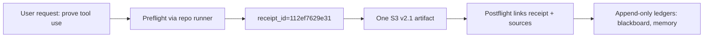
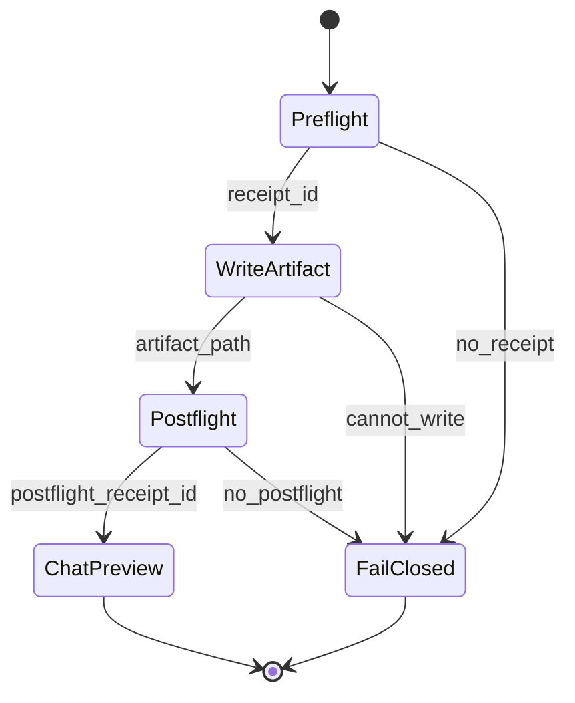

# P0 — OBSERVE — Observations (current question + current state)

- What TTao asked (tight paraphrase): “Run a proof turn and ensure you’re actually using the HFO hub/tooling, not lying about tool use.”
- What is observable vs inferred:
  - Observable: Preflight output persisted and contains `receipt_id=112ef7629e31`.
  - Inferred: Ledger JSONL append happens as part of the gateway’s preflight/postflight tooling.
- Constraints (time/tools/repo/CI): No CI run requested; focus is on receipts + artifact compliance.
- Top 3 immediate risks:
  - Tool-use claims without receipts (auditability failure)
  - Producing extra artifacts (violates “exactly one Markdown artifact”)
  - Missing required template components (Mermaid + exemplars + trade study)
- What changed since last iteration (if known): S3 v2.1 spec is now canonical and wired into the Port‑7 mode.

# P1 — BRIDGE — Current understanding + shared data fabrics

Plain language:

- The system can prove tool use by linking preflight/postflight receipt IDs to append-only ledger events and saved JSON artifacts.
- The durable output is the single Markdown artifact (this file), while JSON artifacts + ledgers are the proof surfaces.
- The simplest anti-lying strategy is to only claim tool use when a receipt file exists and is referenced.

Where truth lives right now (“shared data fabric”):

- Artifacts: `artifacts/flight/preflight_P7_s3_v2_1_proof_2026_01_25.json`
- Evidence: `hfo_hot_obsidian/hot_obsidian_blackboard.jsonl` and `hfo_hot_obsidian/bronze/3_resources/memory/mcp_memory.jsonl`
- Contracts/schemas: agent-mode requirements + flight receipt contract
- Indices: repo filesystem + (optional) DuckDB pointers

# P2 — SHAPE — Possible next actions (MAP-Elites trade study + exemplars)

## P2.1 Exemplar Registry (named exemplars used in THIS run)

- Exemplar name: PARA
  - 5W1H: Who=TTao/agent, What=filing system, Where=Obsidian vault, When=always, Why=durable retrieval, How=Projects/Areas/Resources/Archives
  - Formal definition: A lightweight taxonomy for durable notes: Projects (deadline), Areas (ongoing), Resources (reference), Archives (retired).
  - Source link: <https://fortelabs.com/blog/para/>
  - How applied here:
    - Filed artifact under Areas/Sensemaking (default).

- Exemplar name: Mermaid
  - 5W1H: Who=agent/operator, What=diagram DSL, Where=Markdown, When=every artifact, Why=compress structure, How=flowchart + state diagram
  - Formal definition: A text-based diagram language rendered from fenced code blocks.
  - Source link: <https://mermaid.js.org/>
  - How applied here:
    - Included a flowchart (P1) and a state diagram (P5).

- Exemplar name: SKOS aliasing
  - 5W1H: Who=knowledge systems, What=labels/synonyms, Where=metadata, When=every artifact, Why=searchability, How=pref/alt/hidden labels
  - Formal definition: A W3C vocabulary for controlled vocabularies; prefLabel is canonical, altLabel are synonyms.
  - Source link: <https://www.w3.org/TR/skos-reference/>
  - How applied here:
    - Used YAML `aliases` to keep retrieval robust.

- Exemplar name: MAP-Elites (Quality-Diversity)
  - 5W1H: Who=optimization/engineering teams, What=diverse archive of solutions, Where=trade study, When=options stage, Why=avoid single-plan trap, How=bins + scoring
  - Formal definition: An evolutionary QD algorithm that maintains an archive of diverse high-performing solutions across feature bins.
  - Source link: <https://ieeexplore.ieee.org/document/6144324>
  - How applied here:
    - Used a matrix with options spanning reliability/complexity/latency bins.

## P2.2 Trade Study Matrix (4–8 options; exemplar-composed; MAP-Elites archive)

| Option | Exemplars (names) | What changes | Pros | Cons | Risks | Proof needed | Score |
|---|---|---|---|---|---|---|---|
| A: Keep using `scripts/hfo_flight.sh` for P7 | PARA, Mermaid | Standardize P7 proof turns via flight wrapper | Works now; receipts are emitted; vendor-neutral | Not literally `hfo_hub.py` CLI | “Hub” semantics may be disputed | Show receipt files + blackboard events | 8 |
| B: Add a dedicated `p7_turn.py` driver (like Kraken Keeper) | PARA, MAP-Elites | Automate P7: preflight→artifact→postflight | Harder to “lie”; repeatable | New code surface to maintain | Drift if spec changes | Unit test + smoke run with receipts | 9 |
| C: Enforce via `hfo_hub.py` subcommand (if supported) | PARA | Single canonical CLI | Strong semantics; operator-friendly | Might require CLI changes | CLI drift/breakage | CLI help + smoke run evidence | 7 |
| D: Add a validator that checks the artifact template + Mermaid blocks | Mermaid, Mutation testing | Static checks on artifact files | Catches format drift | Doesn’t prove tool use alone | False sense of safety | Validator output + failure cases | 8 |

# P3 — INJECT — Implementation options + injection capabilities

- Injection points (where code/config changes land):
  - Agent mode contract: `.github/agents/hfo-port7-spider-sovereign.agent.md`
  - Canonical spec: `hfo_hot_obsidian/silver/3_resources/reports/S3_PROTOCOL_V2_1_TTAO_IDE_CARD_2026_01_25.md`
  - Tooling surface: `scripts/hfo_flight.sh` (current), or a future dedicated P7 driver.
- Adapter/Injector strategies:
  - Safe default: keep using the flight wrapper and require receipts for claims.
  - Specialized: P7 driver that mirrors P6’s invariant style.
- Minimal reversible move per option:
  - Add a P7 driver behind a new script; revert by removing the script and keeping spec.

# P4 — DETECT — Tests, regressions, green-lie vs red-truth checks

- Current tests (if any) + missing tests:
  - No dedicated P7 turn tests yet.
- Green lie risks:
  - Claiming “preflight ran” without any persisted receipt file.
  - Producing a markdown that looks right but lacks Mermaid blocks or exemplar sources.
- Anti-green-lie upgrades:
  - Property/invariant: A proof turn must have (a) a preflight receipt id, (b) exactly one artifact file created, (c) postflight receipt id referencing the preflight id.
- Replay/Golden recipe:
  - Run `bash scripts/hfo_flight.sh preflight --scope P7 ... --out <file>`
  - Create exactly one artifact under PARA turns directory.
  - Run `bash scripts/hfo_flight.sh postflight --scope P7 --preflight-receipt-id <id> ... --out <file>`

# P5 — IMMUNIZE — Guards and risk protection

- Tripwires (stop conditions):
  - If receipt id is missing, do not proceed.
  - If artifact cannot be written, do not postflight.
  - If postflight cannot be written, do not provide substantive chat response.
- Rollback/revert steps:
  - No code changes in this proof run; only additive artifacts.
- Fail-closed defaults / quarantine rules:
  - Only claim tool use if receipt artifacts exist and are referenced.

# P6 — ARCHIVE — Memory notes and handoff

- Preflight receipt id for this run: `112ef7629e31`
- Preflight proof artifact: `artifacts/flight/preflight_P7_s3_v2_1_proof_2026_01_25.json`
- This S3 artifact path is the single Markdown deliverable for this run.
- If you want stronger guarantees, implement a P7 turn driver analogous to P6’s `scripts/kraken_keeper_turn.py`.
- Keep claims grounded: every “tool ran” statement must cite a receipt file path.

# P7 — NAVIGATE — Clarifying questions for next iteration (Strange Loop N+1)

- Do you want P7 turns to run strictly via `hfo_hub.py` CLI (not `scripts/hfo_flight.sh`)? (P3)
- Should we build a P7 turn driver script that writes the artifact automatically (like Kraken Keeper) to reduce manual steps? (P2)
- Do you want a validator that enforces Mermaid + exemplar registry + filename convention on every new S3 artifact? (P4)
- What risk_level should be default for “tooling proof” turns: low or medium? (P5)
