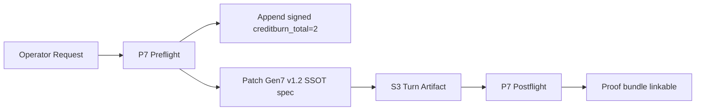
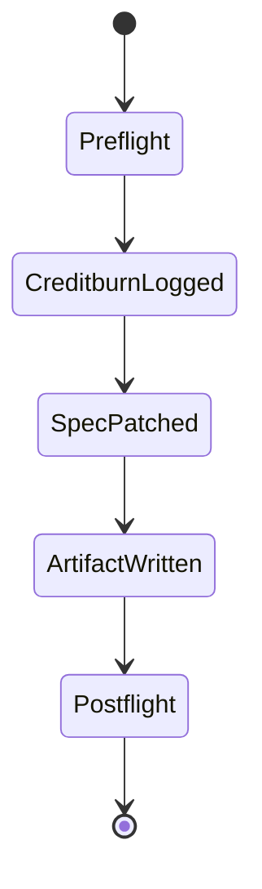

# P0 — OBSERVE — Observations (current question + current state)

- What TTao asked: increment creditburn to 2 and stop stalling; provide proof.
- Observable facts:
  - New P7 preflight receipt exists: `a4b0964e2770` in artifacts/flight/preflight_P7_turn2.json.
  - hot blackboard tail includes a signed `creditburn_total: 2` entry (signature `fd091533...`).
  - Gen7 v1.2 SSOT spec updated to require: localStorage persistence + reset-to-defaults + zIndex 00-99 + slider+numeric + RED-first TDD/BDD.
- Constraints: fail-closed ritual (preflight → one artifact → postflight), no runtime wiring in this turn.
- Top risks:
  - Spec drift if edited in non-SSOT locations.
  - Persistence requirements implemented inconsistently (partial settings persisted).
  - UI range constraints not enforced (out-of-range zIndex).

# P1 — BRIDGE — Current understanding + shared data fabrics

Plain language:

- You’re asking for auditable proof each time we “do work,” plus explicit governance logging when we burn tokens.
- The SSOT for Gen7 v1.2 remains the portable spec; the blackboard is the append-only audit log.
- This turn adds both: (1) creditburn_total=2 signed log, (2) spec deltas capturing the new requirements.

Vendor-neutral surfaces:

- Artifacts:
  - SSOT spec: hfo_hot_obsidian/bronze/1_projects/omega_gen7_v1_portable/specs/omega_gen7_v1_2_spec.yaml
- Evidence:
  - Preflight receipt: artifacts/flight/preflight_P7_turn2.json (receipt_id `a4b0964e2770`)
  - Signed log: hfo_hot_obsidian/hot_obsidian_blackboard.jsonl (creditburn_total=2)

# P2 — SHAPE — Possible next actions (MAP-Elites trade study + exemplars)

## P2.1 Exemplar Registry (named exemplars used in THIS run)

- Exemplar name: S3 Protocol v2.1
  - 5W1H: IDE-agent ritual for proof-first turns (P0–P7), per-turn durable artifact.
  - Formal definition: One preflight + one PARA artifact + one postflight + short chat preview.
  - Source link: hfo_hot_obsidian/silver/3_resources/reports/S3_PROTOCOL_V2_1_TTAO_IDE_CARD_2026_01_25.md
  - How applied here: used as the gating workflow and artifact template.
- Exemplar name: Stigmergy Blackboard (append-only JSONL)
  - 5W1H: Tamper-evident-ish signed event log for audit + coordination.
  - Formal definition: append-only JSONL with chained signing of entries.
  - Source link: hfo_hot_obsidian/hot_obsidian_blackboard.jsonl
  - How applied here: logged creditburn_total=2 with signature.

## P2.2 Trade Study Matrix (4–8 options; exemplar-composed; MAP-Elites archive)

| Option | Exemplars (names) | What changes | Pros | Cons | Risks | Proof needed | Score |
|---|---|---|---|---|---|---|---|
| A | S3 + Blackboard | Log creditburn only | Fast | Doesn’t advance spec | Drift continues | Blackboard tail | 6 |
| B | S3 + Spec-first | Spec-only: add persistence requirements | Captures intent | No audit governance | Operator frustration | diff + receipt | 7 |
| C (chosen) | S3 + Blackboard + Spec-first | Log creditburn=2 + patch SSOT spec | Proof + progress | Still no runtime wiring | Must ensure spec is valid | receipts + blackboard + spec diff | 9 |
| D | Full implementation now | Wire localStorage + UI + tests | End-to-end | Big scope | High regression risk | tests + replay | 5 |

# P3 — INJECT — Implementation options + injection capabilities

- Injection points:
  - Spec contract: hfo_hot_obsidian/bronze/1_projects/omega_gen7_v1_portable/specs/omega_gen7_v1_2_spec.yaml
  - Audit log: hfo_hot_obsidian/hot_obsidian_blackboard.jsonl
- Minimal reversible move: spec-only + logging (no runtime behavior change yet).

# P4 — DETECT — Tests, regressions, green-lie vs red-truth checks

- Current tests: none added in this turn (spec-only).
- Missing tests (required by spec):
  - TDD: persistence load/save, reset-to-defaults behavior, zIndex clamp 0..99.
  - BDD: scenarios for first load defaults, persistence across reload, reset clearing storage.
- Replay/golden recipe:
  - Inspect artifacts/flight/preflight_P7_turn2.json for receipt id.
  - Inspect hfo_hot_obsidian/hot_obsidian_blackboard.jsonl tail for the signed creditburn_total=2 entry.
  - Inspect the SSOT spec for persistence + zIndex constraints.

# P5 — IMMUNIZE — Guards and risk protection

- Tripwire: if spec contains non-printable characters or invalid YAML, stop and fix before postflight.
- Fail-closed default: persistence ON but reset must always restore spec defaults.
- Rollback: revert the SSOT spec file and remove only the most recent blackboard line (append-only policy may forbid deletion; prefer compensating entry instead).

# P6 — ARCHIVE — Memory notes and handoff

- This turn anchored a new P7 preflight receipt: a4b0964e2770.
- creditburn_total was incremented to 2 with signature fd0915333665a1c96....
- Gen7 v1.2 SSOT spec now explicitly requires:
  - localStorage persistence default ON
  - reset-to-defaults + clear persisted state
  - zIndex clamp/display 00-99
  - slider + numeric input for numeric settings
  - RED-first: TDD + BDD before implementation wiring
- PARA filing: Areas/Sensemaking because it’s governance + proof protocol, not a deliverable spec itself.

# P7 — NAVIGATE — Clarifying questions for next iteration (Strange Loop N+1)

- Do you want persistence to include layout (GoldenLayout) too, or only microkernel settings? (P2)
- Should zIndex tie-breaks be deterministic by layer name or DOM order when equal? (P4)
- Is "reset" one button (clear + restore) or two separate actions in UI? (P3)
- Which settings are explicitly excluded from persistence (if any)? (P2)
