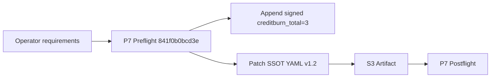
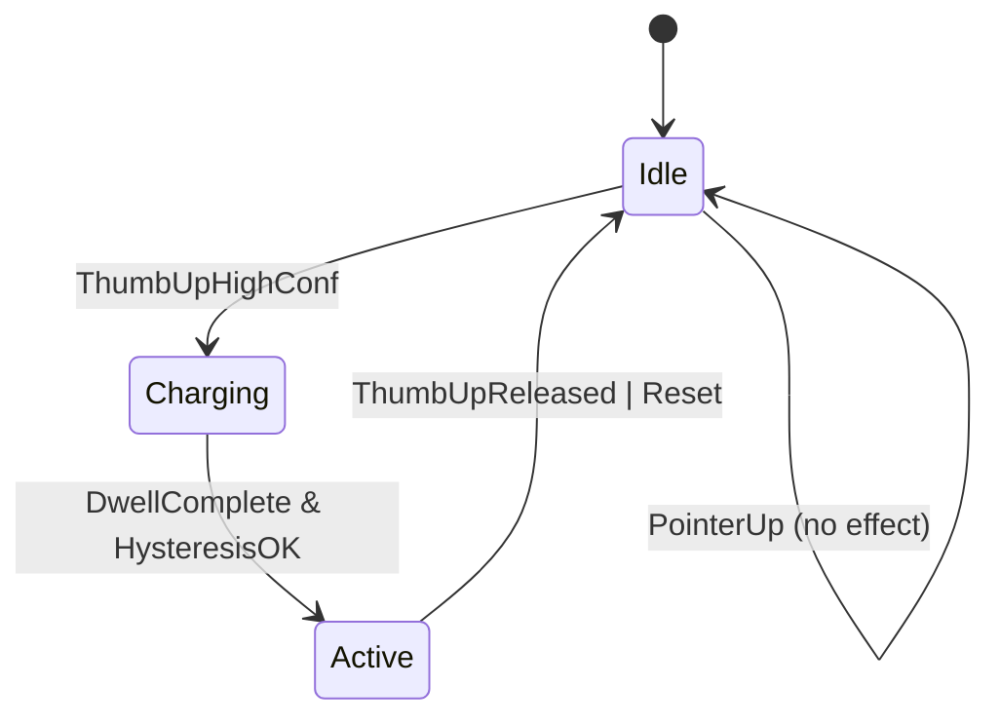

# P0 — OBSERVE — Observations (current question + current state)
- What TTao asked: (1) log creditburn increment with proof, (2) update v1.2 YAML to re-map knuckle_triplane activation to thumb-up dwell/hysteresis, and (3) add user-adjustable PYREBLADE sizing using palm knuckle span, lvl0 defaults.
- Observable:
  - P7 preflight receipt created: `841f0b0bcd3e` (artifacts/flight/preflight_P7_turn4.json).
  - Signed hot blackboard entry appended with `creditburn_total: 3` (signature `0d78bff9...`).
  - SSOT spec updated to include `commit_gates`, `knuckle_triplane`, and `pyreblade` sections.
- Constraints: Spec-first; runtime wiring remains behind RED-first TDD+BDD gates.

# P1 — BRIDGE — Current understanding + shared data fabrics
Plain language:
- The problem is activation confusion: COMMIT_POINTER_UP currently interacts with triplane; you want it isolated.
- Thumb-up (high-confidence + dwell charge meter + hysteresis) becomes the only activator.
- PYREBLADE should be visible/interactive only when enabled and the hand is READY.
- Sizing should be adjustable by palm knuckle span with a pow8 ladder, starting at lvl0.

Truth locations:
- SSOT spec: hfo_hot_obsidian/bronze/1_projects/omega_gen7_v1_portable/specs/omega_gen7_v1_2_spec.yaml
- Evidence:
  - Preflight: artifacts/flight/preflight_P7_turn4.json
  - creditburn log: hfo_hot_obsidian/hot_obsidian_blackboard.jsonl

# P2 — SHAPE — Possible next actions (MAP-Elites trade study + exemplars)
## P2.1 Exemplar Registry (named exemplars used in THIS run)
- Exemplar name: S3 Protocol v2.1
  - 5W1H: Proof-first ritual per turn.
  - Formal definition: preflight → one artifact → postflight → short chat preview.
  - Source link: hfo_hot_obsidian/silver/3_resources/reports/S3_PROTOCOL_V2_1_TTAO_IDE_CARD_2026_01_25.md
  - How applied here: receipts + one durable markdown proof capsule.
- Exemplar name: Fail-closed gesture gate
  - 5W1H: Only thumb-up can activate pyreblade/triplane; pointer-up must not.
  - Formal definition: invalid gesture/state transitions are rejected.
  - Source link: this SSOT spec (parameters.defaults.commit_gates + implementation_notes.commit_and_pyreblade).
  - How applied here: codified activation mapping + invariants.

## P2.2 Trade Study Matrix (4–8 options; exemplar-composed; MAP-Elites archive)
| Option | Exemplars (names) | What changes | Pros | Cons | Risks | Proof needed | Score |
|---|---|---|---|---|---|---|---|
| A | Minimal patch | Document only “thumb-up activates” | Fast | Ambiguous sizing | Mis-wiring | spec diff | 6 |
| B (chosen) | Fail-closed + Spec-first | Add explicit gates + READY gating + pow8 sizing | Clear intent | Spec grows heavier | Needs modularization later | receipts + spec diff | 9 |
| C | Auto-scale only | No user controls; fixed sizing | Simple UX | Wrong fit for users | Usability regressions | UX replay | 5 |
| D | Full profiles now | Export/import profiles | Future-ready | Too heavy now | Revenue mismatch | many tests | 3 |

# P3 — INJECT — Implementation options + injection capabilities
- Injection points:
  - Gesture classifier / commit detector: map thumb-up dwell/hysteresis to “commit” action.
  - Knuckle triplane: enable/disable + interaction gating on hand READY.
  - Visual layer: render PYREBLADE when active; bind fingertip interaction.
  - P7 controls: expose pyreblade level + multipliers with slider+numeric.

# P4 — DETECT — Tests, regressions, green-lie vs red-truth checks
- Missing tests (required by spec):
  - Property: COMMIT_POINTER_UP cannot flip triplane/pyreblade active state.
  - BDD: thumb-up dwell completes → activates; thumb-up released → deactivates.
  - Property: pyreblade size responds monotonically to palm_knuckle_span and level_pow8.
- Green-lie risks:
  - UI shows pyreblade controls but activation still driven by pointer-up.
  - Sizing sliders exist but not applied to rendered geometry.
- Replay/golden recipe:
  - Verify receipts and blackboard signature.
  - Verify SSOT spec includes the new sections.

# P5 — IMMUNIZE — Guards and risk protection
- Tripwires:
  - If persisted settings re-enable pointer-up activation, treat as invalid persisted state and fail-closed.
  - If palm_knuckle_span unavailable, default to lvl0 and show warning.
- Rollback:
  - Revert SSOT YAML changes.
  - Append a compensating blackboard entry (append-only).

# P6 — ARCHIVE — Memory notes and handoff
- creditburn_total incremented to 3 and signed.
- v1.2 spec now encodes:
  - commit_pointer_up activates=false for triplane/pyreblade
  - commit_thumb_up activates=true with high-confidence + dwell + hysteresis
  - READY gating for fingertip interaction
  - PYREBLADE sizing via palm_knuckle_span, lvl0 defaults, pow8 levels

# P7 — NAVIGATE — Clarifying questions for next iteration (Strange Loop N+1)
- Should zIndex uniqueness be enforced for hidden layers too, or only visible layers? (P4)
- What is the exact dwell timing curve (ms) and hysteresis band for thumb-up activation? (P4)
- Should pyreblade sizing apply in screen pixels, CSS units, or world space (Babylon)? (P3)
- When thumb-up deactivates, should pyreblade instantly vanish or decay (fade-out)? (P5)
