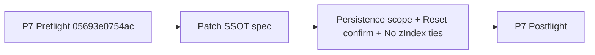
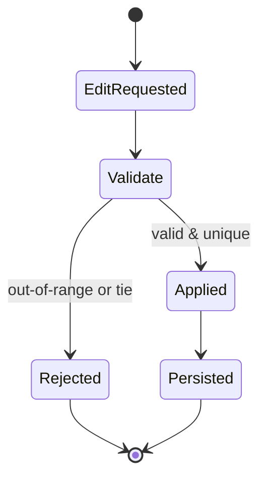

# P0 — OBSERVE — Observations (current question + current state)

- What TTao asked (tight paraphrase): persist only P7 settings (not GoldenLayout yet), make reset a single confirmed action, and disallow any equal zIndex ties.
- What is observable vs inferred:
  - Observable: P7 preflight receipt exists (receipt_id `05693e0754ac`).
  - Observable: Gen7 v1.2 SSOT spec has been updated to reflect these clarified rules.
  - Inferred: Implementation will enforce uniqueness via UI validation + fail-closed apply policy.
- Constraints: Spec-first; wiring is gated behind RED-first TDD+BDD.
- Top 3 immediate risks:
  - Persisting unintended state (layout) and causing drift.
  - Handling zIndex conflicts ambiguously.
  - Reset semantics unclear (needs explicit confirmation + permanence).

# P1 — BRIDGE — Current understanding + shared data fabrics

Plain language:

- We’re tightening the spec so persistence is Pareto-simple: localStorage only, settings only, no layout state.
- Reset is a single action, but must prompt because it’s destructive.
- zIndex uniqueness is mandatory; ties are invalid state.

Truth locations:

- SSOT spec: hfo_hot_obsidian/bronze/1_projects/omega_gen7_v1_portable/specs/omega_gen7_v1_2_spec.yaml
- Preflight: artifacts/flight/preflight_P7_turn3.json

# P2 — SHAPE — Possible next actions (MAP-Elites trade study + exemplars)

## P2.1 Exemplar Registry (named exemplars used in THIS run)

- Exemplar name: S3 Protocol v2.1
  - 5W1H: Proof-first per-turn ritual for IDE agent work.
  - Formal definition: preflight → one PARA artifact → postflight → short chat preview.
  - Source link: hfo_hot_obsidian/silver/3_resources/reports/S3_PROTOCOL_V2_1_TTAO_IDE_CARD_2026_01_25.md
  - How applied here: anchored receipt + single artifact for this clarification turn.
- Exemplar name: Fail-closed uniqueness invariant
  - 5W1H: Disallow invalid state (duplicate zIndex).
  - Formal definition: If invariant violated, reject and revert to last-known-good state.
  - Source link: (internal) this SSOT spec’s implementation_notes/validation.
  - How applied here: codified “no ties” + fail-closed behavior.

## P2.2 Trade Study Matrix (4–8 options; exemplar-composed; MAP-Elites archive)

| Option | Exemplars (names) | What changes | Pros | Cons | Risks | Proof needed | Score |
|---|---|---|---|---|---|---|---|
| A | Spec-first | Only document (no UI semantics) | Fast | Ambiguous behavior | Mis-implementation | spec diff | 6 |
| B (chosen) | Spec-first + fail-closed invariant | Add explicit scope + reset confirm + no ties + reject policy | Clear contract | Still no runtime wiring | Needs tests later | spec diff + receipts | 9 |
| C | Auto-resolve ties | On tie, auto-shift conflicting zIndex | User convenience | Surprising behavior | Hidden drift | replay + tests | 5 |
| D | Expand range beyond 99 | Allow 0..999 | More room | Violates stated scope discipline | Scope creep | none | 2 |

# P3 — INJECT — Implementation options + injection capabilities

- Injection points:
  - P7 settings microkernel (lil-gui): validation + persistence hooks.
  - Layer stacking: DOM zIndex assignment.
- Minimal reversible move: Spec-only update (this turn).

# P4 — DETECT — Tests, regressions, green-lie vs red-truth checks

- Required tests (future, RED-first):
  - Property: zIndex map is injective (no duplicates) and bounded 0..99.
  - BDD: reset confirmation blocks unless confirmed.
  - BDD: GoldenLayout layout state is NOT written/read.
- Green-lie risk: persistence appears to work but includes layout inadvertently.
- Anti-green-lie: assert localStorage key only contains allowed fields.

# P5 — IMMUNIZE — Guards and risk protection

- Tripwires:
  - If zIndex ties detected in persisted state, clear persisted state and revert to defaults (fail-closed).
  - If reset is clicked, require confirmation.
- Rollback: revert SSOT spec changes.

# P6 — ARCHIVE — Memory notes and handoff

- Clarified scope: no GoldenLayout persistence yet.
- Reset semantics: one button + confirmation + permanent clear.
- zIndex ties forbidden; uniqueness invariant required.

# P7 — NAVIGATE — Clarifying questions for next iteration (Strange Loop N+1)

- Should the system reject ties per-layer with inline validation, or block the entire apply action? (P3)
- Should zIndex uniqueness be enforced only among visible layers, or across all layers regardless of visibility? (P4)
- Should reset also reset window-level kiosk flags, or only P7 settings? (P2)
