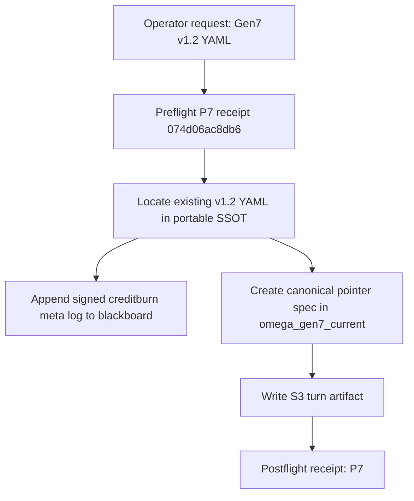
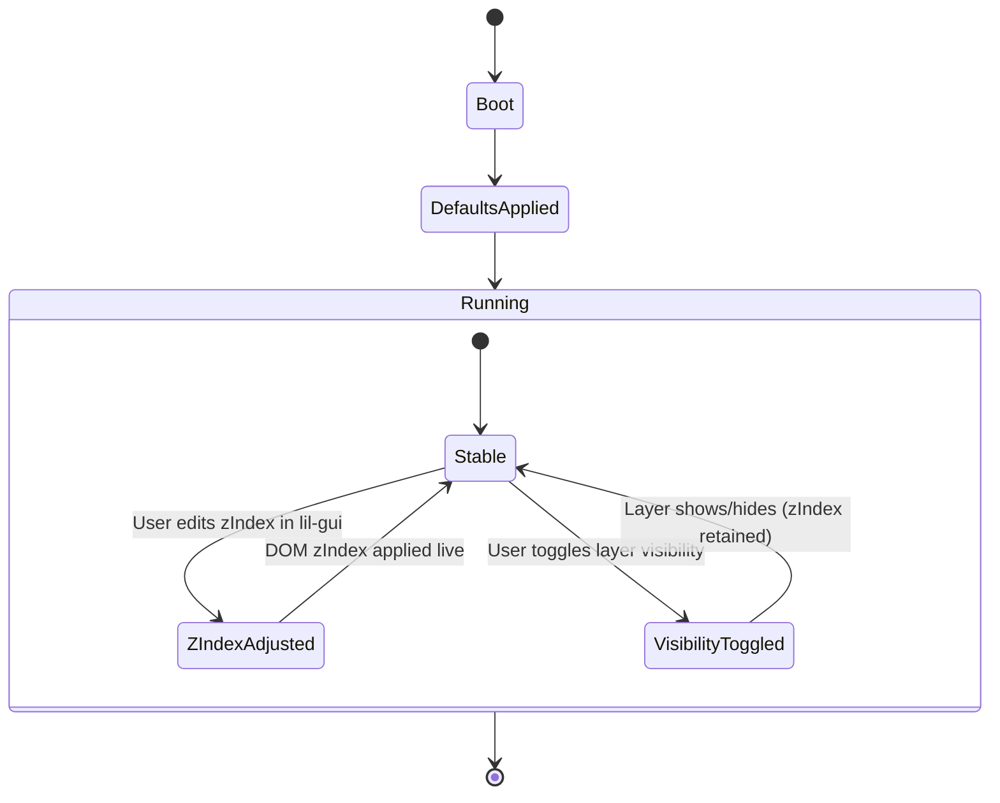

# P0 — OBSERVE — Observations (current question + current state)

- Asked: “Create the YAML spec for Omega Gen7 v1.2; fork from v1.1; update opacity/touch2d defaults; make zlayers runtime-adjustable via lil-gui; enforce microkernel kiosk.”
- Observable:
  - Preflight receipt exists: `074d06ac8db6` in `artifacts/flight/preflight_P7.json`.
  - A full v1.2 YAML spec already exists (portable SSOT): `hfo_hot_obsidian/bronze/1_projects/omega_gen7_v1_portable/specs/omega_gen7_v1_2_spec.yaml`.
  - Creditburn/meta log appended to blackboard with signature `a6ad731b...`.
- Inferred:
  - Operator didn’t see the existing YAML and wants a proof-first response.
- Constraints:
  - Deliver spec-first (Bronze), minimal additional input.
- Top 3 immediate risks:
  - Drift via duplicate specs (multiple “v1.2” authorities).
  - UI control spec not matched by implementation yet (spec≠shipping behavior).
  - Missing “proof-of-result” evidence in outputs.

# P1 — BRIDGE — Current understanding + shared data fabrics

Plain language:

- The v1.2 YAML spec you want is already present and already encodes the defaults + zIndex slider requirement.
- To avoid drift, we add a small “pointer spec” in the canonical Gen7 project that points at the portable SSOT.
- We log the “creditburn” metadata to the blackboard with a chained signature for audit.

Where truth lives right now (“shared data fabric”):

- Artifacts (PARA notes/specs): the v1.2 YAML spec file.
- Evidence: blackboard JSONL tail showing the signed meta log.
- Contracts/schemas: S3 protocol v2.1 (this card) + existing Gen7 microkernel spec.

# P2 — SHAPE — Possible next actions (MAP-Elites trade study + exemplars)

## P2.1 Exemplar Registry (named exemplars used in THIS run)

- Exemplar name: S3 Protocol v2.1
  - 5W1H: Who=Spider Sovereign; What=fail-closed turn ritual; Where=Hot/Bronze PARA; When=every turn; Why=prevent drift; How=preflight→artifact→postflight→chat.
  - Formal definition: A deterministic, auditable 4-output loop that produces one reviewable artifact per user turn.
  - Source link: hfo_hot_obsidian/silver/3_resources/reports/S3_PROTOCOL_V2_1_TTAO_IDE_CARD_2026_01_25.md
  - How applied here:
    - Used as the template for this artifact.

- Exemplar name: PARA (Areas/Sensemaking)
  - 5W1H: Who=operator; What=filing scheme; Where=Areas/Sensemaking; When=ongoing; Why=durable retrieval; How=one artifact per turn.
  - Formal definition: A folder taxonomy: Projects/Areas/Resources/Archives for durable notes.
  - Source link: hfo_hot_obsidian/silver/3_resources/reports/S3_PROTOCOL_V2_1_TTAO_IDE_CARD_2026_01_25.md
  - How applied here:
    - Stored the S3 artifact under Areas/Sensemaking.

- Exemplar name: Z-Layer (zIndex)
  - 5W1H: Who=UI surfaces; What=stacking order; Where=DOM canvas/overlays; When=runtime; Why=Babylon must be on top; How=numeric zIndex adjusted via lil-gui.
  - Formal definition: A numeric total order where higher values render above lower.
  - Source link: hfo_hot_obsidian/bronze/1_projects/omega_gen7_v1_portable/specs/omega_gen7_v1_2_spec.yaml
  - How applied here:
    - Spec encodes defaults and slider requirements.

## P2.2 Trade Study Matrix (4–8 options; exemplar-composed; MAP-Elites archive)

| Option | Exemplars (names) | What changes | Pros | Cons | Risks | Proof needed | Score |
|---|---|---|---|---|---|---|---|
| A | Z-Layer, S3 | Use existing portable v1.2 YAML as-is | Zero churn | Discoverability | Operator can’t find it | File exists + content check | 7/10 |
| B | PARA, Z-Layer | Copy full v1.2 YAML into omega_gen7_current | Discoverable | Duplicates SSOT | Drift | Diff/provenance rules | 5/10 |
| C | PARA, Z-Layer | Add pointer spec in omega_gen7_current → portable SSOT | Discoverable + no duplication | Indirection | Pointer rot | Pointer file + README update | 9/10 |
| D | Zod Contracts | Formalize zlayer schema in `contracts/` | Strong validation | More work | Over-scoping | Contract + tests | 6/10 |

# P3 — INJECT — Implementation options + injection capabilities

- Injection points (config/spec):
  - Portable SSOT spec: `hfo_hot_obsidian/bronze/1_projects/omega_gen7_v1_portable/specs/omega_gen7_v1_2_spec.yaml`
  - Canonical pointer spec: `hfo_hot_obsidian/bronze/1_projects/omega_gen7_current/specs/omega_gen7_v1_2_spec.yaml`
- Adapter/Injector strategy:
  - P7 lil-gui controls adjust `layers_zindex.*` and `layers_visibility.*`.
- Minimal reversible move:
  - Update only YAML + docs (no runtime changes yet) and keep “pointer spec” so reversions are trivial.

# P4 — DETECT — Tests, regressions, green-lie vs red-truth checks

- Current tests: none executed in this turn (spec + logging only).
- Green lie risks:
  - Spec claims sliders exist but UI doesn’t implement them yet.
- Anti-green-lie upgrades:
  - Add a Playwright assertion later that checks computed `z-index` values for the key overlay elements.
- Replay/Golden recipe:
  - Inspect the YAML spec and verify defaults: Touch2D false, Excalidraw opacity 0.8, zIndex map present.

Proof Bundle (low risk, but included for operator demand):

- Preflight receipt: `074d06ac8db6` (artifacts/flight/preflight_P7.json)
- YAML SSOT exists and contains required fields:
  - `parameters.defaults.layers_visibility.p1Touch2D: false`
  - `parameters.defaults.excalidraw.opacity: 0.8`
  - `parameters.defaults.layers_zindex.*` + lil-gui slider requirement
- Signed creditburn log:
  - `hfo_hot_obsidian/hot_obsidian_blackboard.jsonl` tail contains signature `a6ad731b...`

# P5 — IMMUNIZE — Guards and risk protection

- Tripwires:
  - If a second “full” v1.2 YAML appears elsewhere, treat as drift and delete/replace with a pointer.
- Rollback:
  - Remove the pointer spec file and README bullet (portable SSOT remains intact).
- Fail-closed defaults:
  - Kiosk essentials mode is enforced by default in the v1.2 spec.

# P6 — ARCHIVE — Memory notes and handoff

- Gen7 v1.2 YAML spec already exists in portable SSOT and encodes the requested defaults.
- Added a canonical-project pointer spec for discoverability.
- Logged creditburn=1 with GPT-5.2 metadata to the signed blackboard.
- Preflight receipt for this run: `074d06ac8db6`.

# P7 — NAVIGATE — Clarifying questions for next iteration (Strange Loop N+1)

- Do you want the lil-gui zIndex controls to be per-layer **slider** only, or slider + numeric input? (P3)
- What exact zIndex range do you want: 0–100, 0–255, or unbounded? (P2)
- Should zIndex + visibility persist to localStorage by default, or session-only? (P4)
- Which DOM targets should be authoritative for zIndex: wrapper divs, canvases, or both? (P3)
