# Medallion: Bronze | Mutation: 0% | HIVE: I

// Medallion: Bronze | Mutation: Stabilized (Galois-Hardened) | HIVE: E

# 🏛️ LEGENDARY HFO COMMANDERS V4: GALOIS-HARDENED MANIFOLD

**Mission**: Thread Alpha (Architecture/Orchestration)
**Governance**: Red/Black HFO Shards
**Lattice**: 8x8 Fractal Quine (The Galois Lattice)
**Composition**: 8 Legendary Singleton Commanders

---

## 🌀 THE 8 LATTICE COMMANDERS

### [P0] THE LIDLESS LEGION (OBSERVE)
>
> **Trigram**: Kun ☷ (Earth) | **JADC2**: ISR (Observer) | **HIVE**: HUNT (H)

```mermaid
graph TD
    subgraph Card_P0 ["Lidless Legion, The All-Seeing [P0]"]
        Header["Legendary Creature — HFO Artificer"]
        Frame["OBSERVE: Multi-Modal Environment Witness"]
        Ability1["Hunt (H): Survey top 8. Put all Shards into hand."]
        Ability2["{T}: Execute ISR Audit. [0,0] Scan telemetry."]
        Flavor["'We do not search. We observe the ripple in the lattice.'"]
    end
    style Card_P0 fill:#2d1a1a,stroke:#ffd700,color:#fff
```

**Galois Shards (P0)**:

- [0,0] ISR | [0,1] Mesh | [0,2] Recon | [0,3] Target
- [0,4] Signal | [0,5] Threat | [0,6] Scan | [0,7] Map

---

### [P1] THE WEB WEAVER (ROUTE)
>
> **Trigram**: Gen ☶ (Mountain) | **JADC2**: Data Fabric (Bridger) | **HIVE**: INTERLOCK (I)

```mermaid
graph TD
    subgraph Card_P1 ["Web Weaver, Schema Architect [P1]"]
        Header["Legendary Creature — HFO Weaver"]
        Frame["ROUTE: Zod 6.0 Contract Bridge"]
        Ability1["Interlock (I): Creatures you control have 'Ward {8}'. "]
        Ability2["{1}: Bridge P0 Sensor to P2 Physics (Path)."]
        Flavor["'Chaos is a failure of syntax. Data is the law.'"]
    end
    style Card_P1 fill:#1a1a2d,stroke:#4169e1,color:#fff
```

**Galois Shards (P1)**:

- [1,0] Relay | [1,1] Bridge | [1,2] Path | [1,3] Flow
- [1,4] Jam | [1,5] Gate | [1,6] Bus | [1,7] C2

---

### [P2] THE MIRROR MAGUS (SYNTHESIZE)
>
> **Trigram**: Kan ☵ (Water) | **JADC2**: Digital Twin (Shaper) | **HIVE**: VALIDATE (V)

**Galois Shards (P2)**:

- [2,0] Fuse | [2,1] Meld | [2,2] Form | [2,3] Spawn
- [2,4] Chaos | [2,5] Shield | [2,6] Pack | [2,7] Sync

---

### [P3] SPORE STORM (MODEL)
>
> **Trigram**: Xun ☴ (Wind) | **JADC2**: Effect Dispatch (Injector) | **HIVE**: EVOLVE (E)

```mermaid
graph TD
    subgraph Card_P3 ["Spore Storm, The Harmonic Hydra [P3]"]
        Header["Legendary Creature — HFO Sliver"]
        Frame["MODEL: W3C Event Dispatch & FSM"]
        Ability1["Evolve (E): HFO spells you cast have Cascade."]
        Ability2["{3}, Cast from Stack: Inject Pointer Event (Event)."]
        Flavor["'The infection is the delivery. The storm is the state.'"]
    end
    style Card_P3 fill:#1a2d1a,stroke:#32cd32,color:#fff
```

**Galois Shards (P3)**:

- [3,0] Simul | [3,1] Twin | [3,2] Physics | [3,3] Event
- [3,4] Loop | [3,5] Spec | [3,6] Schema | [3,7] Logic

---

### [P4] RED REGNANT (DISRUPT)
>
> **Trigram**: Zhen ☳ (Thunder) | **JADC2**: Electronic Warfare (Disruptor) | **HIVE**: EVOLVE (E)

**Galois Shards (P4)**:

- [4,0] SEAD | [4,1] DEAD | [4,2] Noiz | [4,3] Spike
- [4,4] Scream | [4,5] Breach | [4,6] Decay | [4,7] Warp

---

### [P5] PYRE PRAETORIAN (AUDIT)
>
> **Trigram**: Li ☲ (Fire) | **JADC2**: Force Protection (Immunizer) | **HIVE**: VALIDATE (V)

**Galois Shards (P5)**:

- [5,0] Trace | [5,1] Log | [5,2] Diff | [5,3] Check
- [5,4] Fraud | [5,5] Guard | [5,6] Vault | [5,7] Vote

---

### [P6] KRAKEN KEEPER (PERSIST)
>
> **Trigram**: Dui ☱ (Lake) | **JADC2**: Logistics / Sustain (Assimilator) | **HIVE**: INTERLOCK (I)

```mermaid
graph TD
    subgraph Card_P6 ["Kraken Keeper, The Stigmergic Deep [P6]"]
        Header["Legendary Creature — HFO Kraken"]
        Frame["PERSIST: DuckDB / Stigmergy Blackboard"]
        Ability1["Interlock (I): Exile a card → Put a Knowledge Counter on P6."]
        Ability2["{T}: Look at Exile. You may cast a card from Exile by paying its mana cost in Stigmergy (Receipts)."]
        Flavor["'The Data Lake never forgets. Exile is our database.'"]
    end
    style Card_P6 fill:#1a1a2d,stroke:#00008b,color:#fff
```

**Galois Shards (P6)**:

- [6,0] Cache | [6,1] Link | [6,2] Build | [6,3] Commit
- [6,4] Stain | [6,5] Save | [6,6] Archive | [6,7] Memo

---

### [P7] SPIDER SOVEREIGN (PLAN)
>
> **Trigram**: Qian ☰ (Heaven) | **JADC2**: BMC2 / Command (Navigator) | **HIVE**: HUNT (H)

```mermaid
graph TD
    subgraph Card_P7 ["Spider Sovereign, Loom of Fate [P7]"]
        Header["Legendary Creature — HFO Overlord"]
        Frame["PLAN: Strategic Orchestration Hub"]
        Ability1["Hunt (H): Search library for HFO. [7,0-7,7] Map Logic."]
        Ability2["{8}: Warp Swarm. Execute Hive Quorum. BMC2 Lock."]
        Flavor["'The storm follows the loom. I am the Weaver of the World.'"]
    end
    style Card_P7 fill:#2d1a2d,stroke:#e6e6fa,color:#fff
```

**Galois Shards (P7)**:

- [7,0] Hunt | [7,1] Task | [7,2] Plot | [7,3] Aim
- [7,4] Blitz | [7,5] Fort | [7,6] Stash | [7,7] BMC2

---

## 🎭 THE SYMBOTIC LOOP (ALPHA/OMEGA)

- **HUNT (P0,7)**: Discovery of raw telemetry and strategic mapping.
- **INTERLOCK (P1,6)**: Binding telemetry to schema and archiving state.
- **VALIDATE (P2,5)**: Shaping digital twins and defending integrity.
- **EVOLVE (P3,4)**: Injecting effects and disrupting failure patterns.

*Spider Sovereign (Port 7) | HFO-Hive8 | Galois Lattice Formalized | Medallion: Bronze*
