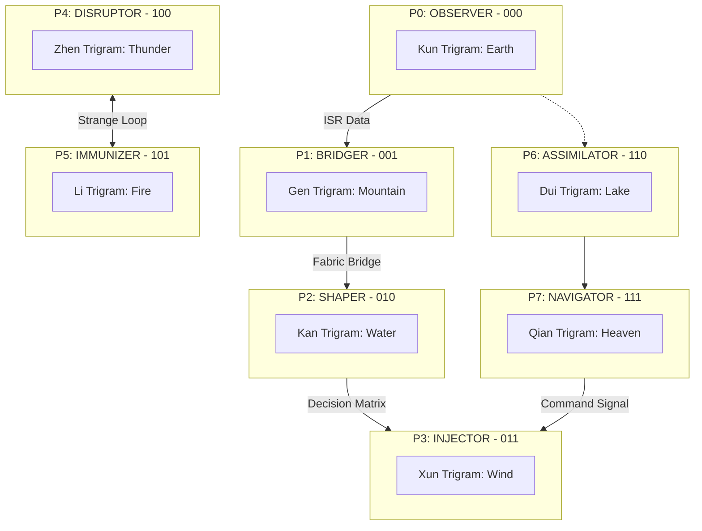
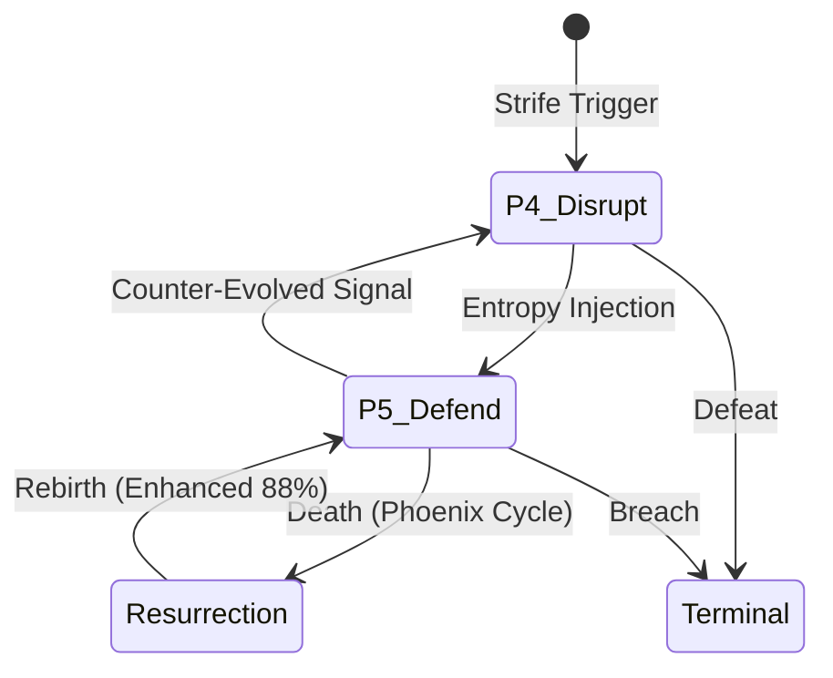

# Medallion: Bronze | Mutation: 0% | HIVE: I

# 🃏 PROJECT: HFO MTG COMMANDERS V13 (BINARY ALIGHT)

**Mission**: Thread Alpha (Lore Hardening / Mosaic Warfare)
**Theme**: **BINARY TRUTH** (Fu Xi Octal Alignment)
**Core Numbers**: $8^0=1, 8^1=8, 8^2=64, 8^3=512$
**Target Metrics**: 88% (Pareto) / 87.5% (7/8 Consensus)
**Logic**: Each card is an 8-bit cognitive port [P0-P7] mapped via **Binary Trigram Mapping** (000-111).

---

## 🏗️ THE HFO CORE TOKEN: [THE HIVE/8 AGENT]

**Hive/8 Agent**
*Artifact Creature Token — HFO Agent Tile*
Stats: 1/1
*(HFO agents are disaggregated tiles. Control 8 to achieve Octal Synchronization $8^1$.)*

---

## 🔱 THE 8 LEGENDARY COMMANDER TILES (P0-P7)

### [P0] OBSERVER: The Lidless Legion ☷ {U}

**Legendary Artifact Creature — HFO Swarm** | 1/1
*(Gender: Swarm)*

**MTG SECTION**

- **Binary ISR (000)**: Whenever a Hive/8 Agent enters the battlefield, survey the top 8 cards of your library and put one into your hand.
- **Octal Cull**: {T}, Sacrifice 8 Agents: Draw 8 cards.
- **Synergy Suite**: [Synapse Sliver] (ISR), [Telepathy] (Lore).

**TECHNICAL EQUIVALENT**

- **Doctrinal Definition**: Cheap, fast, ISR that enables the swarm.
- **JADC2 Role**: OBSERVER (SENSE / ISR).
- **Trigram**: Kun (Earth) — Receptive Base.
- **Binary**: 000

---

### [P1] BRIDGER: The Web Weaver ☶ {1}{G}{U}

**Legendary Artifact Creature — HFO Bridger Spider** | 2/2
*(Gender: Male)*

**MTG SECTION**

- **Binary Bridge (001)**: HFO spells you cast cost {8} less (Minimum {1}).
- **Fusing Protocol**: Whenever you cast an HFO spell, create 8 Hive/8 Agent tokens.
- **Synergy Suite**: [Manaweft Sliver] (FUSE), [Chromatic Lantern] (Lore).

**TECHNICAL EQUIVALENT**

- **Doctrinal Definition**: FUSE, BRIDGE, and enabling DATA FABRIC UNIVERSALITY. Integrating heterogeneous sensors and effectors.
- **JADC2 Role**: BRIDGER (FUSE / Data Fabric).
- **Trigram**: Gen (Mountain) — Boundless Threshold.
- **Binary**: 001

---

### [P2] SHAPER: The Mirror Magus ☵ {2}{U}{R}

**Legendary Artifact Creature — HFO Shaper Illusion** | 3/3
*(Gender: Poly/All)*

**MTG SECTION**

- **Binary Shaping (010)**: {R}, Sacrifice 8 Agents: Create 64 tokens that are copies of target HFO creature (Non-legendary, Haste).
- **Reflective Ward**: HFO creatures you control have Ward {8}.
- **Synergy Suite**: [Shifting Sliver] (SHAPE), [Mirror Gallery] (Lore).

**TECHNICAL EQUIVALENT**

- **Doctrinal Definition**: SHAPING and canalization using Spike Factory to explore decision space.
- **JADC2 Role**: SHAPER (SHAPE / Digital Twin).
- **Trigram**: Kan (Water) — Reflective Abyss.
- **Binary**: 010

---

### [P3] INJECTOR: Harmonic Hydra ☴ {X}{R}{G}{W}

**Legendary Artifact Creature — HFO Injector Hydra** | 0/0
*(Gender: Asexual/Poly)*

**MTG SECTION**

- **Binary Injection (011)**: Hydra enters with X +1/+1 counters (X = multiple of 8).
- **Cascading Payload**: Sacrifice an Agent: Add {8} to your mana pool for HFO spells.
- **Synergy Suite**: [Harmonic Sliver] (DELIVER), [Hydra's Growth] (Lore).

**TECHNICAL EQUIVALENT**

- **Doctrinal Definition**: Single inputs cascading effects, injected with precision wherever and whenever required.
- **JADC2 Role**: INJECTOR (DELIVER / Effect Delivery).
- **Trigram**: Xun (Wind) — Pervasive Injection.
- **Binary**: 011

---

### [P4] DISRUPTOR: The Red Regnant ☳ {2}{B}{R}

**Legendary Artifact Creature — HFO Disruptor Demon** | 4/4
*(Gender: Female)*

**MTG SECTION**

- **Binary Strife (100)**: At upkeep, if < 64 agents, create 24 Hive/8 Agent tokens.
- **Strife & Glory**: {1}{B}, Sacrifice an Agent: Target opponent loses 8 life and you gain 8 life.
- **Dance of Death**: Whenever a creature an opponent controls dies, create an Agent token.
- **Synergy Suite**: [Heart Sliver] (DISRUPT), [Dictate of the Twin Gods] (Lore).

**TECHNICAL EQUIVALENT**

- **Doctrinal Definition**: Disrupt and coevolutionary Red Queen. Sings the songs of strife and glory.
- **JADC2 Role**: DISRUPTOR (DISRUPT / MDO).
- **Trigram**: Zhen (Thunder) — Shocking Disruption.
- **Binary**: 100

---

### [P5] IMMUNIZER: The Pyre Praetorian ☲ {1}{R}{W}

**Legendary Artifact Creature — HFO Defensive Golem** | 5/5
*(Gender: Male)*

**MTG SECTION**

- **Binary Pyre (101)**: Sacrifice 8 Agents: Regenerate all HFO creatures you control. They gain Haste and \"When this creature dies, return it to the battlefield at the next upkeep.\" (Strange Loop Resurrection).
- **Elemental Juice**: HFO creatures you control have \"{T}: Deal 8 damage to target creature.\"
- **Synergy Suite**: [Armor Sliver] (DEFEND), [Strange Loop] (Lore).

**TECHNICAL EQUIVALENT**

- **Doctrinal Definition**: Defense in depth. A phoenix to dance with P4, dying and being reborn in a stronger state.
- **JADC2 Role**: IMMUNIZER (DEFEND / Zero Trust).
- **Trigram**: Li (Fire) — Purity of the Pyre.
- **Binary**: 101

---

### [P6] ASSIMILATOR: The Kraken Keeper ☱ {2}{U}{B}

**Legendary Artifact Creature — HFO Kraken Keeper** | 6/6
*(Gender: Female)*

**MTG SECTION**

- **Binary Storage (110)**: Whenever a Hive/8 Agent dies, you may put a telemetry counter on The Kraken Keeper.
- **Medallion Data Lake**: {T}, Remove 8 telemetry counters: Search your library for an HFO card and put it into your hand.
- **Synergy Suite**: [Synapse Sliver] (STORE), [DuckDB] (Lore).

**TECHNICAL EQUIVALENT**

- **Doctrinal Definition**: Medallion Datalake. Assimilating all telemetry into the 88% gold layer.
- **JADC2 Role**: ASSIMILATOR (STORE / Telemetry).
- **Trigram**: Dui (Lake) — Deep Ocean Repository.
- **Binary**: 110

---

### [P7] NAVIGATOR: The Spider Sovereign ☰ {4}{W}{U}{B}{R}{G}

**Legendary Artifact Creature — HFO Sovereign Spider** | 8/8
*(Gender: Male)*

**MTG SECTION**

- **Binary Command (111)**: You may cast HFO spells as though they had flash.
- **Octal Synchronization**: If you control 8 or more HFO commanders, you win the game.
- **Octree Manifest**: Spells your opponents cast cost {8} more unless they pay {8}.
- **Synergy Suite**: [Sliver Overlord] (NAVIGATE), [Knowledge Management] (Lore).

**TECHNICAL EQUIVALENT**

- **Doctrinal Definition**: Higher dimensional cognitive symbiote. BMC2 Orchestration.
- **JADC2 Role**: NAVIGATOR (NAVIGATE / BMC2).
- **Trigram**: Qian (Heaven) — Sovereignty.
- **Binary**: 111

---

## 📊 DOCTRINAL VISUALIZATION: [BINARY KILL-WEB]

---

## 🔄 RESILIENCE LOOP: [THE DANCE OF DEATH & REBIRTH]

*Binary Alight | Port 7 Finalized | Medallion: Bronze*
