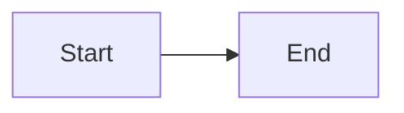
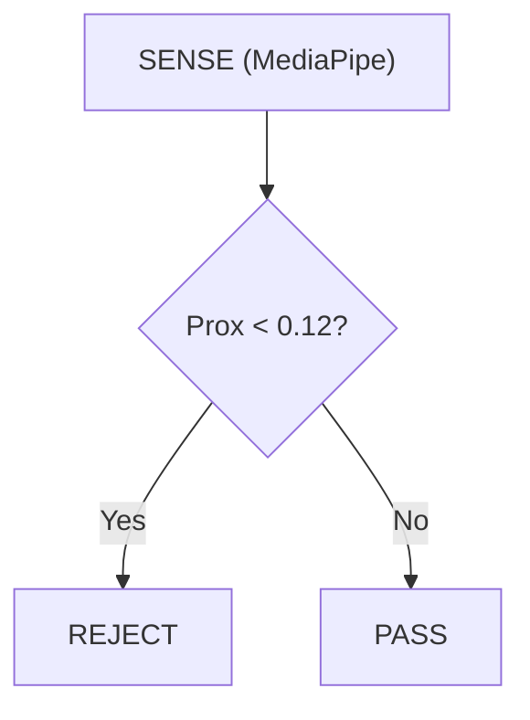
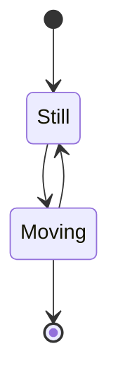
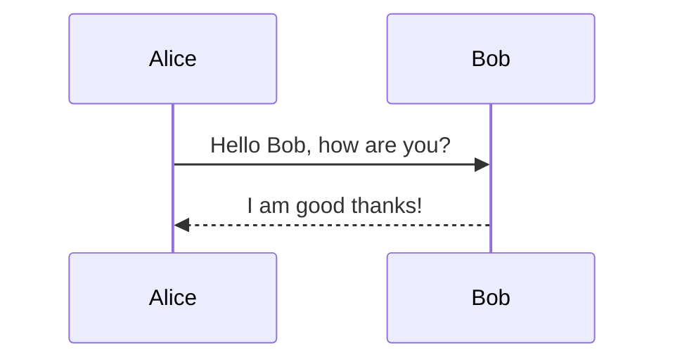
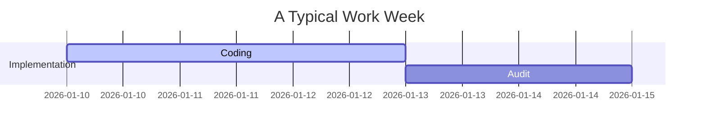

<!-- Medallion: Bronze | Mutation: 0% | HIVE: V -->
# 🧜 Mermaid Rendering Test Suite

**Medallion**: Bronze | **Mutation**: 0% | **HIVE**: V
**Purpose**: Isolate which Mermaid diagram types and syntax patterns are supported by your current VS Code environment.

---

## TEST 1: Minimalist Graph (Success Baseline)

If this fails, your Mermaid extension is disabled or not loading.

---

## TEST 2: Escaped Character Graph (The "V34" Fix)

Testing if double-quotes resolve the `<` and `()` collision.

---

## TEST 3: State Diagram V2

Checking for modern State Machine support.

---

## TEST 4: Sequence Diagram

Testing multi-participant coordination.

---

## TEST 5: Gantt Chart

Testing temporal horizontal rendering.

---

## 🛠️ Troubleshooting Instructions

1. **Open the Preview**: Press `Ctrl+Shift+V` while focusing this file.
2. **If TEST 1 Fails**:
   - Check if the `bierner.markdown-mermaid` extension is enabled.
   - Look for a small lock icon in the top right of the preview pane and ensure "Enable Scripts" is allowed.
3. **If TEST 1 Works but TEST 2 Fails**:
   - Your renderer is extremely strict about character escaping. We must double-quote all non-alphanumeric labels.
4. **If "No diagram type detected" persists**:
    - Ensure there are **no spaces** after the Mermaid code-fence marker.
   - Check `settings.json` for `markdown-preview-enhanced.codeBlockTheme` conflicts.
