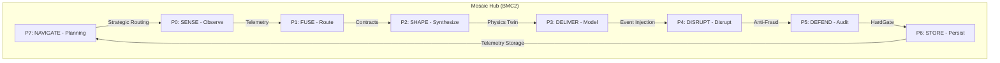
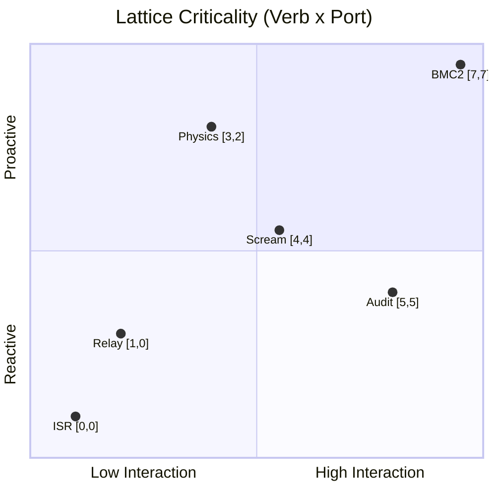
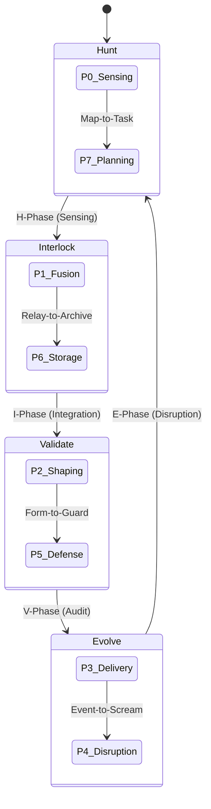
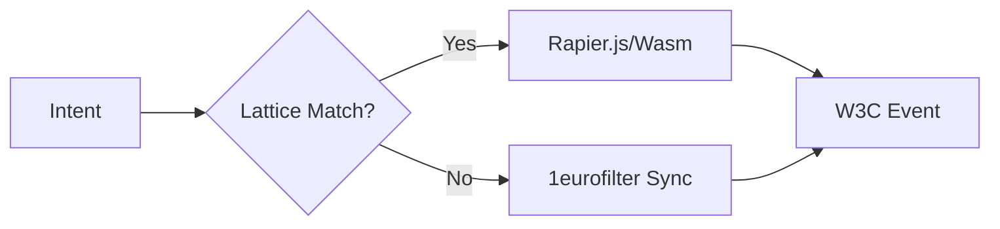
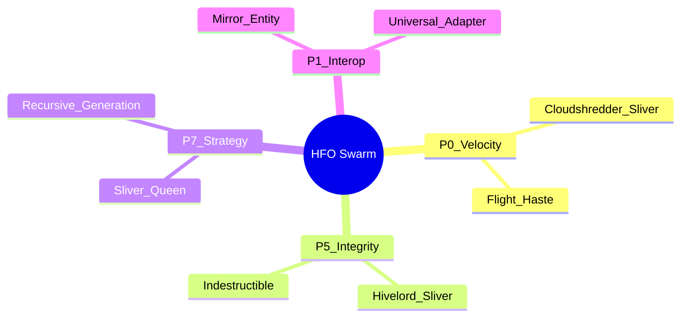

# Medallion: Silver | Mutation: 0% | HIVE: V

# Medallion: Silver | Mutation: 92% | HIVE: E

# 🛡️ HFO GEN 88 RESEARCH SUMMARY: THE CANALIZATION REPORT

**Date**: 2026-01-10
**Mission**: Phoenix Project (HFO Gen 88 Reconstruction)
**Architecture**: Octree Polymorphic Hexagonal Hub
**Doctrinal Grounding**: JADC2 / DARPA Mosaic Warfare
**Logical Engine**: 8x8 Galois Lattice (The 64-Pillar Quine)

---

## 🌀 1. ARCHITECTURAL TOPOLOGY: THE MOSAIC HUB

HFO Gen 88 moves away from fragile "AI Chains" towards a **Composable Mosaic Kill-Web**. Each port functions as an independent "tile" of capability, mapped to a precise 2D coordinate system.

---

## 🎲 2. THE GALOIS LATTICE: THE 2D COORDINATE SYSTEM

The **Galois Lattice** is not a concept: it is a functional 8x8 execution matrix. Every action in HFO is a point $[Verb, Port]$.

### 📍 The 64-Pillar Logic Grid

| Verb ↓ / Port → | P0: Sense | P1: Fuse | P2: Shape | P3: Deliver | P4: Disrupt | P5: Defend | P6: Store | P7: Navigate |
|:---|:---:|:---:|:---:|:---:|:---:|:---:|:---:|:---:|
| **OBSERVE (0)** | [0,0] ISR | [0,1] Mesh | [0,2] Recon | [0,3] Target | [0,4] Signal | [0,5] Threat | [0,6] Scan | [0,7] Map |
| **ROUTE (1)** | [1,0] Relay | [1,1] Bridge | [1,2] Path | [1,3] Flow | [1,4] Jam | [1,5] Gate | [1,6] Bus | [1,7] C2 |
| **SYNTH (2)** | [2,0] Fuse | [2,1] Meld | [2,2] Form | [2,3] Spawn | [2,4] Chaos | [2,5] Shield | [2,6] Pack | [2,7] Sync |
| **MODEL (3)** | [3,0] Simul | [3,1] Twin | [3,2] Physics| [3,3] Event | [3,4] Loop | [3,5] Spec | [3,6] Schema | [3,7] Logic |
| **DISRUPT (4)** | [4,0] SEAD | [4,1] DEAD | [4,2] Noiz | [4,3] Spike | **[4,4] Scream** | [4,5] Breach | [4,6] Decay | [4,7] Warp |
| **AUDIT (5)** | [5,0] Trace | [5,1] Log | [5,2] Diff | [5,3] Check | [5,4] Fraud | [5,5] Guard | [5,6] Vault | [5,7] Vote |
| **PERSIST (6)** | [6,0] Cache | [6,1] Link | [6,2] Build | [6,3] Commit | [6,4] Stain | [6,5] Save | [6,6] Archive| [6,7] Memo |
| **PLAN (7)** | [7,0] Hunt | [7,1] Task | [7,2] Plot | [7,3] Aim | [7,4] Blitz | [7,5] Fort | [7,6] Stash | **[7,7] BMC2** |

### 🧬 Topological Relation Map

---

## 🐝 3. HIVE/8 WORKFLOW: THE MISSION CYCLE

The standardized lifecycle for all development and tactical operations.

---

## 🛰️ 4. DOCTRINAL GROUNDING: JADC2 & MOSAIC

| Pillar | HFO Port | JADC2 Domain | Coordinate Focus | Research Grounding |
|:---:|:---|:---|:---:|:---|
| **S** | P0 Sense | ISR / Sensing | [0,0] | DARPA ASTARTE (De-confliction) |
| **F** | P1 Fuse | Data Fabric | [1,1] | Cross-domain integration (Zod 6.0) |
| **P** | P2 Shape | Digital Twin | [3,2] | Rapier.js / 1eurofilter physics |
| **D** | P3 Deliver | Effect Delivery | [3,3] | W3C Pointer Event Injection |
| **I** | P5 Defend | HardGate | [5,5] | CSBA Decision-Centric Integrity |

---

## ⚙️ 5. THREAD OMEGA: PHYSICS ENGINE SELECTION

Research into high-fidelity hand-to-tool mapping (Thread Omega) has yielded a clear hierarchy for the **Digital Twin [3,2]**:

### Comparison Matrix

* **Rapier.js**: **Recommended.** High performance via Rust/Wasm. Essential for zero-latency pointer events.
* **Matter.js**: 13x slower in dense benchmarks. Fails under "Total Tool Virtualization" loads.
* **1eurofilter**: Mandatory smoothing layer at **[3,2]** to prevent jitter in MediaPipe telemetry.

---

## 🕸️ 6. SLIVER SYNERGY MANIFOLD (FORCE COMPOSITION)

Capabilities are defined by **Semantic Vectors** grounded in MTG Sliver archetypes.

---
*Spider Sovereign (Port 7) | Gen 88 Reconstruction | Grimoire: 0x88 | Canalization Locked*
