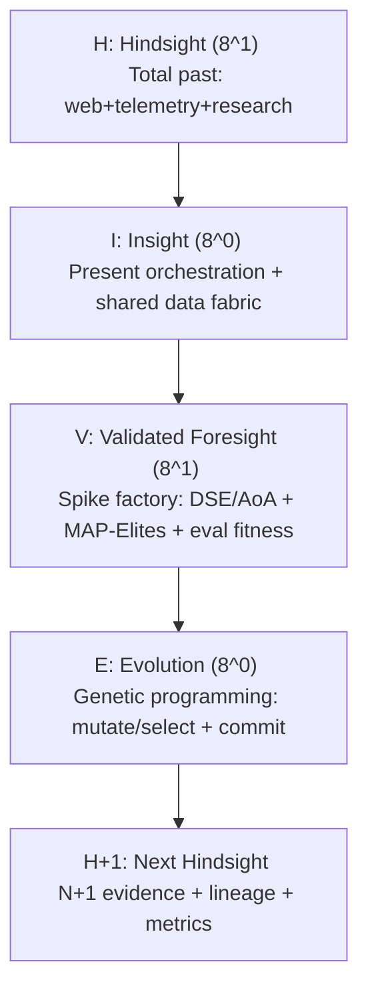

# Medallion: Silver | Mutation: 0% | HIVE: V

## HIVE/8:1010 — Obsidian Hourglass (Fractal Atomic Unit) v0.2

Purpose: a cognitive framework that stays simple, reliable, extendable while scaling swarm orchestration as powers of 8 via a fractal octree / strange-loop recursion.

One-line definition:

> HIVE/8 is a four-phase hourglass where the swarm (8 ports) turns total past into present orchestration, then into validated option-futures, then into evolutionary mutations—and repeats at the next level. “Validated learning” is the unit of progress.

---

## 1) The four phases (corrected semantics)

### H — Hindsight (total available past)

Meaning: ingest and compress all accessible past truth into a usable substrate:

- web + public sources
- telemetry/logs/replays
- papers/research (e.g., arXiv)
- prior artifacts and outcomes

This is the past-lens. It is not merely “what happened last run”; it’s “everything we can reach that is relevant.”

Key coordination style: Hunting Hyperheuristics.

Outputs (minimum):

- Evidence bundle (links, citations, telemetry slices)
- Candidate heuristics list (what to try / what to avoid)
- Known constraints (hard limits, failure modes, invariants)

### I — Insight (present-moment orchestration)

Meaning: run the now: decide what’s active, coordinate agents, and compose the shared data fabric so all roles operate on a coherent “current world model.”

This is the present-lens. It is coordination + composition, not research.

Key coordination style: Interlocking Interfaces.

Outputs (minimum):

- Shared state snapshot (the “now” view)
- Work graph / routing (who does what, in what order)
- Contracts (schemas, invariants, acceptance gates)

### V — Validated Foresight (spike factory)

Meaning: generate future options only through evaluation machinery:

- Design Space Exploration (DSE): systematic exploration of alternatives and tradeoffs
- AoA / trade studies: compare alternatives with explicit ranking
- MAP-Elites / quality diversity (QD): maintain an archive of high-performing and diverse candidates across a feature space
- Eval harness / fitness: measurable scoring and harness execution (coverage, latency, false positives, robustness, etc.)

Key coordination style: Validation Vanguards.

Outputs (minimum):

- Candidate set (options), not a single plan
- Fitness function(s) + eval harness results
- Selection decision with traceable ranking

### E — Evolution (mutation engines)

Meaning: implement change as evolutionary operators (mutation/crossover/selection), including genetic programming where programs evolve under a fitness measure.

Key coordination style: Evolving Engines.

Critical recursion rule (N+1):

> Every Evolution step must produce artifacts that become the next cycle’s Hindsight inputs (evidence, deltas, metrics, lineage, failures).

Outputs (minimum):

- Mutation patch (reversible change / variant)
- Lineage record (parent → child operators)
- Post-change measurements (for next H)

---

## 2) HIVE/8:1010 — the 8-power expansion pattern

HIVE/8:1010 is a structural instruction for how much the swarm fans out per phase:

- H = 8^1 (fan out): expand into parallel retrieval/probes across many sources
- I = 8^0 (collapse): one integrated present-state + orchestration decision
- V = 8^1 (fan out): expand into parallel spikes / alternatives / evaluations
- E = 8^0 (collapse): one committed evolutionary step (or a small bounded set), producing the canonical N+1 state

So 1010 is the fanout mask across the hourglass:

- 1 = expand (parallelize)
- 0 = integrate (compress/commit)

This reduces cognitive load by making the expansion points explicit: you are allowed to go wide only in H and V, and you must compress in I and E.

---

## 3) The “/8” part: swarm orchestration across 8 ports

HIVE/8 assumes every phase can be executed by (or mapped onto) the 8-port system, but with different emphasis:

- In H, ports behave like collectors and curators of past truth.
- In I, ports behave like a coordinated machine around a shared fabric.
- In V, ports behave like a spike factory + evaluators.
- In E, ports behave like mutation operators + safety gates + ledger writers.

Stigmergic coordination is the default glue: agents coordinate via durable traces left in the environment.

Practically: every phase must write a minimal trace packet so the next step can proceed without re-deriving context.

---

## 4) Minimal artifacts (the receipts that make it reliable)

Require the same four artifacts at every recursion level:

### Hindsight Artifact — H-Pack

- sources + citations + telemetry slices
- constraints + known failure modes
- candidate heuristics (hyperheuristic menu)

### Insight Artifact — I-Weave

- shared data fabric snapshot (“current truth”)
- routing/orchestration plan
- interface contracts (schemas, invariants)

### Validated Foresight Artifact — V-Forge

- DSE/AoA matrix + MAP-Elites/QD archive summary
- eval harness outputs + fitness definition
- ranked options + decision rationale

### Evolution Artifact — E-Mutation

- mutation operator + lineage
- reversible patch / variant ID
- measured deltas (becomes next H)

These four artifacts are the trace packet for stigmergy.

---

## 5) Compact diagram (hourglass + 1010 fanout)

Strange-loop recursion: the cycle returns to H, but as H+1, with new state and new evidence.

---

## 6) Alliterative cognitive rails (load reduction)

- Hunting Hyperheuristics (H): wide retrieval + heuristic menu building.
- Interlocking Interfaces (I): compose the present via contracts + shared fabric.
- Validation Vanguards (V): spikes + DSE/AoA + QD archives + fitness harness.
- Evolving Engines (E): mutation machinery (GP/EA) that emits N+1.

---

## 7) Operational invariant (what makes it “atomic”)

A single HIVE/8:1010 unit is done only when all are true:

1. H-Pack exists (total past gathered, cited, and constrained)
2. I-Weave exists (present orchestration + shared fabric snapshot)
3. V-Forge exists (options evaluated via harness; fitness defined)
4. E-Mutation exists (a committed mutation + lineage + measurements)
5. N+1 handoff exists (Evolution outputs indexed as next Hindsight inputs)

This is the smallest unit that preserves truth acquisition (H), coordination (I), evaluation (V), and adaptation (E), while keeping recursion legible.

---

## 8) References

Past chats (context anchors; non-SSOT):

- Past chat 1: <https://chatgpt.com/c/6958475e-ef28-8333-a83d-dffc9defebe5>
- Past chat 2: <https://chatgpt.com/c/69519080-1c60-832f-ac97-ce8f44282105>
- Past chat 3: <https://chatgpt.com/c/693dd73e-794c-8326-8b10-7cd14e971177>
- Past chat 4: <https://chatgpt.com/c/695578c7-a1b4-8326-a291-6d3b76c73278>

Primary refs:

- Strange loop: <https://en.wikipedia.org/wiki/Strange_loop>
- Hyper-heuristics survey (Nottingham): <https://people.cs.nott.ac.uk/pszrq/files/HHSurveyJORS2013.pdf>
- IBM data fabric overview: <https://www.ibm.com/think/topics/data-fabric>
- NASA Systems Engineering Handbook Rev 2: <https://soma.larc.nasa.gov/SIMPLEx/pdf_files/NASA-SP-2016-6105-Rev2.pdf>
- Genetic programming: <https://en.wikipedia.org/wiki/Genetic_programming>
