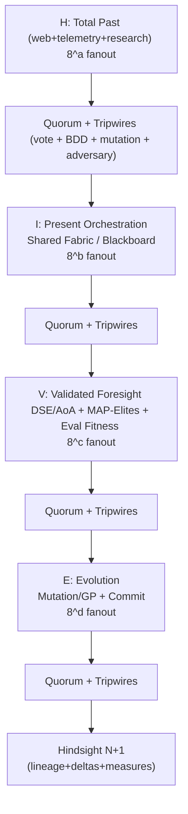

# Medallion: Silver | Mutation: 0% | HIVE: V

## HIVE/8 Obsidian Hourglass v0.3 — Probabilistic Prescience (Quorum + Tripwires)

Atomic unit: HIVE/8:1010

Thesis: HIVE/8 is a recursive strange-loop that turns total past into present orchestration, then into validated option-futures, then into evolutionary mutations that become Hindsight(N+1). It is probabilistic, not perfect: correctness comes from redundant diversity + voting + deterministic tripwires + adversarial pressure.

---

## 1) The hourglass phases (definitions)

### H — Hindsight = total available past

Scope: anything reachable that improves the next decision.

Minimum output (H-Pack):

- Evidence bundle (links/cites + telemetry slices)
- Known constraints + failure modes
- Heuristic menu (“what tactics are even worth trying”)

### I — Insight = present-moment orchestration + shared data fabric composition

Scope: run the now: coordinate ports/agents and compose the shared fabric so every actor sees the same current world-model.

Minimum output (I-Weave):

- Current-state snapshot (canonical “now”)
- Orchestration routing (who does what next)
- Contracts (schemas/invariants/gates)

### V — Validated Foresight = spike factory + eval harness (fitness)

Scope: generate future options only through evaluation machinery (DSE/AoA/MAP-Elites/QD + harness).

Minimum output (V-Forge):

- Candidate set (not a single plan)
- Fitness definition + harness results
- Ranked options + decision rationale

### E — Evolution = mutation engines

Scope: produce variants via mutation/selection (and optionally program evolution).

N+1 rule: every E step must emit artifacts that become next-cycle Hindsight inputs:

> Evolution → (lineage + deltas + measured outcomes) → Hindsight(N+1)

Minimum output (E-Mutation):

- Mutation patch/variant ID + lineage
- Revert path / rollback
- Post-change measurements (feeds next H)

---

## 2) BFT-style reliability layer (quorum + deterministic tripwires + adversaries)

HIVE/8 becomes a probabilistic prescience engine when each phase is guarded by:

1) Diverse redundant opinions (multi-model family quorum)
2) Voting/adjudication
3) Deterministic tripwires
4) Adversarial “double agents” (to catch “meaningless green”)

### 2.1 Quorum logic: BFT analog (not literal blockchain)

Mapping:

- Each “opinion producer” (model family, tool, heuristic engine, evaluator) behaves like a replica.
- “Lies/meaningless green” behaves like Byzantine behavior.

### 2.2 Diversity: multi-model families as N-version programming

Treat diversity as the anti-correlation lever:

- multi-model families
- diverse prompts/contexts
- independent toolchains

### 2.3 Voting: why it helps (and when it doesn’t)

Voting helps when voters are independently more likely than not to be correct.

Caveat: LLM voters are not independent; mitigate correlation via diversity + adversaries + deterministic tripwires.

### 2.4 Deterministic tripwires to prevent “green lies”

Two hard tools:

- BDD scenarios (Given/When/Then) as executable behavioral contracts
- Mutation testing to detect weak tests that stay green while bugs slip through

### 2.5 Adversarial agents (“double agents”)

Adversarial nodes attempt to:

- fabricate passing results
- exploit evaluator holes
- produce plausible but ungrounded “insight”
- collude/copy to inflate agreement

---

## 3) Goldilocks agreement zone (probabilistic, tunable)

A practical tuning target (not a theorem): ~75–99% agreement.

- Too low agreement ⇒ uncertainty; force more evidence or reduce scope.
- Too high agreement ⇒ possible correlation/copying/collusion/shared blind spot; inject stronger adversaries and demand more deterministic evidence.

Hard rule: agreement never overrides tripwires. If tripwires fail, it’s red even at 99% vote.

---

## 4) Stigmergy substrate: shared fabric + blackboard + database

Coordination is stigmergic: agents leave traces in a shared workspace that shape subsequent actions.

Implementation intent: a shared data fabric/blackboard (JSONL, DB tables, event log) storing:

- H-Pack / I-Weave / V-Forge / E-Mutation
- votes + dissent reports + adversary findings
- eval harness outputs + lineage

---

## 5) Powers-of-8 strange-loop DAGs (HIVE/8 masks)

### 5.1 Fanout mask semantics

Represent each recursion level as a 4-tuple of exponents: HIVE/8:abcd where:

- H fanout = 8^a
- I fanout = 8^b
- V fanout = 8^c
- E fanout = 8^d

Base atomic unit:

- HIVE/8:1010 = expand in H and V (8^1), compress in I and E (8^0)

### 5.2 “8787 + 7676 + 6565 … + 1010” schedule

Interpret as a schedule of recursion depths (coarse→fine), where higher levels run wider:

- 8787 at top-level: massive parallel hindsight/foresight; still commits through narrow I/E
- then 7676, 6565, … down to 1010 at leaf-level tasks

This creates a durable DAG of HIVE nodes:

- each node is restartable
- each node writes blackboard traces
- parent nodes consume child receipts as part of Hindsight(N+1)

---

## 6) Operational contract: the BFT-HIVE Receipt (minimum fields)

Every HIVE node must write a receipt with:

### H (H-Pack)

- Sources + telemetry references
- Claims labeled: EVIDENCE / INFERENCE / SPECULATION

### I (I-Weave)

- Current-state snapshot hash/ID
- Orchestration plan (next actions + owners)

### V (V-Forge)

- Candidate set + fitness function
- Eval harness outputs + ranking

### E (E-Mutation)

- Variant ID + lineage
- Rollback plan + measured deltas

### Quorum block (BFT analog)

- Voters: model families/tools used (diversity note)
- Agreement % + dissent summary
- Tripwire results (BDD + mutation + adversarial checks)
- Escalation decision (pass / re-probe / widen evidence / shrink scope)

---

## 7) Diagram (hourglass + quorum + N+1)

---

## 8) Non-negotiables (prescience over vibes)

1) No foresight without eval harness (fitness must exist).
2) No green without mutation strength (tests must kill mutants).
3) No trust without diversity (N-version / multi-family).
4) No stability without adversaries (red-team nodes are first-class).
5) No scaling without traces (stigmergy/blackboard receipts).

---

## 9) References

- PIT mutation testing: <https://pitest.org/>
- N-version programming (Avizienis): <https://curtsinger.cs.grinnell.edu/teaching/2019S/CSC395/papers/avizienis.pdf>
- LLM red-teaming: <https://www.evidentlyai.com/llm-red-teaming>
- Blackboard / agent behaviour notes (Versaggi): <https://matt-versaggi.com/mit_open_courseware/GameAI/artificial-intelligence-agent-behaviour-i.pdf>
