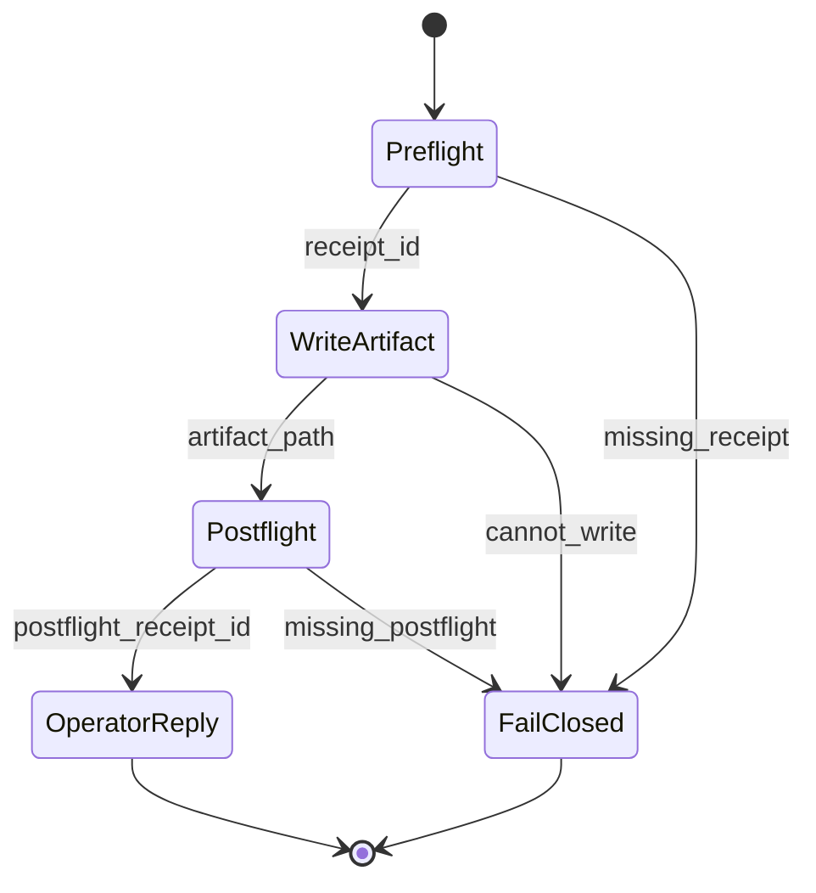

# Medallion: Silver | Mutation: 0% | HIVE: V

# Port 7 — Spider Sovereign Sensemaking Protocol (S3 Protocol)

This is the canonical Hot/Silver spec for **S3 Protocol**.

S3 is a **vendor-neutral** way to turn any prompt into **exactly one** reviewable Markdown artifact, produced via a fail-closed ritual:

1) Preflight (stigmergy + receipt)
2) One artifact (Hot/Bronze, PARA-filed)
3) Postflight (receipt)
4) Short operator reply (TOC preview + artifact path only)

This spec upgrades the previous v0.1 template to **TTao Card v1.5** contract discipline.

---

## Contract: TTao Card v1.5 (Non-Negotiables)

- **Exactly one artifact per run.**
- Artifact **must** contain the **exact headings**: `## P0`, `## P1`, `## P2`, `## P3`, `## P4`, `## P5`, `## P6`, `## P7`.
- **PARA filing rule:** If a precise PARA target is unknown, default to:
  - `hfo_hot_obsidian/bronze/3_resources/para/areas/sensemaking/`
- **Mermaid requirement:** Each artifact must include:
  - at least one **state diagram**, and
  - at least one **relationship/flow diagram**.
- **Exemplar registry required in P2** (see below).
- **High-risk proof gate:** for any high-risk claim/action, include a proof bundle (sources + test evidence + replay/golden steps) or mark as **blocked**.
- **P7 must include 2–4 clarifying questions** (N+1).
- **Operator chat reply must not include the full analysis**; it must be:
  - short TOC preview + artifact path.

---

## Artifact Storage (Hot/Bronze, PARA)

Default artifact directory:

- `hfo_hot_obsidian/bronze/3_resources/para/areas/sensemaking/s3_protocol_turns/`

Filename convention:

- `P7_<preflight_receipt_id>_S3_TTAO_CARD_v1_5.md`

---

## Required Mermaid Diagrams (Minimum Set)

Each artifact must embed both diagrams.

### State Diagram (ritual)



### Flow Diagram (inputs → claims → proofs)

```mermaid
flowchart LR
  U["User prompt"] --> P0["P0: Inputs + constraints"]
  P0 --> P1["P1: Facts vs hypotheses"]
  P1 --> P2["P2: Exemplars + frames"]
  P2 --> P3["P3: Options (IBIS) + tests"]
  P3 --> P4["P4: MAP-Elites archive + selection"]
  P4 --> P5["P5: Proof bundle + tripwires"]
  P5 --> P6["P6: Receipts + memory hooks"]
  P6 --> P7["P7: N+1 questions + next action"]
```



---

## S3 Turn Artifact Template (TTao Card v1.5)

Copy/paste this template verbatim for each run.

```markdown
---
medallion: Bronze
mutation_score: 0.0
hive: V
protocol: S3
protocol_version: TTao_Card_v1_5
agent:
  name: GitHub Copilot
  model: GPT-5.2
port: 7
scope: P7
failure_counter: <integer>
para:
  target: <projects|areas|resources|archives>
  path: <relative_path_under_para>
receipts:
  preflight: <receipt_id>
  postflight: <receipt_id|pending>
artifact:
  path: <this_file_path>
timestamp_z: <ISO-8601 Z>
---

# S3 Turn Artifact — TTao Card v1.5

## P0
- Question (verbatim): <...>
- Constraints: <...>
- PARA target decision: <...>

## P1
### Facts (grounded)
- <fact> (source: <file/URL>)

### Hypotheses (explicitly unproven)
- <hypothesis> (proof needed: <test/probe>)

## P2
### Exemplar Registry (required)
- PARA (Projects/Areas/Resources/Archives)
- Progressive Summarization
- MAP-Elites (option archive)
- SKOS (concept vocabulary)
- Concept maps
- Mermaid diagrams
- Cognitive load theory + scaffolding
- IBIS
- Mutation testing + property-based testing
- (Optional) DORA metrics

### Frame Selection
- Operating mode: <checklist|analysis|probe|stabilize>
- Why (<=3 bullets):
  - <...>

## P3
### Options (IBIS)
- Issue: <...>
- Options:
  - A: <...>
  - B: <...>
  - C: <...|optional>

### Evaluation (AoA-lite)
- Criteria: reliability, effort, reversibility, risk, time_to_value
- Pick: <A|B|C>
- Rationale (<=5 bullets):
  - <...>

## P4
### Option Archive (MAP-Elites style)

Axes (example):
- X: time_to_value (low→high)
- Y: risk (low→high)

Cells:
- (low,low): <candidate>
- (high,low): <candidate>
- (low,high): <candidate>
- (high,high): <candidate>

### Selected Path
- Selected cell: <...>
- Why: <...>

## P5
### Proof Gate (required for high-risk)
- Risk level: <low|medium|high>
- If high-risk, include proof bundle or mark BLOCKED.

Proof bundle (if applicable):
- Sources: [<file/URL>, ...]
- Tests run: [<command>, ...]
- Repro steps / replay: <minimal deterministic steps>

### Green Lie vs Red Truth Check
- Potential green lie (plausible but unproven): <...>
- Red truth (what is actually supported): <...>

### Tripwires
- Stop rule: <...>
- Rollback: <...>

## P6
### Receipts
- Preflight: <receipt_id>
- Postflight: <receipt_id>

### Artifacts
- <artifact paths>

### Memory Hooks
- canonical_name: <...>
- aliases: [<...>]
- tags: [p7, s3, ttao_card_v1_5, <domain>]

## P7
### N+1 Questions (2–4)
1) <...?>
2) <...?>

### Next Action (single smallest step)
- <...>

### Operator Reply Stub (TOC preview only)
- Return only the section list + artifact path.

```

---

## Promotion Rules (Medallion)

- Bronze may be incomplete, but must label uncertainty.
- Promote to Silver only when receipts + sources + at least one proof step exist.
- Promote to Gold only when the claim survives adversarial review (contracts/tests/tripwires and replayable evidence).

---

## Fail-Closed Policy

Stop immediately if any of these are missing:

- preflight receipt
- exactly one artifact written
- postflight receipt
