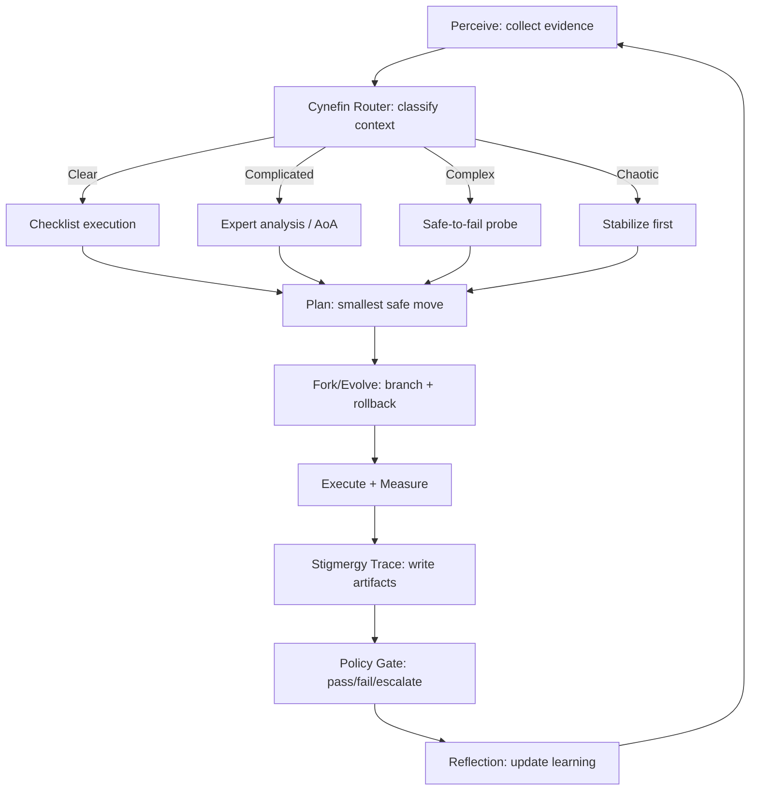

# Medallion: Silver | Mutation: 0% | HIVE: V

## Spider Sovereign (Port 7 Navigator) — Shard Framework v0.1

Goal: simple, reliable, extendable meta-process for navigating the HIVE/8 (Obsidian Hourglass) without getting lost in fractal detail.

---

## 1) What this is (plain language)

Spider Sovereign is the orchestrator that decides how to decide, then how to change the system safely, and how to leave durable traces so future cycles (or other agents) can continue without re-deriving everything.

A practical, theory-aligned name for the meta-process:

> Fractal Sensemaking Control Loop
> (aka “Cynefin-Routed MAPE-K with Stigmergy”)

- Cynefin chooses the decision mode based on the situation type (clear/complicated/complex/chaotic).
- MAPE-K is the standard autonomic control loop: Monitor → Analyze → Plan → Execute, backed by Knowledge.
- Stigmergy is coordination via environmental traces (shared artifacts, logs, blackboards).
- Fractal / holonic recursion means the same loop repeats at every level of scope (“whole-part” units).

Why this matters: Cynefin prevents you from applying the wrong method, MAPE-K prevents freeform drift, stigmergy prevents lost context, and recursion prevents the framework from breaking when the system scales.

---

## 2) The 8 shards (Port 7 = pieces of the whole)

### Shard 1 — Sequential Thinking (Step-by-step planning)

Function: force linearity when humans/agents thrash.

- Output: smallest next safe move + explicit preconditions.
- Maps to: MAPE-K’s Analyze/Plan disciplines.

### Shard 2 — Reflection (during + after action)

Function: detect drift while operating, and learn after.

- Output: “what surprised me” + “what I’ll change next time.”
- Maps to: reflection-in-action / reflection-on-action.

### Shard 3 — Apex Assimilation (Exemplar composition; no invention)

Function: adopt proven components and compose them; minimize bespoke code.

- Output: adopt list (repos/libs/patterns) + glue plan + what we refuse to invent.
- Maps to: software reuse + component-based reuse / COTS mindset.

### Shard 4 — Cynefin Router (choose the action style)

Function: classify context → pick the correct playbook.

- Output: a one-line domain label + the corresponding action logic:
  - Clear: sense–categorize–respond (checklists)
  - Complicated: sense–analyze–respond (experts, AoA)
  - Complex: probe–sense–respond (safe-to-fail experiments)
  - Chaotic: act–sense–respond (stabilize first)

### Shard 5 — Fork/Evolve over Destructive Change

Function: mutate safely: branch, test, merge; keep rollback cheap.

- Output: explicit revert path (commit/flag rollback).
- Maps to: GitOps principles (versioned desired state + easy rollback).

### Shard 6 — Stigmergy Coordination (shared traces)

Function: coordinate across agents/time via durable artifacts.

- Output: the trace packet (receipt, logs, decisions, measurements).
- Maps to: stigmergic coordination (environment-mediated).

### Shard 7 — Policy Gate (requisite variety / escalation)

Function: prevent fractal overwhelm and unsafe autonomy.

- Output: go/no-go rules + escalation triggers (algedonic alerts).
- Maps to: viable recursion + policy balancing stability vs adaptation.

### Shard 8 — Fractal Octree / Holonic Recursion (scope discipline)

Function: run the same loop at every level, but never lose the boundary.

- Output: current level + what we refuse to descend into this cycle.
- Maps to: holons (whole-part units) + recursive viable systems.

---

## 3) The Spider Sovereign loop (simple operational form)

### The only invariant: produce a Navigation Receipt every cycle

This is the anti-overwhelm compressor and anti-hallucination anchor.

Navigation Receipt (one screen):

- Scope (Level): where in the fractal you are operating
- Cynefin Domain + Why: clear/complicated/complex/chaotic
- Intent: what you want to change (one sentence)
- Evidence: what you can prove right now (telemetry/tests/observations)
- Plan (Next move): smallest safe step
- Mutation method: fork/flag/rollback plan
- Trace drop: what artifact you write for others/future you
- Policy gate: pass/fail + escalation condition
- Reflection note: what changed your mind, what surprised you

This matches the spirit of Cynefin’s act/probe then sense then respond, but enforces it through a control-loop artifact rather than vibes.

---

## 4) Routing logic (how shards cooperate)

Decision routing rule:

1) Classify with Cynefin (Shard 4)
2) Select action style:
   - Clear → checklist + automation
   - Complicated → AoA/DSE + expert reasoning
   - Complex → safe-to-fail probes (bounded experiments)
   - Chaotic → stabilize, reduce harm, restore observability
3) Run MAPE-K step with strict outputs (Shards 1, 5, 6)
4) Apply Policy Gate (Shard 7) and stamp Receipt
5) Reflect (Shard 2) and update Knowledge traces (Shard 6)

---

## 5) Fractal rule to prevent “lost in the octree”

One-level rule: in a single cycle, you may go down at most one recursion level, and you must come back up with a Receipt.

Escalation rule: if any of these occur, escalate one level up (policy/guardianship) instead of diving deeper:

- missing evidence / broken telemetry
- repeated failures of the same gate
- unclear Cynefin domain (disorder/confusion)
- rollback not credible
- safety envelope incomplete

---

## 6) Extendability: how to add shards/tools without breaking simplicity

Extension contract (additions must satisfy all):

1) Composable: can be swapped without rewriting everything (ports/adapters mindset).
2) Receiptable: produces machine- or human-auditable outputs that can be dropped into stigmergy traces.
3) Revertable: every action has a compensating action (branch/flag/rollback).
4) Routed: declares which Cynefin domains it is valid for.
5) Evidence-bearing: ties to measurable signals (MAPE-K knowledge).

---

## 7) Minimal diagram (the meta-process at a glance)

---

## 8) What you should treat as “done” vs “open” right now

Done (solid conceptual spine):

- Cynefin as router
- MAPE-K as control loop backbone
- Stigmergy as coordination substrate
- Fork/rollback discipline via GitOps-style thinking
- Reflection-in/on-action as learning lock-in

Open (your “Shard 8+” risk):

- defining your exact recursion boundaries (what is a node vs subnode)
- escalation thresholds (when to go up vs continue probing)
- the exact schema for the Receipt + Trace packet (fields above are the minimal set)

---

## 9) References (anchor sources)

- Snowden & Boone, A Leader’s Framework for Decision Making (Cynefin domains and response modes): <https://www.chds.us/ed/resources/uploads/2020/10/A-Leaders-Framework-for-Decision-Making-Snowden-and-Boone.pdf>
- IBM autonomic computing framing of Monitor/Analyze/Plan/Execute + Knowledge (MAPE-K): <https://www.redbooks.ibm.com/redbooks/pdfs/sg246665.pdf>
- Schön reflective practice (reflection in action vs on action): <https://libguides.hull.ac.uk/reflectivewriting/schon>
- Stigmergy definition and environment-mediated coordination: <https://en.wikipedia.org/wiki/Stigmergy>
- GitOps principles and rollback via version control: <https://www.redhat.com/en/topics/devops/what-is-gitops>
- Holons and recursion / viable systems as a model for nested control: <https://en.wikipedia.org/wiki/Holon_(philosophy)>
