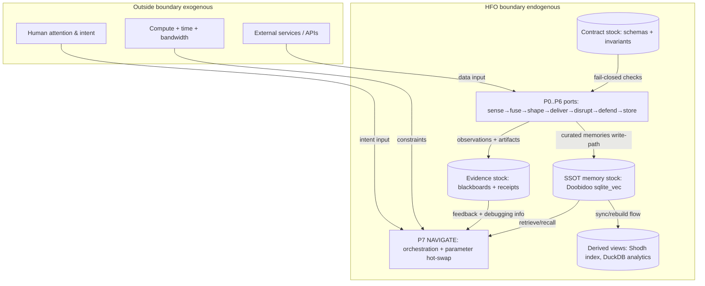
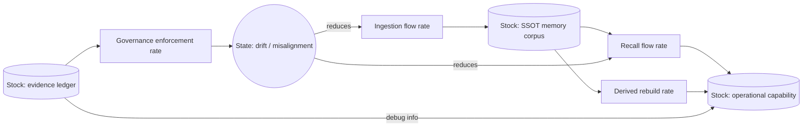
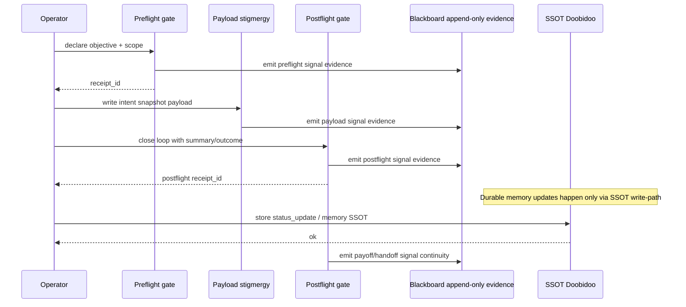
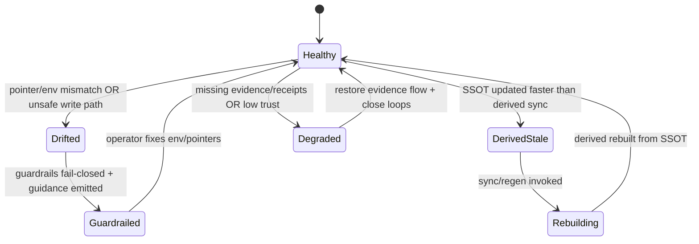
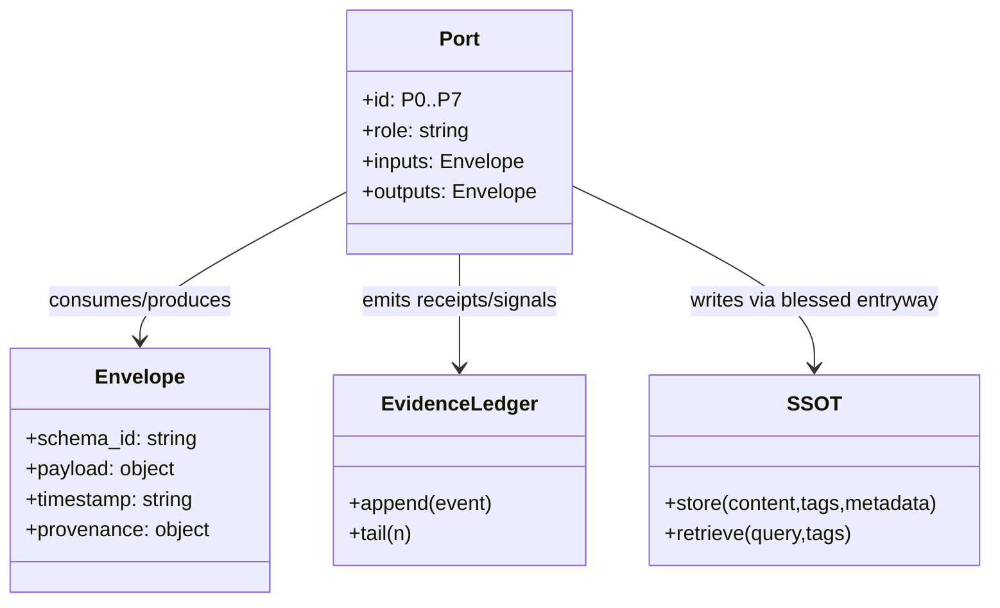
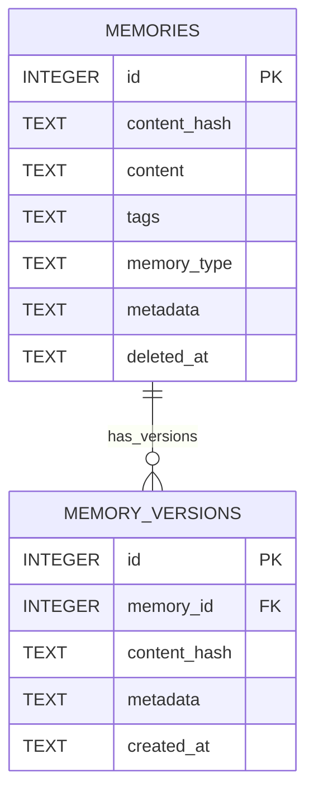
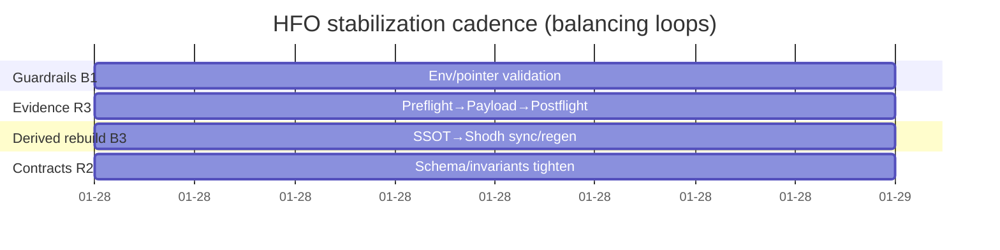
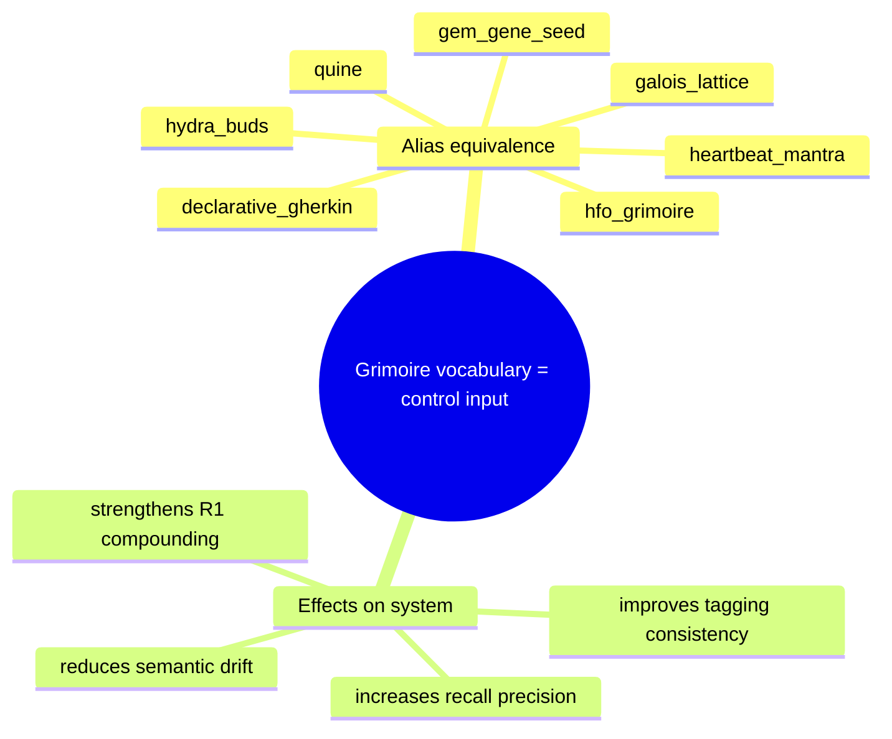

<!-- Medallion: Gold | Mutation: 0% | HIVE: V -->
---
medallion_layer: gold
mutation_score_target: 0.88
hfo_scope: systems_thinking
protocol: donna_meadows_systems_lens
version: v1
created_utc: 2026-01-29
source_of_truth: repo
---

# HFO Systems Lens (Donna Meadows) — Executive Summary + 8 Mermaid Diagrams

## Executive summary (≈2 pages)

### 1) System definition
**HFO is a socio-technical control system** for maintaining **mission continuity under agent churn**.

- **System purpose (goal):** preserve the braided mission thread (Alpha ⇄ Omega) by converting raw work and observations into durable knowledge, then using that knowledge to drive reliable future action.
- **Primary success condition:** decisions remain correct and recoverable over time (anti-fragile), even when individual agents fail.
- **Primary safety condition:** no hidden coupling; all cross-boundary data is explicit, schema-checked, and logged.

In Meadows terms, HFO is not “a repo”; it is a **network of feedback loops** that regulate drift (balancing loops) while compounding usable knowledge (reinforcing loops).

### 2) System boundary and architecture
**Inside the boundary** (what HFO governs directly):
- **Interfaces + rules:** strict port boundaries (P0–P7), fail-closed entrypoints, and explicit contracts.
- **State and memory:** a single write-path SSOT (Doobidoo sqlite_vec) for durable memory; append-only blackboards/receipts for telemetry + coordination.
- **Ritualized execution:** preflight → payload → postflight → handoff/payoff, producing receipts and stigma signals.

**Outside the boundary** (inputs/constraints):
- Human attention/energy, machine resources, and external services (e.g., derived recall/index servers).

This boundary is crucial: it determines which variables you can control directly (rules, info flows, tooling) versus indirectly (behavior via incentives and visibility).

### 3) Core stocks (state variables that accumulate)
These are the “levels” in a system dynamics sense:

1) **SSOT memory stock** (durable): the corpus of stored memories in Doobidoo sqlite_vec.
2) **Evidence stock** (durable/append-only): blackboards + receipts + proofs; the audit trail.
3) **Contract stock** (durable): schemas and invariants that define safe cross-port communication.
4) **Operational capability stock**: working scripts, tasks, and health checks that can be executed repeatably.
5) **Trust/legibility stock** (human): how reliably the system explains itself (naming, tags, grimoire vocabulary).

### 4) Core flows (rates that change the stocks)
Flows are where “work” turns into “system change”:

- **Ingestion flow:** documents/notes/artifacts → SSOT memories (batch ingest or MCP store).
- **Recall flow:** SSOT retrieval and/or derived search index query → working context.
- **Governance enforcement flow:** guardrails + audits + root purity checks → reduced drift and reduced unsafe writes.
- **Derived rebuild flow:** SSOT → derived indexes (Shodh) and analytics exports (DuckDB).
- **Ritual flow:** preflight/postflight gates create receipts and stabilize execution.

### 5) Dominant feedback loops (why HFO “works”)

**Reinforcing loops (R) — compounding growth**
- **R1 Knowledge compounding:** more SSOT captures → higher recall hit-rate → better decisions/actions → more captures.
- **R2 Interface hardening:** clearer contracts → fewer cross-port surprises → faster integration → more contract use → clearer contracts.
- **R3 Evidence → reliability:** more receipts/proofs → faster debugging → higher uptime → more runs → more evidence.
- **R4 Vocabulary stabilization (grimoire):** stable alias equivalence → consistent tagging/naming → better retrieval → stronger reuse of vocabulary.

**Balancing loops (B) — stability / constraint**
- **B1 Guardrails drift control:** misconfig/unsafe write paths → hard errors + guidance → correction → drift reduced.
- **B2 Root purity control:** unauthorized root writes → enforcement + grudges/audit pressure → fewer future violations.
- **B3 Derived-index decay control (Phoenix):** recall/index quality degrades → rebuild from SSOT → recall restored.

HFO’s “systems advantage” is that it **institutionalizes** these loops: they are encoded in scripts, pointers, receipts, and rules.

### 6) Delays, nonlinearities, and failure modes
Key delays:
- **SSOT → derived recall delay:** derived indexes lag SSOT until sync/regen.
- **Human review delay:** doctrine/spec updates and refactors take time.
- **Postflight gating delay:** bounded retries and audits delay completion (but stabilize output).

Key nonlinearities:
- **Trust threshold effects:** below a reliability threshold, operators stop using the system, collapsing ingestion and recall.
- **Coupling cascade:** a single hidden coupling can trigger cross-port failures that look “random” until surfaced.

Primary failure modes:
- **Memory fragmentation:** knowledge stored as unstructured artifacts without stable tags/aliases reduces recall.
- **Dual authority:** multiple competing sources of truth create “forked reality” (Meadows: rule/information conflict).
- **Green-theater drift:** “fixing logs” instead of fixing causes breaks the learning loop.

### 7) Leverage points (Meadows) already present in HFO
HFO is strongly aligned with high-leverage interventions:
- **Information flows:** memory overview/health checks and immutable telemetry make state visible.
- **Rules:** SSOT-only write path, fail-closed boundaries, and root governance.
- **System structure:** ports + contracts reduce coupling.
- **Paradigm:** “red truth > green lie” makes learning real.

The next best leverage is to strengthen the *semantic coupling* between grimoire vocabulary ↔ tags ↔ retrieval queries, turning “naming” into an explicit control input.

---

## 8 diverse Mermaid diagrams (systems terminology)

### Mermaid 1 — System boundary + subsystems (flowchart)


### Mermaid 2 — Stock-and-flow skeleton (flowchart)


### Mermaid 3 — Ritual control loop (sequence)


### Mermaid 4 — Balancing loop: memory/health states (state machine)


### Mermaid 5 — Contract surface (class diagram)


### Mermaid 6 — SSOT data model (ER diagram)

```

### Mermaid 7 — Operational cadence (Gantt)


### Mermaid 8 — Vocabulary as control input (mindmap)

