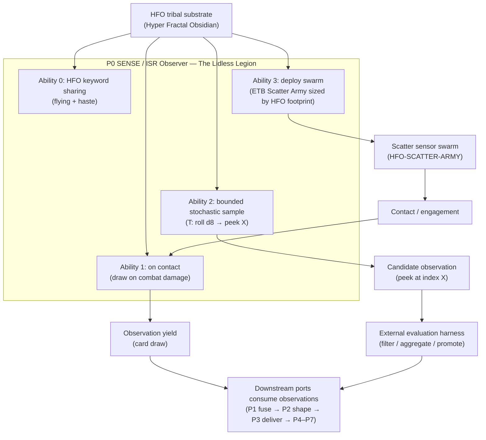

<!-- Medallion: Gold | Mutation: 0% | HIVE: V -->

## <!-- markdownlint-disable MD041 MD003 MD022 -->

medallion_layer: gold
mutation_score_target: 0.88
hfo_scope: hive8
port: P0
powerword: OBSERVE
jadc2_domain: ISR (Observer)
mosaic_tile: SENSE
card_id: p0_lidless_legion_quad_sided
protocol: hive8_commander_quad_sided_card
version: v1
created_utc: 2026-01-28

---

# HFO Quad-Sided Card — P0: The Lidless Legion (V1)

This is literate programming for a **JADC2 MOSAIC WARFARE MISSION ENGINEERING PLATFORM**.

- **MTG is a perspective lens** for conceptual incarnation and cognitive scaffolding.
- **HFO is the creature type** (tribal synergy substrate): _Hyper Fractal Obsidian_.
- Slivers are a useful reference class, but **HFO is not “base Slivers”**; Sliver-like sharing is a _local mechanical analogy_ inside a broader holonarchy.

Canonical MTG rules text source:

- hfo_hot_obsidian_forge/2_gold/2_resources/reports/hive8_cards/HFO_CARD_P0_LIDLESS_LEGION_V1_2026_01_27.md

Quad lens scaffold:

- hfo_hot_obsidian_forge/2_gold/2_resources/reports/hive8_doctrine/HFO_HIVE8_QUAD_CARD_LENS_TEMPLATE_GALOIS_GHERKIN_JADC2_MERMAID_V1_2026_01_27.md

---

## Side 0 — JADC2 MOSAIC (Domain)

### Identity

- Port: **P0**
- Mosaic tile: **SENSE**
- JADC2 domain: **ISR (Observer)**
- Powerword: **OBSERVE**

### Mission Role (P0 / SENSE)

Produce _observations_ that downstream ports can:

- fuse into typed fabric (P1),
- shape into models/twins (P2),
- deliver/inject as effects (P3),
- disrupt/defend/store/navigate (P4–P7).

### Ability-to-Domain Mapping (P0)

- **Ability 0 (Keyword sharing: Flying + Haste)** → _reach + tempo_: sensors get “airborne” coverage (access) and “rapid readiness” (low latency).
- **Ability 1 (Draw on damage)** → _contact-driven learning_: when sensing makes contact with an actor/environment, you acquire additional information.
- **Ability 2 (d8 Tap-to-Peek)** → _bounded stochastic sampling_: repeated sampling from a store (library) yields candidate observations without full reveal.
- **Ability 3 (ETB Scatter Army)** → _deploy sensor swarm proportional to current footprint_: the observation surface grows with the number of HFO permanents.

### Where the mapping is strong

- Clean port intent: “SENSE/OBSERVE” matches a first-class ISR observer role.
- The **scatter swarm** is a good cognitive stand-in for distributed sensors.
- The **d8 sampling** communicates “probabilistic probe, repeated trials, filtering” (mission harness behavior) without prescribing implementation.

### Where the mapping is weak (gaps to harden later)

- No explicit **provenance/timestamp/confidence** model in rules text.
- No explicit **deception/adversary** modeling (spoofing, denial, camouflage).
- “Note the card’s position” is an informal memory; for mission engineering, this should become a declared artifact (schema + audit trail).

---

## Side 1 — Declarative Gherkin (Acceptance)

### Invariant

- Given P0 is mapped to Mosaic tile SENSE and JADC2 domain ISR (Observer)
- When the P0 commander card is rendered in Gold
- Then it presents exactly **four Gen88v4 ability slots** (Ability 0–3) and each slot can be interpreted as an ISR observer mechanic.

### Happy Path (Observer loop)

- Given an HFO swarm is established (HFO permanents exist)
- When The Lidless Legion enters the battlefield
- Then a **scatter army** is created sized by current HFO footprint

- Given the swarm engages and makes contact
- When an HFO creature deals combat damage
- Then an **observation yield** is produced (draw a card)

- Given an operator wants bounded sampling
- When an HFO creature taps to roll a d8
- Then a **single bounded sample** is taken (peek position X) without reordering or revealing the full store

### Fail-Closed Path (Conservative observer)

- Given the sampling mechanism is used
- When a sample index would exceed the available store size
- Then it is reduced into range (no out-of-bounds access)

- Given the card text uses “note its position”
- When a stricter system requires auditable memory
- Then a separate declared memory artifact is required (do not treat player notes as authoritative SSOT)

---

## Side 2 — MTG (Rules Text)

## Card Box

### The Lidless Legion

**Type line:** Legendary Creature — HFO

**Controlled HFO (HFO under control):** The Lidless Legion (this permanent).

## Ability 0 — Passive Keyword Sharing — Flying + Haste (Manifold)

- HFO creatures you control have **flying** and **haste**.

## Ability 1 — Passive Effect — Draw on Damage (Synapse)

- Whenever an HFO creature you control deals combat damage to a player, **draw a card**.

## Ability 2 — Activated Effect — Tap-to-Peek (ISR)

- HFO creatures you control have “{T}: Roll a d8. Let X be the result. If X is greater than the number of cards in your library, subtract that number from X until X is within that range. Look at the card at position X from the top of your library. You may note that card’s position in your library.”

## Ability 3 — ETB Effect — HFO-SCATTER-ARMY (Scatter)

- When The Lidless Legion enters the battlefield, create **HFO-SCATTER-ARMY**, a colorless **Artifact Creature — Army HFO** token with base **0/0**. It enters with a **+1/+1 counter** on it for each **HFO permanent** you control.

---

## Side 3 — Mermaid (Wiring)

---

## Sources

- Canon P0 card text: hfo_hot_obsidian_forge/2_gold/2_resources/reports/hive8_cards/HFO_CARD_P0_LIDLESS_LEGION_V1_2026_01_27.md
- Commander invariants (domain/tile): contracts/hfo_legendary_commanders_invariants.v1.json
- MTG mapping references: contracts/hfo_mtg_port_card_mappings.v1.json
- Quad lens template: hfo_hot_obsidian_forge/2_gold/2_resources/reports/hive8_doctrine/HFO_HIVE8_QUAD_CARD_LENS_TEMPLATE_GALOIS_GHERKIN_JADC2_MERMAID_V1_2026_01_27.md
