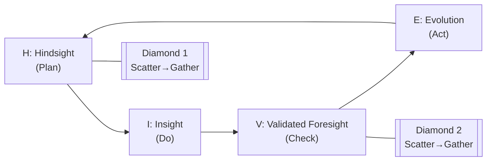
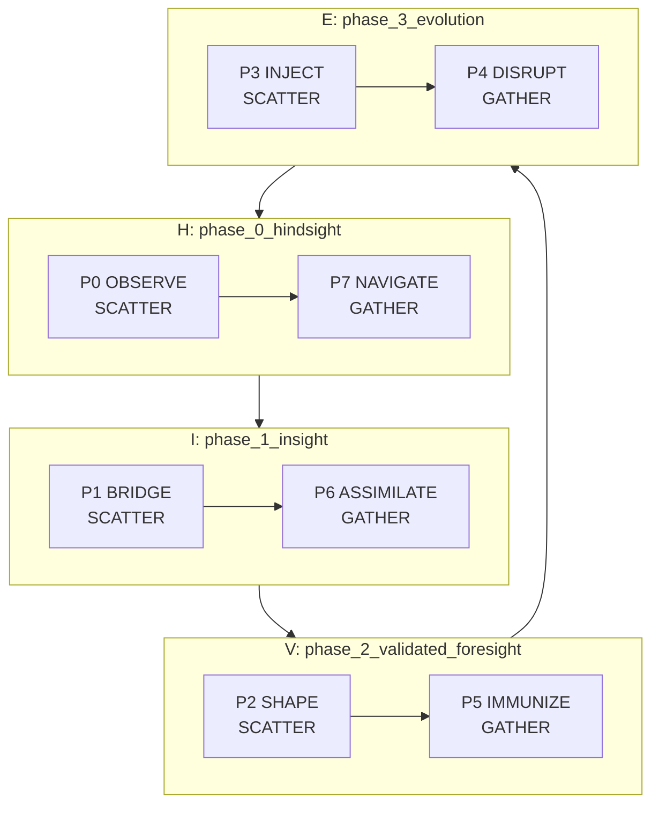
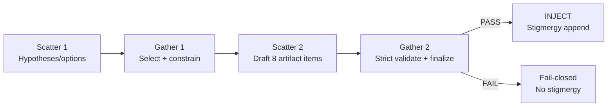
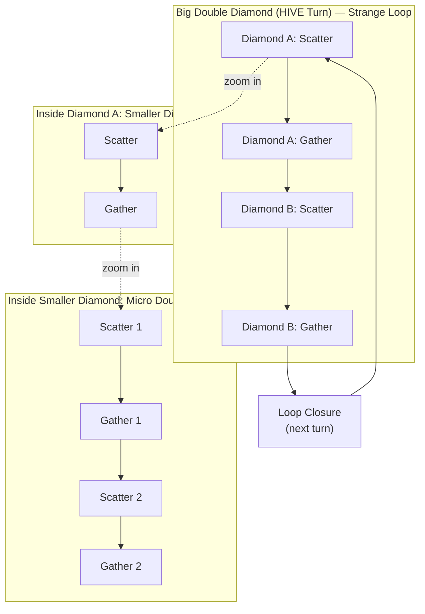

<!-- Medallion: Gold | Mutation: 0% | HIVE: V -->

---

medallion_layer: gold
mutation_score_target: 0.88
hfo_scope: hive8
protocol: hive_pdca_double_diamond_fractal_scatter_gather
version: v1
created_utc: 2026-01-27
consolidation_target: github_copilot_hive8_gen88v4_agent_mode
---

# HFO HIVE/8 — H‑I‑V‑E PDCA Double Diamond (Fractal Scatter/Gather) (V1)

## Intent

Lock the **canonical zoom levels** for the HIVE/8 Gen88v4 architecture:

- **Zoomed-out (macro):** H‑I‑V‑E is a 4‑phase loop that aligns to PDCA and reads as a double diamond.
- **Zoomed-in (phase):** each phase is a **paired port micro-diamond** (scatter ↔ gather).
- **Zoomed-in (port):** each port internally runs **scatter → gather → scatter → gather** (a mini double diamond).

This document is **Gold**: it is meant to be stable, simple enough to teach, and precise enough to implement.

## Canonical phase names (HIVE)

| Letter | Phase | Meaning |
|---|---|---|
| H | phase_0_hindsight | look back; sense reality; establish evidence |
| I | phase_1_insight | interface/bridge; bind evidence into constraints |
| V | phase_2_validated_foresight | prove/validate; quantify confidence |
| E | phase_3_evolution | deliver/change; apply feedback and red-team |

Pair order (anti-diagonal): `(P0+P7) → (P1+P6) → (P2+P5) → (P3+P4)`.

## PDCA overlay (strange loop)

HIVE also labels a PDCA loop:

- **H = Plan** (discover/define the problem from evidence)
- **I = Do** (bridge into an executable contract / plan-of-record)
- **V = Check** (validate claims: bounds, audits, invariants)
- **E = Act** (ship, disrupt weak points, evolve the next cycle)

## Diagram 1 — Zoomed-out: 4-phase loop (double diamond + PDCA)

This is the “one slide” view.

## Diagram 2 — Zoomed-in: each HIVE phase is a paired micro-diamond

Each phase runs a **scatter port** adjacent to a **gather port**.

## Diagram 3 — Zoomed-in: each port runs a mini double diamond (SGSG)

Within any single port, enforce an internal rhythm:

1) **Scatter**: generate candidate hypotheses/options.
2) **Gather**: select a dominant path and tighten constraints.
3) **Scatter**: draft the 8‑item artifact surface.
4) **Gather**: validate, finalize, and (if strict PASS) publish stigmergy.

## Diagram 4 — Nested diamonds (zoom rule: 2 at a time; 4 when doubled)

This diagram is intentionally “structural” (not geometric): it shows how a **big double diamond** contains a **smaller diamond**, which itself contains a **micro double diamond**.

Zoom rule:

- When you zoom in one level, a “piece” becomes **2** (scatter → gather).
- When you zoom in one more level, that becomes **4** (scatter → gather → scatter → gather).

## Fractal rule (what “nested diamonds” means)

- **Macro:** the whole turn is a double diamond (H→I, V→E) inside a PDCA strange loop.
- **Meso:** each HIVE phase contains a pair (scatter→gather).
- **Micro:** each port repeats scatter→gather→scatter→gather and then emits stigmergy only on PASS.

In practice: every “completed object” becomes the next cycle’s environment.

- Baton artifacts become the next port’s observed substrate.
- Stigmergy events become the next turn’s observed substrate.

## Hard constraints (Gen88v4 invariants)

- Ports 0–3 are SCATTER; ports 4–7 are GATHER.
- Each port publishes exactly **8** artifact items.
- Meta promotion counts are fixed (scatter=2, gather=1).
- Stigmergy is **append-only** and must be **strict-gated**.

## References

- Silver: [hfo_hot_obsidian_forge/1_silver/2_resources/reports/hive8_doctrine/HFO_HIVE8_SCATTER_GATHER_DOUBLE_DIAMOND_PDCA_PROTOCOL_V1_2026_01_26.md](hfo_hot_obsidian_forge/1_silver/2_resources/reports/hive8_doctrine/HFO_HIVE8_SCATTER_GATHER_DOUBLE_DIAMOND_PDCA_PROTOCOL_V1_2026_01_26.md)
- Gold vocabulary: [hfo_hot_obsidian_forge/2_gold/2_resources/reports/hive8_doctrine/HFO_OBSIDIAN_POWERWORDS_JADC2_DOMAIN_MAP_V1_2026_01_26.md](hfo_hot_obsidian_forge/2_gold/2_resources/reports/hive8_doctrine/HFO_OBSIDIAN_POWERWORDS_JADC2_DOMAIN_MAP_V1_2026_01_26.md)
