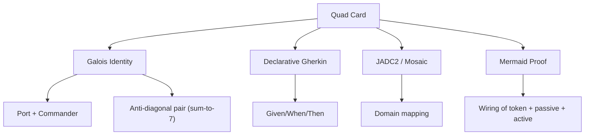

<!-- Medallion: Gold | Mutation: 0% | HIVE: V -->
<!-- markdownlint-disable MD041 MD003 MD022 -->
---
medallion_layer: gold
mutation_score_target: 0.88
hfo_scope: hive8
protocol: quad_card_lens_template
version: v1
created_utc: 2026-01-27
---

# HFO HIVE8 — Quad Card Lens Template (Galois × Gherkin × JADC2 × Mermaid) (V1)

## Purpose

Anchor identity with one stable “quad card” scaffold:

1. **Galois lattice identity** (who/where)
2. **Declarative Gherkin** (what done means)
3. **JADC2 / Mosaic** (tactical domain)
4. **Mermaid proof** (wiring diagram)

This is intended to be applied to:

- HFO as a whole (one quad card)
- Each of the 8 Legendary Commanders (8 quad cards)

## Template

## 1) Galois Lattice Identity

- Port: `P?`
- Powerword: `OBSIDIAN` mapping
- Commander: `THE …`
- Anti-diagonal pair (sum-to-7): `P?`

## 2) Declarative Gherkin

### Invariant

- Given …
- When …
- Then …

### Happy Path

- Given …
- When …
- Then …

### Fail-Closed Path

- Given …
- When …
- Then …

## 3) JADC2 / Mosaic

- JADC2 domain: `…`
- Mosaic tile role: `…`

## 4) Mermaid Proof

## P0–P3 Card Structure Constraint (Gold)

For ports **P0–P3**, the legendary commander card must present (in order):

- **Ability 0 — Passive Keyword Sharing**
- **Ability 1 — Passive Effect**
- **Ability 2 — Activated Effect**
- **Ability 3 — ETB Effect**

## Sources

- Silver quad template: hfo_hot_obsidian_forge/1_silver/2_resources/reports/hive8_doctrine/HFO_HIVE8_QUAD_CARD_LENS_TEMPLATE_GALOIS_GHERKIN_JADC2_MERMAID_V1_2026_01_27.md
- Gold vocabulary (OBSIDIAN↔JADC2): hfo_hot_obsidian_forge/2_gold/2_resources/reports/hive8_doctrine/HFO_OBSIDIAN_POWERWORDS_JADC2_DOMAIN_MAP_V1_2026_01_26.md
- Galois lattice behavior: hfo_hot_obsidian_forge/2_gold/2_resources/reports/hive8_doctrine/HFO_HIVE8_META_PROMOTED_DELIVERABLES_GALOIS_LATTICE_PROTOCOL_V1_2026_01_26.md
- Grimoire alias SSOT: hfo_hot_obsidian_forge/1_silver/2_resources/reports/hive8_doctrine/HFO_GRIMOIRE_POWERWORDS_ALIAS_EQUIVALENCE_V1_2026_01_27.md
- Bronze concept capture: hfo_hot_obsidian_forge/0_bronze/2_resources/reports/hive8_doctrine/HFO_HIVE8_QUAD_CARD_CONCEPT_V0_1_2026_01_27.md
