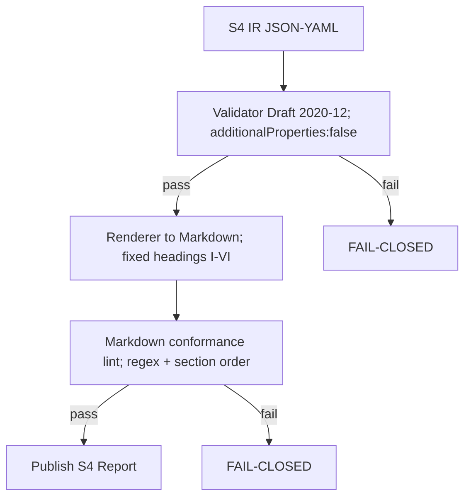
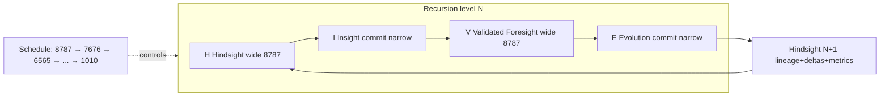

<!-- Medallion: Gold | Mutation: 0% | HIVE: V -->
---
medallion_layer: gold
mutation_score_target: 0.88
hfo_scope: hive8
protocol: hfo_s4_protocol_gen88_v1_5 + hive8_obsidian_hourglass + hive8_schedule_8787_to_1010
version: v1
created_utc: 2026-01-28
sources:
  - hfo_hot_obsidian_forge/1_silver/2_resources/reports/hive8_doctrine/HFO_S4_PROTOCOL_GEN88_V1_5_SPEC_SILVER_V1_2026_01_27.md
  - hfo_hot_obsidian/silver/3_resources/reports/HIVE8_OBSIDIAN_HOURGLASS_V0_3_PROBABILISTIC_PRESCIENCE_2026_01_25.md
  - hfo_hot_obsidian/silver/3_resources/reports/HIVE8_1010_OBSIDIAN_HOURGLASS_FRACTAL_ATOMIC_UNIT_V0_2_2026_01_25.md
  - hfo_hot_obsidian/silver/3_resources/reports/HIVE8_OBSIDIAN_HOURGLASS_BOOTSTRAP_LADDER_2026_01_25.md
---

# HFO S4 Protocol × Obsidian Hourglass (HIVE/8) — 8787→…→1010 Schedule (Gold) (V1)

## I) BLUF
- **S4 Protocol (Gen88 v1.5)**: a **fail-closed report contract** that forces grounding (assumptions, falsifiers, evidence refs, premortem) and enforces the HIVE/8 **scatter→gather heartbeat** in a machine-checkable way.
- **Obsidian Hourglass (HIVE/8)**: a **recursive strange-loop** with four semantic phases (H/I/V/E) + a reliability layer (quorum + deterministic tripwires + adversarial pressure).
- **“8787 + 7676 + 6565 … + 1010”**: a **coarse→fine schedule** (and also a “ladder mnemonic” in repo notes) for how hard/wide the system runs per recursion level. It is the operational encoding of **where you are allowed to expand** and **where you must compress/commit**.

## II) Canonical Definitions (Repo-Truth)

### A) S4 Protocol (what it is)
S4 is not “a prompt.” It is a **formal interface**:
- Agent emits S4 IR (JSON/YAML)
- Validator rejects on schema failure
- Renderer produces Markdown with fixed headings
- Markdown linter rejects presentation drift

S4’s minimum anti-hallucination hooks (Omega fields) are:
- Nonnegotiables
- Top risks
- Recommended next action
- Assumptions (≥1)
- Falsifiers (≥1)
- Evidence refs (0–12)
- Premortem

S4 also encodes a smallest pulse:
- Scatter roles (P0–P3): **2 options each** (Option A / Option B), one paragraph each
- Gather roles (P4–P7): **1 Omega each**, grounded via required fields

### B) Obsidian Hourglass / HIVE/8 (what it is)
The hourglass is the system’s **control loop** over time:
- **H — Hindsight**: compress total reachable past into a usable evidence substrate
- **I — Insight**: present-moment orchestration + shared data fabric composition
- **V — Validated Foresight**: generate future options only through evaluation machinery
- **E — Evolution**: mutation engines whose outputs become Hindsight(N+1)

Reliability is layered on top:
- Diversity + voting
- Deterministic tripwires
- Adversarial “double agents”
- Agreement zone tuning (but tripwires override consensus)

### C) Fanout Masks (HIVE/8:abcd)
At any recursion level, describe expansion as exponents:
- H fanout = 8^a
- I fanout = 8^b
- V fanout = 8^c
- E fanout = 8^d

Base atomic unit:
- **HIVE/8:1010** = expand in H and V, compress/commit in I and E.

## III) The 8787→…→1010 Schedule (what it means)

### A) Interpretation 1 (explicit in hourglass v0.3)
The schedule is a **recursion-depth plan** (coarse→fine):
- At the top level: **8787** (very wide H/V search; I/E still narrow/committing)
- Then: **7676**, **6565**, …
- Down to leaf tasks: **1010** (the atomic unit)

This yields a restartable DAG of HIVE nodes where:
- parent nodes consume child receipts as part of Hindsight(N+1)
- every node is auditable (stigmergy traces + receipts)

### B) Interpretation 2 (explicit in bootstrap ladder)
The schedule is also used as a **readiness/tightening mnemonic**:
- **1010** = establish base invariants (pointers resolve, entrypoints exist, minimum harness passes)
- **2121 … 8787** = progressively tighten gates (more fail-closed checks, stronger proof requirements)

### C) Gold unification (recommended)
Treat the schedule as a **policy vector per recursion level**:
- **Expansion policy** (fanout mask): where the swarm may go wide
- **Gate policy** (tripwires/quorum strictness): how hard it is to declare “green”

In other words: the digits encode how much you allow **breadth** and how much you demand **proof**, as you zoom from strategic to atomic.

## IV) Systems Terminology Mapping (control + safety)

### A) Control loop
- **Plant**: the repo + runtime + toolchain state
- **Controller**: hourglass execution (H/I/V/E)
- **Sensors**: evidence refs + telemetry + tests
- **Actuators**: mutations/patches/commands
- **State estimator**: I-Weave shared fabric snapshot

### B) Safety constraints (fail-closed)
- **Hard invariants**: schema validity + required headings + deterministic tripwires
- **Soft constraints**: agreement %, dissent summaries, heuristic confidence

S4 is the **constraint surface**; the hourglass is the **closed-loop dynamics**.

## V) Mermaid Proof Diagrams (minimal)

### A) S4 enforcement pipeline

### B) Hourglass + schedule

## VI) Implementation-Agnostic Acceptance Criteria (what “done” means)
A node/run is “done” only if:
- S4 sections exist and pass schema + render + lint
- H/I/V/E artifacts exist (H-Pack, I-Weave, V-Forge, E-Mutation)
- Evidence refs are present or explicitly `MISSING:<field>`
- A fail-closed path exists (reversible next action when unknown)

