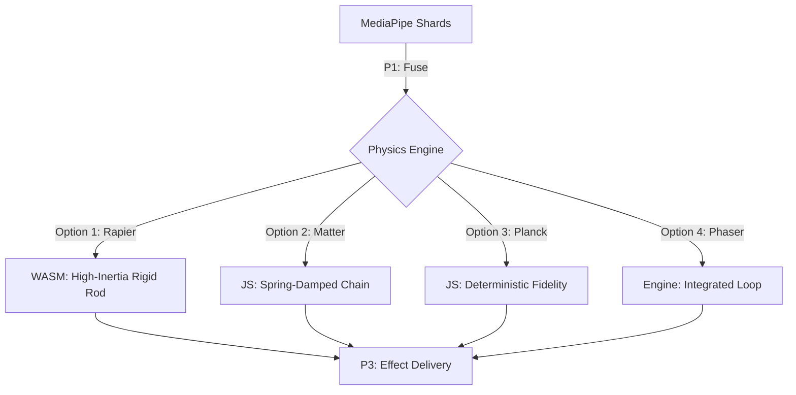
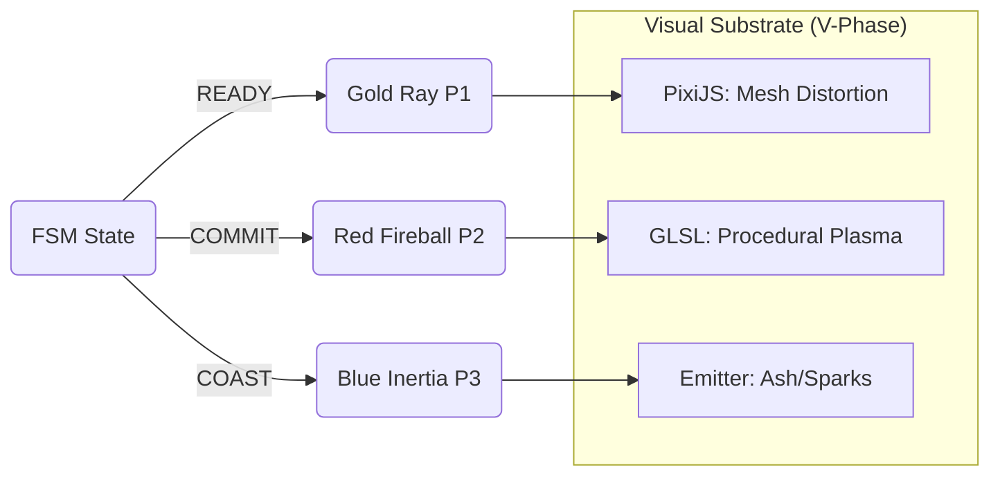

# 🛰️ HFO Front-End Maximalism: Front-End Trade Study (V1.0)

**Project**: Omega Gen 4 - Hyper-Fractal Obsidian  
**Mission Thread**: Omega (Total Tool Virtualization)  
**Medallion Status**: 🥉 Bronze  
**HIVE Phase**: I (Interlock)  

---

## 🏗️ 1. Physics Systems (The Kinetic Fabric)

For high-fidelity cursor behavior (Inertia, Spring-Damping, Attractors), the engine must be deterministic and low-latency.

### 📊 Physics Trade Study: 4 Options

| Engine | Type | Weight | Performance | Best For |
| :--- | :--- | :--- | :--- | :--- |
| **Rapier.js** | WASM | Moderate | ⭐⭐⭐⭐⭐ | Multi-hand constraints, high-density collisions, 2D/3D parity. |
| **Matter.js** | JS | Medium | ⭐⭐⭐⭐ | Rigid body interactions, stable constraints, ease of debugging. |
| **Planck.js** | JS (Box2D) | Heavy | ⭐⭐⭐⭐ | Precise, high-fidelity engineering simulations. |
| **Phaser (Matter)**| Wrapper | Light | ⭐⭐⭐ | Rapid game-loop integration, built-in state management. |

### 🧬 Physics Integration Topology

---

## 🌠 2. Visual Systems (The Juice Substrate)

To achieve "Beautiful, Stable, and Quick" fire and laser effects on mobile hardware (Chromebook V-1), the rendering path must leverage the GPU effectively.

### 📊 Visual Trade Study: 4 Options

| Engine | Tech | Impact | Juice Potential | Best For |
| :--- | :--- | :--- | :--- | :--- |
| **PixiJS** | WebGL/WebGPU | Low | ⭐⭐⭐⭐⭐ | **Hyper-Juice**. Filter-heavy fireballs, glow effects, 2D particles. |
| **Three.js** | WebGL (3D) | Medium | ⭐⭐⭐⭐ | "Obsidian Mirror" 3D cursor effects, depth-based fire volumes. |
| **GLSL (Raw)** | Shaders | Minimal | ⭐⭐⭐⭐⭐ | **Max Control**. Minimal overhead procedural fire on a single quad. |
| **Phaser** | Canvas/WebGL | Moderate| ⭐⭐⭐ | All-in-one UI, sound, and visual management. |

### ⚡ Visual Flow Pattern

---

## 🎯 3. Executive Recommendation: The "Apex Mosaic"

For the **OMEGA MAXIMALIST** vision, we recommend a **Hybrid Mosaic Architecture**:

1.  **Physics**: **Rapier.js**. Its WASM nature ensures that physics calculations never block the main JS thread during high-frequency MediaPipe updates.
2.  **Visuals**: **PixiJS + Custom Shaders**. PixiJS provides the "Maximal" scaffolding (z-indexing, container management), while custom GLSL Shaders injected into Pixi Meshes provide the "Elemental Juice" (Fireballs) with zero performance penalty on the Chromebook's GPU.

**Why not Phaser?**  
While Phaser is an excellent "all-in-one", it brings significant overhead for a modular monolith. HFO's hexagonal architecture benefits more from the "best-in-class" specialization of Rapier + PixiJS.

---
*Spider Sovereign (Port 7) | Phoenix Reconstruction | RED_TRUTH*
