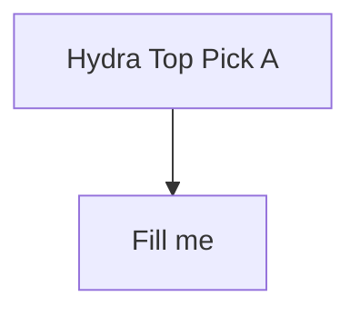
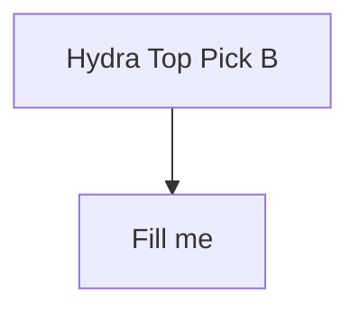
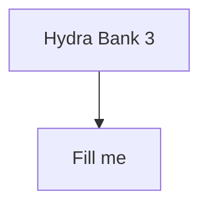

<!-- Medallion: Bronze | Mutation: 0% | HIVE: V -->
---

artifact_kind: hive8_turn_port_artifact
turn_id: "${TURN_ID}"
created_utc: "${CREATED_UTC}"
phase: "${PHASE}"
port: "${PORT}"
paired_with: "${PAIRED_WITH}"
commander_name: "${COMMANDER_NAME}"
commander_verb: "${COMMANDER_VERB}"
commander_port_role: "${COMMANDER_PORT_ROLE}"
summary_blurb: ""
summary_bullets: []
mission_thread: "${MISSION_THREAD}"
slug: "${SLUG}"
user_prompt: "${USER_PROMPT}"
title: "${TITLE}"
proof_marker: "credit_burn_counter_1 2026-01-27T02:44:01.300Z"
---

# ${TITLE}

## Commander (advisor)

- ${COMMANDER_NAME} — ${COMMANDER_VERB} (${COMMANDER_PORT_ROLE})

## P3 Hydra Protocol

- Output should be **Mermaid-first**. Avoid English paragraphs.
- Required: **Top Picks (2)** + **at least 8 Mermaid diagrams** total.

## Port Summary (for Meta Synthesis)

(2–4 bullets; labels only)

-

## Mermaid Top Picks (2)

<!-- P3_TOP_MERMAIDS_START -->

### Top Pick A

### Top Pick B

<!-- P3_TOP_MERMAIDS_END -->

## Mermaid Bank (at least 6 more)

(Provide 6+ additional Mermaid blocks below; powers of two preferred.)

## Inputs (evidence)

- Memory MCP:
- Repo sources:
- Web sources:

## Proof

- What proves this port’s output:

## Output / Handoff

- Handoff target:
- Open loops:

## Scatter/Gather Contract (Mosaic Warfare / Galois Lattice)

- Mode: ${SCATTER_GATHER_MODE}
- Artifact cardinality (required): ${ARTIFACT_CARDINALITY_LABEL} (= ${ARTIFACT_CARDINALITY_COUNT})
- Meta-promoted cardinality (required): ${META_CARDINALITY_LABEL} (= ${META_CARDINALITY_COUNT})

### Artifact Items (exactly 8; 8^1)

<!-- HIVE8_CARD_8_ITEMS_START -->

- 1
- 2
- 4
- 8
- 16
- 32
- 64
- 128

<!-- HIVE8_CARD_8_ITEMS_END -->

### Meta-Promoted Items (exactly ${META_CARDINALITY_COUNT})

<!-- HIVE8_META_PROMOTED_START -->

${META_PROMOTED_PLACEHOLDERS}

<!-- HIVE8_META_PROMOTED_END -->
