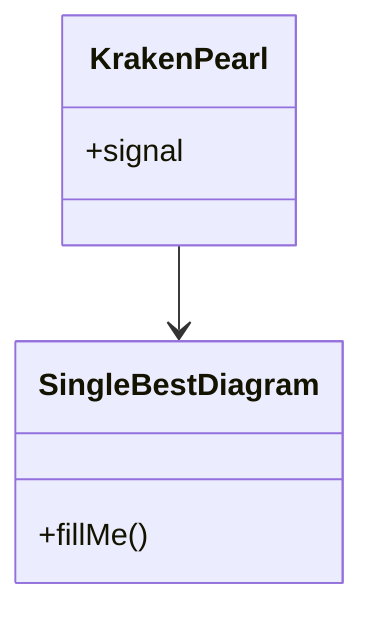

<!-- Medallion: Bronze | Mutation: 0% | HIVE: V -->
---

artifact_kind: hive8_turn_port_artifact
turn_id: "${TURN_ID}"
created_utc: "${CREATED_UTC}"
phase: "${PHASE}"
port: "${PORT}"
paired_with: "${PAIRED_WITH}"
commander_name: "${COMMANDER_NAME}"
commander_verb: "${COMMANDER_VERB}"
commander_port_role: "${COMMANDER_PORT_ROLE}"
summary_blurb: ""
summary_bullets: []
mission_thread: "${MISSION_THREAD}"
slug: "${SLUG}"
user_prompt: "${USER_PROMPT}"
title: "${TITLE}"
proof_marker: "credit_burn_counter_1 2026-01-27T02:44:01.300Z"
---

# ${TITLE}

## Commander (advisor)

- ${COMMANDER_NAME} — ${COMMANDER_VERB} (${COMMANDER_PORT_ROLE})

## P6 Kraken Protocol

- Output should be **tendrils + pearl**. Avoid English paragraphs.
- Required: **8 Memory Tendrils** + **1 Iridescent Pearl Mermaid diagram**.

## Port Summary (for Meta Synthesis)

(2–4 bullets; labels only)

-

## Memory Tendrils (8)

(8 short tendrils; label-like, not paragraphs)

1.
2.
3.
4.
5.
6.
7.
8.

## Iridescent Pearl (single best Mermaid)

<!-- P6_IRIDESCENT_PEARL_START -->

<!-- P6_IRIDESCENT_PEARL_END -->

## Inputs (evidence)

- Memory MCP:
- Repo sources:
- Web sources:

## Proof

- What proves this port’s output:

## Output / Handoff

- Handoff target:
- Open loops:

## Scatter/Gather Contract (Mosaic Warfare / Galois Lattice)

- Mode: ${SCATTER_GATHER_MODE}
- Artifact cardinality (required): ${ARTIFACT_CARDINALITY_LABEL} (= ${ARTIFACT_CARDINALITY_COUNT})
- Meta-promoted cardinality (required): ${META_CARDINALITY_LABEL} (= ${META_CARDINALITY_COUNT})

### Artifact Items (exactly 8; 8^1)

<!-- HIVE8_CARD_8_ITEMS_START -->

- 1
- 2
- 4
- 8
- 16
- 32
- 64
- 128

<!-- HIVE8_CARD_8_ITEMS_END -->

### Meta-Promoted Items (exactly ${META_CARDINALITY_COUNT})

<!-- HIVE8_META_PROMOTED_START -->

${META_PROMOTED_PLACEHOLDERS}

<!-- HIVE8_META_PROMOTED_END -->
